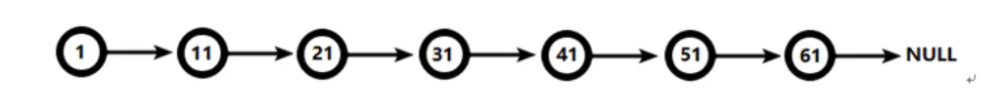
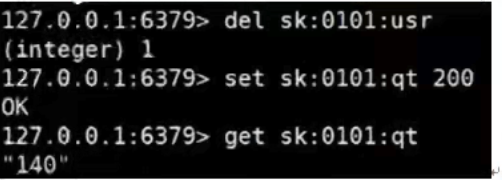

# Redis6笔记

# 1.NOSQL数据库简介

## 1.1.技术发展

技术的分类：

1. 解决功能性的问题:Java, Jsp,RDBMS, Tomcat, HTML, Linux, JDBC, SVN 
2. 解决扩展性的问题: Struts, Spring, SpringMVC, Hibernate, Mybatis
3. 解决性能的问题: NoSQL, Java线程、Hadoop, Nginx, MQ, ElasticSearch

### 1.1.1.Web1.0时代

Web1.0的时代,数据访问量很有限,用一夫当关的高性能的单点服务器可以解决大部分问题。


### 1.1.2.Web2.0时代

随着Web2.0的时代的到来,用户访问量大幅度提升,同时产生了大量的用户数据。加上后来的智能移动设备的普及,所有的互联网平台都面临了巨大的性能挑战。.


### 1.1.3.解决CPU及内存的压力


### 1.1.4.解决IO压力


## 1.2.NoSQL数据库

### 1.2.1.NoSQL数据库概述

NoSQL(NoSQL = **Not Only SQL**)，意即“不仅仅是SQL" ，泛指**非关系型的数据库**。NoSQL不依赖业务逻辑方式存储，而以简单的**key-value**模式存储。因此大大的增加了数据库的扩展能力。

- 不遵循SQL标准。
- 不支持ACID
- 远超与SQL的性能

### 1.2.2.NoSQL适用场景 

- 对数据高并发的读写
- 海量数据的读写
- 对数据高可扩展性的

### 1.2.3.NoSQL不适用场景

- 需要事务的支持
- 基于s q l的结构化查询存储，处理复杂的关系，需要**即席**查询

### 1.2.4.Memcache


### 1.2.5.Redis


### 1.2.6.MongoDB


## 1.3.行式存储数据库（大数据时代）

### 1.3.1.行式数据库

 

### 1.3.2.列式数据库

 

#### 1.3.2.1.Hbase

HBase是Hadoop项目中的数据库。它用于需要对大量的数据进行随机、实时的读写操作的场景中。

#### 1.3.2.2.Cassandra

Apache Cassandra是一款免费的开源NosQL数据库,其设计目的在于管理由大量商用服务器构建起来的庞大集群上的**海量数据集(数据量通常达到PB级别)**。在众多显著特性当中, Cassandra最为卓越的长处是对写入及读取操作进行规模调整,而且其不强调主集群的设计思路能够以相对直观的方式简化各集群的创建与扩展流程。.

> 计算机存储单位计算机存储单位一般用B, KB, MB, GB, TB, EB, ZB, YB, BB来表示,它们之间的关系是:
> 位bit (比特)(Binary Digits) :存放一位二进制数,即0或1,最小的存储单位。

## 1.4.图关系数据库

主要应用:社会关系,公共交通网络,地图及网络拓谱(n*(n-1)/2)


## 1.5.DB-Engines数据库排名


# 2.Redis6概述和安装

- Redis是一个开源的key-value存储系统。
- 和Memcached类似,它支持存储的value类型相对更多,包括string(字符串)，list(链表)，set(集合)，zset(sorted set --有序集合)和hash (哈希类型)。
- 这些数据类型都支持push/pop, add/remove及取交集并集和差集及更丰富的操作,而且这些操作都是原子性的。
- 在此基础上,Redis支持各种不同方式的**排序**。
- 与memcached一样,为了保证效率,数据都是**缓存在内存**中。
- 区别的早Redis会**国期性**的把雨新的**数据写入磁盘**或者把修改操作写入追加的记录文件
- 并且在此基础上实现了**master-slave(主从)**同步

## 2.1.应用场景

### 2.1.1.配合关系型数据库做高速缓存

- 高频次,热门访问的数据,降低数据库IO
- 分布式架构,做session共享

 

### 2.1.2.多样的数据结构存储持久化数据


## 2.2.redis安装


### 2.2.1.安装版本

-  6.2.1 for Linux ( redis-6.2.1.tar.gz)
- 不用考虑在windows环境下对Redis的支持

### 2.2.2.安装步骤

- 准备工作：下载最新版的gcc编译器

  - yum install gcc

- 将下载redis压缩包上传到服务器上，解压缩，tar -zxvf 

- 进入解压之后的文件夹，执行`make && make install`

- 安装之后的redis，在`/usr/local/bin`下可以看到

  

- 安装目录 : `/usr/local/bin`，查看默认的安装目录：

  - redis-benchmark:性能测试工具,可以在自己本子运行,看看自己本子性能如何
  - redis-check-aof :修复有问题的AOF文件, rdb和aof后面讲
  - redis-check-dump : 修复有问题的 dump.rdb 文件
  - redis-sentinel : Redis 集群使用
  - **redis-server** : Redis 服务器启动命令
  - **redis-cli** :客户端,操作入口

### 2.2.3.前台启动


### 2.2.4.后台启动

- 将re di s.conf复制一份
- 将daemon 修改为yes
-  

### 2.2.5.redis介绍相关知识


- Redis是单线程+多路IO复用技术
- 多路复用是指使用一个线程来检查多个文件描述符(Socket)的就绪状态,比如调用select和poll函数,传入多个文件描述符,如果有一个文件描述符就绪,则返回,否则阻塞直到超时。得到就绪状态后进行真正的操作可以在同一个线程里执行,也可以启动线程执行(比如使用线程池).
- 串行vs 多线程+锁(memcached) vs 单线程+多路IO复用(Redis)
  - (与Memcache三点不同:支持多数据类型,支持持久化,单线程+多路I0复用)

# 3.常用五大数据类型

- Redis字符串(String) 
- Redis列表(List) 
- Redis集合(Set) 
- Redis哈希(Hash) 
- Redis有序集合Zset

## 3.1.redis键(key)

- keys *查看当前库所有key (配: keys *1) 
- exists key 判断某个key是否存在
- type key查看你的key是什么类型 
- del key 删除指定的key数据
- **unlink key 根据value选择非阻塞删除**，仅将keys M keyspace元数据中删除,真正的删除会在后续异步操作。
- expire key 10 10秒钟:为给定的key设置过期时间
- ttl key查看还有多少秒过期,-1表示永不过期,-2表示已过期
- select命令切换数据库。
- dbsize查看当前数据库的key的数量
- flushdb 清空当前库
- flushall 通杀全部库

## 3.2.Redis字符串(String) 

### 3.2.1.简介

- String 是Redis最基本的类型,你可以理解成与Memcached一模一样的类型,一个key 对应一个value
- String类型是二进制安全的。意味着Redis的string可以包含任何数据。比如jpg图片或者序列化的对象。
- String类型是Redis最基本的数据类型,一个Redis中字符串value最多可以是512M

### 3.2.2.常用命令

- set <key> <value> 添 加键值对

  

  - *NX:当数据库中key不存在时,可以将key-value添加数据库。
  - *XX:当数据库中key存在时,可以将key-value添加数据库,与NX参数互斥
  - *EX: key的超时秒数
  - *PX: key的超时毫秒数,与EX互斥

- gét <key>查询对应键值

- append <key><value>将给定的<value>追加到原值的末尾

- strlen <key>获得值的长度

- setnx <key><value>只有在key不存在时 设置key的值

- incr <key>

  - 将key中储存的数字值增1
  - 只能对数字值操作,如果为空,新增值为1. 

- decr <key>

  - 将kev中储存的数字值减1
  - 只能对数字值操作,如果为空,新增值为-1.

- incrby/decrby <key><步>将key中储存的数字值增减。自定义步长

- mset <key1><value1><key2><value2> ..

  - 同时设置一个或多个key-value对.

- mget <key1><key2><key3>....

  - 同时获取一个或多个value

- msetnx <key1><value1><key2><value2> .....

  - 同时设置一个或多个key-value对,当且仅当所有给定key都不存在。
  - **原子性,有一个失败则都失败**

- getrange <key><起始位置>结束位置>

  - 获得值的范围,类似 java中的substring,**前包,后包**

- setrange <key><起始位置><value>

  - 用<value>覆写<key>所储存的字符串值,从<起始位置>开始(**索引从0开始**)。

- setex <key><过期时间><value>

  - 设置键值的同时,设置过期时间,单位秒。

- getset <key><value>

  - 以新换旧,设置了新值同时获得旧值。

#### 原子性

> 所谓原子操作是指不会被线程调度机制打断的操作;
> 这种操作一旦开始,就一直运行到结束,中间不会有任何context switch (切换到另一个线程)。
> (1)在单线程中,能够在单条指令中完成的操作都可以认为是"原子操作”,因为中断只能发生于指令之间。
> (2)在多线程中 不能被其它进程(线程)打断的操作就叫原子操作。
>
> redis单命令的原子性主要得益于redis的单线程

### 3.2.3.数据结构

- String的数据结构为简单动态字符串(Simple Dynamic String,缩写SDS)。是可以修改的字符串,内部结构实现上类似于Java的ArrayList,采用预分配冗余空间的方式来减少内存的频繁分配.


- 如图中所示,内部为当前字符串实际分配的空间capacity一般要高于实际字符串长度len。当字符串长度小于1M时,扩容都是加倍现有的空间,如果超过1M,扩容时一次只会多扩1M的空间。需要注意的是字符串最大长度为512M.

## 3.3.Redis列表(List) 

### 3.3.1.简介

- 单键多值
- Redis列表是简单的字符串列表,按照插入顺序排序。你可以添加一个元素到列表的头部(左边)或者尾部(右边)
- 它的底层实际是个双向链表,对两端的操作性能很高,通过索引下标的操作中间的节点性能会较差


### 3.3.2.常用命令

- Ipush/rpush <key><value1><value2><value3>....从左边/右边插入一个或多个值。
- Ipop/rpop <key>从左边/右边吐出一个值。**值在键在,值光键亡**。
- rpoplpush <key1><key2> 从 <key1>列表右边 吐出一个值,插到<key2>列表左边。
- Irange <key><start><stop>
  - 按照索引下标获得元素(从左到右)
- Irange mylist 0  -1 
  - 0左边第一个,-1右边第一个,(0-1表示获取所有).
- lindex <key><index>
  - 按照索引下标获得元素(从左到右)
- llen <key>
  - 获得列表长度
- linsert <key> before <value><newvalue>
  - 在<value>的后面插入<newvalue>插入值 
- Irem <key><n><value>从左边删除n个value(从左到右)
- Iset<key><index><value>
  - 将表 key下标 index 的值替换成 value

### 3.3.3.数据结构

- List的数据结构为快速链表quickList.
- 首先在列表元素较少的情况下会使用一块连续的内存存储,这个结构是ziplist,也即是压缩列表。
- 它将所有的元素紧挨着一起存储,分配的是一块连续的内存
- 当数据量比较多的时候才会改成 quicklist.
- 因为普通的链表需要的附加指针空间太大,会比较浪费空间。比如这个列表里存的只是int类型的数据,结构上还需要两个额外的指针prev和next.


- Redis将链表和ziplist结合起来组成了quicklist.也就是将多个ziplist使用双向指针串起来使用。这样既满足了快速的插入删除性能,又不会出现太大的空间冗余。

## 3.4.Redis集合(Set) 

### 3.4.1.简介

- Redis set对外提供的功能与list类似是一个列表的功能,特殊之处在于set是可以自动排重的,当你需要存储一个列表数据,又不希望出现重复数据时, set是一个很好的选择,并且set提供了判断某个成员是否在一个set集合内的重要接口,这个也是list所不能提供的。
- Redis的Set是string类型的无序集合。它底层其实是一个value为null的hash表,所以添加,删除,查找的**复杂度都是 0(1)**
- 一个算法,随着数据的增加,执行时间的长短,如果是O(1),数据增加,查找数据的时间不变

### 3.4.2.常用命令

- sadd <key><value1><value2> ....
  - 将一个或多个member元素加入到集合key中,已经存在的member元素将被忽略 
- smembers <key>
  - 取出该集合的所有值。.
- sismember <key><value>
  - 判断集合<key>是否为含有该<value>值,有1,没有0
- scard<key>
  - 返回该集合的元素个数。
- srem <key><value1><value2>...
  - 删除集合中的某个元素。.
- spop <key>
  - **随机从该集合中吐出一个值。**
- srandmember <key><n>
  - 随机从该集合中取出n个值。不会从集合中删除。
- smove <source><destination>
  - value把集合中一个值从一个集合移动到另一个集合 
- sinter <key1><key2>
  - 返回两个集合的**交集**元素。.
- sunion <key1><key2>
  - 返回两个集合的**并集**元素。.
- sdiff <key1><key2>返回两个集合的**差集**元素(key1中的,不包含key2中的)

### 3.4.3.数据结构

- Set数据结构是dict字典,字典是用哈希表实现的。
- Java中 HashSet的内部实现使用的是HashMap,只不过所有的value都指向同一个对象。
- Redis的set结构也是一样,它的内部也使用hash结构,所有的value都指向同一个内部值。

## 3.5.Redis哈希(Hash)

### 3.5.1.简介

- Redis haşh 是一个键值对集合。
- Redis hash是一个string类型的**field** 和**value**的映射表,hash特别适合用于存储对象。类似Java里面的Map<String,Object>
- 用户ID为查找的key,存储的value用户对象包含姓名,年龄,生日等信息,如果用 普通的key/value结构来存储
- 主要有以下2种存储方式:

### 3.5.2.常用命令

- hset <key><field><value>
  - 给<key>集合中的<field>键赋值<value
- hget <key1><field>
  - 从<key1>集合<field>取出value
- hmset <key1><field1><value1><field2><value2>...
  - 批量设置hash的值 
- hexists<key1><field>
  - 查看哈希表key中,给定域field是否存在。 
- hkeys <key)
  - 列出该hash集合的所有field.
- hvals <key)
  - 列出该hash集合的所有value
- hincrby <key><field><increment>
  - 为哈希表key中的域field的值加上增量1      -1 
- hsetnx <key><field><value>
  - 将哈希表key中的域field的值设置为value,当且仅当域 field 不存在

### 3.5.3.数据结构 


## 3.6.Redis有序集合Zset

### 3.6.1.简介

- Redis有序集合 zset与普通集合set非常相似,是一个**没有重复元素**的字符串集合。
- 不同之处是有序集合的每个成员都关联了一个**评分(score)**,这个评分(score)被用来按照从最低分到最高分的方式排序集合中的成员。**集合的成员是唯一的,但是评分可以是重复了。**
- 因为元素是有序的,所以你也可以很快的根据评分(score )或者次序(position )来获取一个范围的元素。
- 访问有序集合的中间元素也是非常快的,因此你能够使用有序集合作为一个没有重复成员的智能列表。

### 3.6.2.常用命令

- zadd <key><score1><value1><score2><value2>....
  - 将一个或多个member元素及其score值加入到有序集key当中。
- **zrange <key><start><stop> [WITHSCORES]**
  - 返回有序集key中,下标在<start><stop>之间的元素，带WITHSCORES,可以让分数一起和值返回到结果集。
- zrangebyscore key minmax [withscores] [limit offset count]-
  - 返回有序集key中,所有score值介于min和max之间(包括等于min或max)的成员。有序集成员按score值递增(从小到大)次序排列。
- z**rev**rangebyscore key **maxmin** [withscores] [limit offset count]
  - 同上,改为从大到小排列。
- zincrby <key><increment><value> 
  - 为元素的score加上增量
- zrem <key><value>
  - 删除该集合下,指定值的元素
- zcount <key><min><max>
  - 统计该集合,分数区间内的元素个数
- zrank <key><value>
  - 返回该值在集合中的排名,从0开始。

### 3.6.3.数据结构

- SortedSet (zset)是Redis提供的一个非常特别的数据结构,一方面它等价于Java 的数据结构Map(String, Double),可以给每一个元素value赋予一个权重score,另一方面它又类似于TreeSet,内部的元素会按照权重score进行排序,可以得到每个元素的名次,还可以通过score的范围来获取元素的列表。

- zset底层使用了两个数据结构
  - hash, hash的作用就是关联元素value和权重score,保障元素value的唯一性,可以通过元素value找到相应的score值。
  - 跳跃表,跳跃表的目的在于给元素value排序,根据score的范围获取元素列表。

### 3.6.4.跳跃表

- 简介

  - 有序集合在生活中比较常见,例如根据成绩对学生排名,根据得分对玩家排名等,对于有序集合的底层实现,可以用数组、平衡树、链表等、数组不便元素的插入、删除;平衡树或红黑树虽然效率高但结构复杂:链表查询需要遍历所有效率低。Redis采用的是跳跃表。跳跃表效率堪比红黑树,实现远比红黑树简单。.

- 实例

  - 对比有序链表和跳跃表,从链表中查询出51

  - 有序链表

    

    - 要查找值为51的元素,需要从第一个元素开始依次查找、比较才能找到。共需要6次比较。

  - 跳跃表

    

    - 从第2层开始,1节点比51节点小,向后比较。.
    - 21节点比51节点小,继续向后比较,后面就是NULL 了,所以从21节点向下到第1层
    - 在第1层,41节点比51节点小,继续向后,61节点比51节点大,所以从41向下
    - 在第0层,51节点为要查找的节点,节点被找到,共查找4次..
    - 从此可以看出跳跃表比有序链表效率要高

# 4.Redis6配置文件详解

## 4.1.Units单位

配置大小单位,开头定义了一些基本的度量单位,只支持bytes,不支持bit-，打小写不敏感


## 4.2.INCLUDES包含


类似jsp中的include,多实例的情况可以把公用的配置文件提取出来

## 4.3.网络相关配置

### 4.3.1.bind

- 默认情况bind=127.0.0.1只能接受本机的访问请求
- 不写的情况下,无限制接受任何ip地址的访问
- 生产环境肯定要写你应用服务器的地址;服务器是需要远程访问的,所以需要将其注释掉
- **如果开启了 protected-mode,那么在没有设定bind ip且没有设密码的情况下, Redis只允许接受本机的响应**


- 保存配置,停止服务,重启启动查看进程,不再是本机访问了。

### 4.3.2.protected-mode

将本机访问保护模式设置no


### 4.3.3.port


### 4.3.4.tcp-backlog

- 设置tcp的backlog, backlog其实是一个连接队列,backlog队列总和-未完成三次握手队列+已经完成三次握手队列。.
- 在高并发环境下你需要一个高backlog值来避免慢客户端连接问题。.
- 注意Linux内核会将这个值减小到/proc/sys/net/core/somaxconn的值(128),所以需要 确认増大/proc/sys/net/core/somaxconn 和/proc/sys/net/ipv4/**tcp_max_syn_backlog** (128)两个值来达到想要的效果


## 4.4.GENERAL通用

### 4.4.1.daemonsize

- 是否为后台进程,设置为yes.
- 守护进程,后台启动

### 4.4.2.pidfile

- 存放pid文件的位置,每个实例会产生一个不同的pid文件

### 4.4.3.loglevel


### 4.4.4.logfile

- 日志文件名称

### 4.4.5.database

- 设定库的数量默认16,默认数据库为0,可以使用SELECT <dbid>命令在连接上指定数据库id

## 4.5.SECURITY通用

### 4.5.1.设置密码

- 访问密码的查看、设置和取消
- 在命令中设置密码,只是临时的。重启redis服务器,密码就还原了。
- 永久设置,需要再配置文件中进行设置。

## 4.6.LIMITS限制

### 4.6.1.maxclients

- 设置redis同时可以与多少个客户端进行连接。
- 默认情况下为10000个客户端。.
- 如果达到了此限制,redis则会拒绝新的连接请求,并且向这些连接请求方发出 "max number of clients reached"以作回应

### 4.6.2.maxmemory

- 建议**必须设置**,否则,将内存占满,造成服务器岩机
- 设置redis可以使用的内存量。一旦到达内存使用上限,redis将会试图移除内部数 据,移除规则可以通过**maxmemory-policy**来指定。

### 4.6.3.maxmemory-policy.

- volatile-Iru:使用LRU算法移除key,只对设置了**过期时间**的键;(最近最少使用).
- allkeys-Iru : 在所有集合 key中,使用LRU算法移除key..
- volatile-random :在过期集合中移除随机的key,只对设置了过期时间的键
- allkeys-random:在所有集合key中,移除随机的key

- volatile-ttl :移除那些TTL值最小的key,即那些最近要过期的key.
- noeviction :不进行移除。针对写操作,只是返回错误信息。

### 4.6.4.maxmemory-samples

- 设置样本数量,LRU算法和最小TTL算法都并非是精确的算法,而是估算值,所以你可以设置样本的大小,redis默认会检查这么多个key并选择其中LRU的那个。
- 一般设置3到7的数字,数值越小样本越不准确,但性能消耗越小。

# 5.Redis6的发布和订阅

### 5.1.什么是发布和订阅.

- Redis发布订阅(pub/sub)是一种消息通信模式:发送者(pub)发送消息,订阅者(sub)接收消息。
- Redis客户端可以订阅任意数量的频道。

### 5.2.redis的发布与订阅

- 客户端可以订阅频道如下图


- 当给这个频道发布消息后，消息就会发送给订阅的客户端


### 5.3.发布订阅命令行实现

- 打开一个客户端订阅channell
- 打开另一个客户端，给channell发布消息hello
- 打开第一个客户端可以看到发送的消息

# 6.Redis6新数据类型

## 6.1.bitmaps

### 6.1.1.简介

- 现代计算机用二进制(位)作为信息的基础单位,1个字节等于8位,例如"abc"字符串是由3个字节组成,但实际在计算机存储时将其用二进制表示, “abc"分别对应的ASCII码分别是 97, 98,99,对应的二进制分别是 01100001, 01100010和01100011,如下图

  

- 合理地使用操作位能够有效地提高内存使用率和开发效率。

- Redis提供了 Bitmaps这个“数据类型”可以实现对位的操作:.

  - (1) Bitmaps本身不是一种数据类型,实际上它就是字符串(key-value)但是它可以对字符串的位进行操作。
  - (2) Bitmaps 单独提供了一套命令,所以在Redis中使用Bitmaps和使用字符串的方法不太相同。可以把Bitmaps想象成一个以位为单位的数组,数组的每个单元只能存储0和1,数组的下标在Bitmaps中叫做偏移量。

  

### 6.1.2.命令

- 

## 6.2.HyperLogLog


## 6.3.Geospatial


# 7.Redis-Jedis测试


# 8.Redis-Jedis实例 


# 9.Redis与SpringBoot整合

  

# 10.redis事务-锁机制-秒杀

## 10.1.redis的事务定义

- Redis 事务是一个单独的隔离操作:事务中的所有命令都会序列化、按顺序地执行。事务在执行的过程中,不会被其他客户端发送来的命令请求所打断
- Redis事务的主要作用就是**串联多个命令**防止别的命令插队。

## 10.2. Multi, Exec, discard

- 从输入Multi命令开始,输入的命令都会依次进入命令队列中,但不会执行,直到输入Exec后, Redis会将之前的命令队列中的命令依次执行。
- 组队的过程中可以通过discard来放弃组队。


## 10.3.事务的错误处理

- 组队中某个命令出现了报告错误,执行时整个的所有队列都会被取消。


- 如果执行阶段某个命令报出了错误,则只有报错的命令不会被执行,而其他的命令都会执行,不会回滚。


## 10.4.为什么要做成事务

- 想想一个场景:有很多人有你的账户,同时去参加双十一抢购

## 10.5.事务冲突的问题

### 10.5.1.例子

- 一个请求想给金额减 8000
- 一个请求想给金额减5000
- 一个请求想给金额减1000


### 10.5.2.悲观锁


- **悲观锁(Pessimistic Lock)**,顾名思义,就是很悲观,每次去拿数据的时候都认为别人会修改,所以每次在拿数据的时候都会上锁,这样别人想拿这个数据就会block直到它拿到锁。**传统的关系型数据库里边就用到了很多这种锁机制**,比如**行锁,表锁**等,读锁,写锁等,都是在做操作之前先上锁。

### 10.5.3.乐观锁


- 乐观锁(Optimistic Lock),顾名思义,就是很乐观,每次去拿数据的时候都认为别人不会修改,所以不会上锁,但是在更新的时候会判断一下在此期间别人有没有去更新这个数据,可以使用版本号等机制。乐观锁适用于多读的应用类型,这样可以提高吞吐量。Redis就是利用这种check-and-set机制实现事务的。


### 10.5.4.watch key [key。。。]

- 在执行multi之前,先执行watch keyl [key2],可以监视一个(或多个) key,如果在事务
  **执行之前这个(或这些) key被其他命令所改动,那么事务将被打断**。

### 10.5.5.unwatch

- 取消WATCH命令对所有key的监视。
- 如果在执行WATCH 命令之后,EXEC命令或 DISCARD命令先被执行了的话,那么就
  不需要再执行UNWATCH了。
- http://doc.redisfans.com/transaction/exec.html.

## 10.6.Redis事务三特性

- 单独的隔离操作
  - 事务中的所有命令都会序列化、按顺序地执行。事务在执行的过程中,不会被其他客户端发送来的命令请求所打断。
- 没有隔离级别的概念
  - 队列中的命令没有提交之前都不会实际被执行,因为事务提交前任何指令都不会被实际执行
- 不保证原子性。
- 事务中如果有一条命令执行失败,其后的命令仍然会被执行,没有回滚。

# 11.Redis-事务-秒杀案例

## 11.1.解决计数器和人员记录的事务操作


## 11.2.redis事务--秒杀并发模拟

- 使用具ab模拟测试 
- CentOS6默认安装 
- CentOS7 需要手动安装

### 11.2.1.联网：yum install https-tools

### 11.2.2.无网络

- 进入cd  /run/media/root/CentOS 7 x86_64/Packages (B径R centos6 不同)
- 顺序安装
  - apr-1.4.8-3.e17.x86 64.rpm
  - apr-util-1.5.2-6.e17.x86_64.rpm
  - httpd-tools-2.4.6-67.el7.centos.x86_64. rpm

### 11.2.3.测试及结果

#### 11.2.3.1.通过a b测试

- vim postfile 模拟表单提交参数,以&符号结尾;存放当前目录。
- 内容: prodid=0101&
- ab -n 1000 -c 100 -p postfile -T 'äpplication/x-www-form-urlencoded" http://192.168.140.1:8080/seckill/doseckill
- ab-n 1000 -c 100 -p

#### 11.2.3.2.超卖


### 11.2.4.通过浏览器测试


## 11.3.超卖问题


## 11.4.利用乐观锁淘汰用户


## 11.5.继续增加并发测试

### 11.5.2.已经秒光，可是还有库存

-  ab-n 2000 -c 100 -p postfile -T 'application/x-www-form-urlencoded" http://192.168.137.1:8080/seckill/doseckill-
- 已经秒光,可是还有库存。原因,就是**乐观锁导致很多请求都失败**。先点的没秒到,后点的可能秒到了。



### 11.5.3.连接超时，通过连接池解决


### 11.5.4.连接池

- 节省每次连接redis服务带来的消耗,把连接好的实例反复利用。
- 通过参数管理连接的行为
- 代码见项目中
- 链接池参数
  - MaxTotal :控制一个 pool可分配多少个jedis实例,通过pool.getResource()来获取;如果赋值为-1,则表示不限制;如果pool已经分配了MaxTotal 个jedis实例,则此时pool的状态为exhausted。
  - maxIdle :控制一个pool最多有多少个状态为idle(空闲)的jedis实例; 
  - MaxWaitMillis :表示当borow个jedis实例时,最大的等待毫秒数,如果超过等待 时间,则直接抛JedisConnectionException;

## 11.6.解决数据库遗留问题

### 11.6.1.LUA脚本

- Lua是一个小巧的**脚本语言**,Lua脚本可以很容易的被C/C+代码调用,也可以反过来调C/C++的函数,Lua并没有提供强大的库,一个完整的Lua解释器不过200k,所以Lua不适合作为开发独立应用程序的语言,而是作为**嵌入式脚本语言**。
- 很多应用程序、游戏使用LUA作为自己的嵌入式脚本语言,以此来实现可配置性、可扩展性。
- 这其中包括魔兽争霸地图、魔兽世界、博德之门、愤怒的小鸟等众多游戏插件或外挂。https://www.w3cschool.cn/lua

### 11.6.2.LUA脚本在redis

- 将复杂的或者多步的redis操作,写为一个脚本,一次提交给redis执行,减少反复连接redis的次数。提升性能。
- LUA脚本是类似redis事务,有一定的原子性,不会被其他命令插队,可以完成一些redis 事务性的操作。
- 但是注意redis的lua脚本功能,只有在Redis 2.6以上的版本才可以使用。
- 利用lua脚本淘汰用户,解决超卖问题。
- redis 2.6版本以后,通过lua脚本解决**争抢问题**,实际上是**redis利用其单线程的特性用任务队列的方式解决多任务并发问题。**


## 11.7.redis事务——秒杀案例


### 11.7.1.项目结构


### 11.7.2.第一版：简单版本


### 11.7.3.第二版：加事务


### 11.7.4.第三版：连接池解决超时问题


### 11.7.5.第四版：解决库存依赖问题，LUA脚本

```

```


# 12.Redis6持久化之RDB 


# 13.Redis6持久化之AOF


# 14.Redis6的主从复制


# 15.Redis6集群


# 16.Redis应用问题解决


# 17.Redis6新功能


