# Jenkins

# 大纲

- 基础运行环境快速安装部署
- jenkins传统/blue ocean ui使用
- 一键maven 拉取gi代码完成构建jar包并提交到测试服务器自动运行
- ide提交代码后自动构建并发布任务
- 定时构建发布任务
- 邮件通知任务执行结果
- jenkins构建项目自动化运行在docker容器中
- jenkins pipeline脚本与jenkinsfile使用
- jenkins多分枝项目

# 安装步骤

- jenkins在开发过程中所属位置

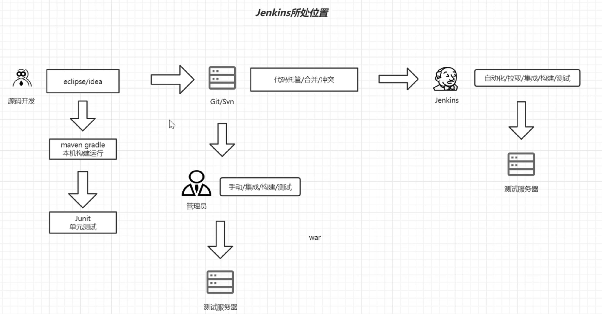

- jenkins+maven+git持续集成基础使用

- 安装硬件环境和知识储备

## gitlab

- gitlab介绍及安装准备

| 云服务器ip                            | 账号 | 密码          | cpu  | 内存 |
| ------------------------------------- | ---- | ------------- | ---- | ---- |
| 129.211.190.48（公）10.206.0.15（内） | root | 28*Z9M-Tz}5pr | 4    | 8    |
| 119.45.94.53（公）10.206.0.14（内）   | root | 28*Z9M-Tz}5pr |      |      |
| 119.45.149.228（公）10.206.0.16（内   | root | 28*Z9M-Tz}5pr | 4    | 8    |

### ssh下安装

- 执行`yum install -y curl policyconreutils-python openssh-server perl`

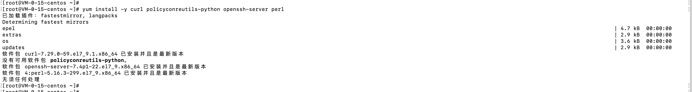

- 执行`systemctl enable sshd`和`systemctl start  sshd`


- 执行`curl -fsSl https://packages.gitlab.cn/repository/raw/scripts/setup.sh | /bin/bash`

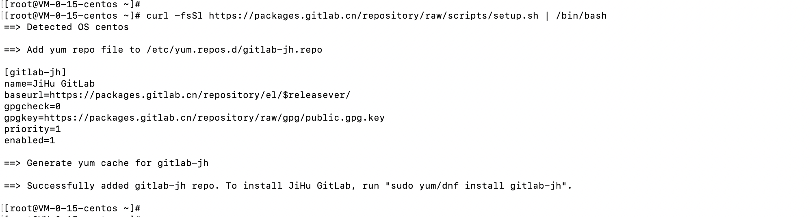

- 执行`EXTERNAL_URL="http://129.211.190.48" yum install -y gitlab-jh`

  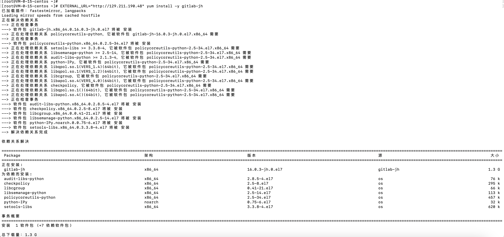

  - EXTERNAL_URL内容是gitlab外部访问的地址，需要修改为自己的

  - 最后可以看到安装成功的截图

    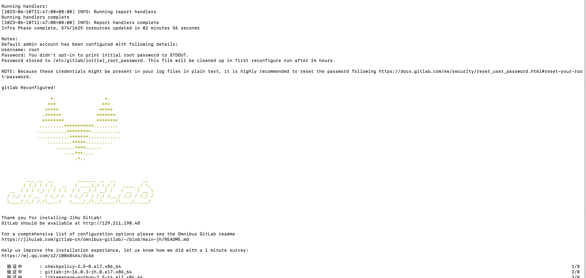

- root的密码默认存储在`cat /etc/gitlab/initial_root_password`，这个密码只能用来第一次登录初始化root密码使用。
- 将服务器的80端口放开，然后访问`http://129.211.190.48/admin`

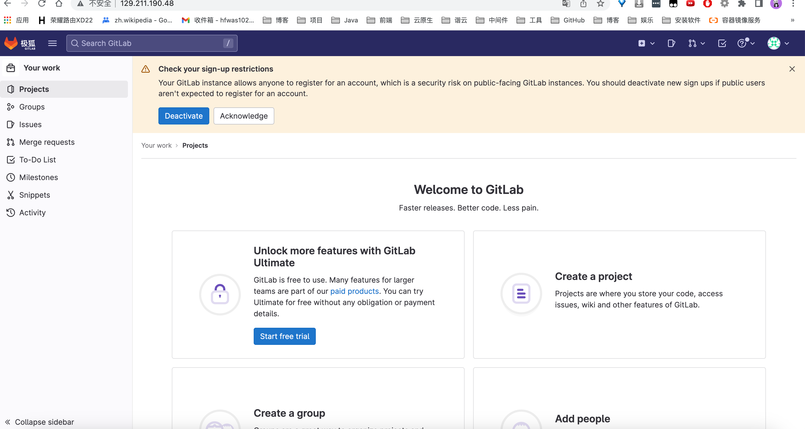

- 修改gitlab的admin密码，点击用户，点击编辑，修改密码。


### docker下安装

- 安装docker

  - 最小配置
    - 内存至少4g
    - 系统内核至少在3.10以上uname -r命令可以查看系统内核版本
  - 更新yum源，执行`yum update`

  

  - 安装依赖，执行`yum install -y yum-utils device-mapper-persistent-data lvm2`

  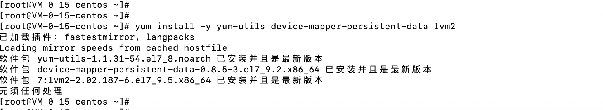

  - 添加镜像

    - 国外镜像，执行`yum-config-manager --add-repo https://download.docker.com/linux/centos/docker-ce.repo`
    - 阿里镜像，执行`yum-config-manager --add-repo http://mirrors.aliyun.com/docker-ce/linux/centos/docker-ce.repo`

    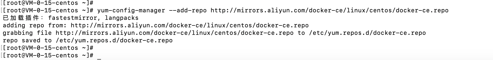

  - 查看源中可使用版本，执行`yum list docker-ce --showduplicates | sort -r `

  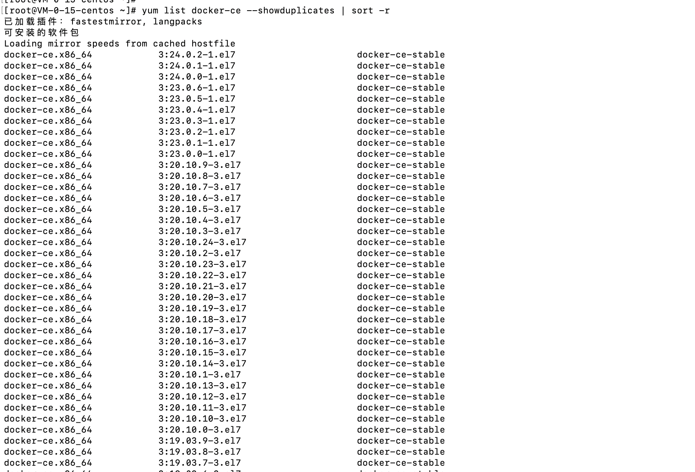

  - 安装指定版本，执行`yum install 软件名称-版本号`。例如：`yum install docker-ce-3:20.10.9-3.el7`

  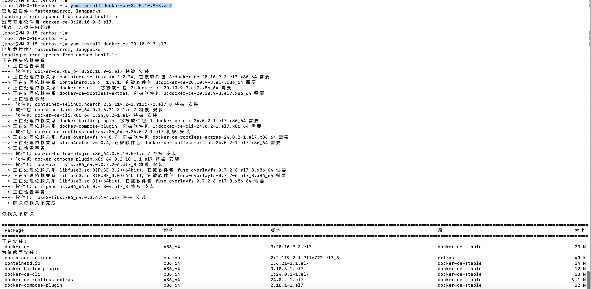

  - 启动docker并且设置开启启动

  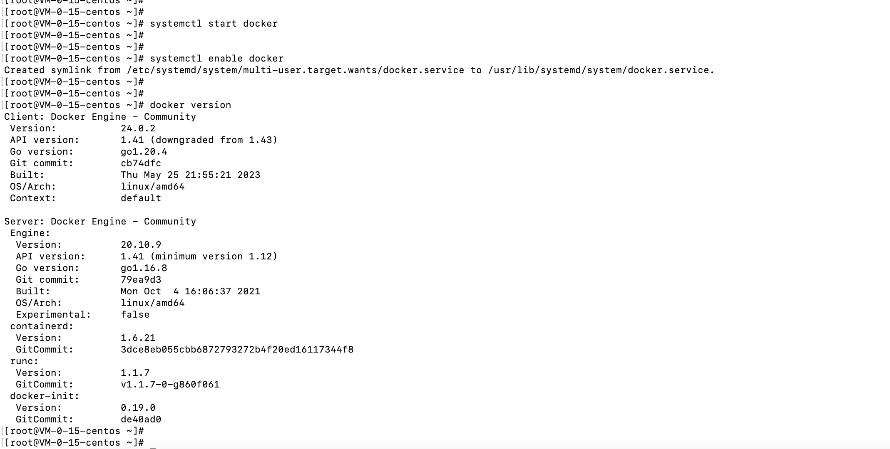

  - 使用容器安装gitlab
    - 添加容器，执行`docker run --detach --hostname 129.211.190.48 --publish 443:443 --publish 80:80 --name gitlab --restart always --volume $GITLAB_HOME/config:/etc/gitlab:Z --volume $GITLAB_HOME/logs:/var/log/gitlab:Z --volume $GITLAB_HOME/data:/var/opt/gitlab:Z --shm-size 521m registry.gitlab.cn/omnibus/gitlab-jh:latest ` 
    - 进入容器查看密码，登录gitlab修改密码。

## jenkins

- 安装java jdk
  - 检索可用包，执行`yum search java| grep jdk`
- 安装maven

# jenkins使用

## ssh publisher超时机制

- 目前使用的启动jar包的命令为`nohup java -jar /root/xxxjenkins/demo*.jar & `

  - 执行上述命令，在控制台会卡住，jenkins可能会因为这个原因导致
  - 必须手动回车才可以退出这个状态

  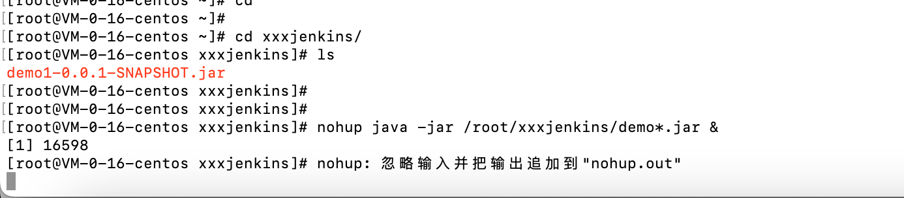

  - 修改为下述`nohup java -jar /root/xxxjenkins/demo*.jar >nohup.out 2>&1 &`命令之后，就不用手动回车，远程ssh命令执行事件就会变短。

- 发现jenkins日志当中的ssh 执行命令事件为一千多ms

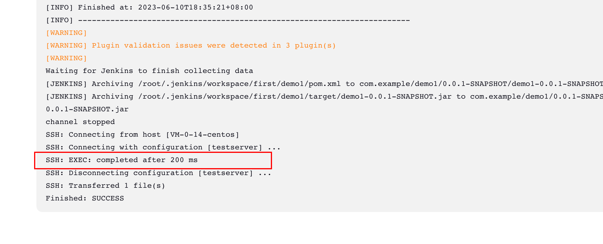

- 修改启动jar包命令为`nohup java -jar /root/xxxjenkins/demo*.jar >nohup.out 2>&1 & `，

## 前置步骤

- 构建之前可以先kill掉之前的Java进程，
- shell脚本

```

```


- 

## 几种构建方式

- 快照依赖构建/bu
  - 当依赖的快照被构建时执行本job
- 触发远程构建（例如：使用脚本）
  - 远程调用本job的restapi时执行本job
- job依赖构建
  - 当依赖的job被构建时执行本job
- 定时构建
  - 使用cron表达式定时构建本job
- 向github提交代码时触发jenkins自动构建
  - GitHub-webhook触发时构建本job
- 定期检查代码变更
  - 使用cron表达式定时检查代码变更，变更后构建本job

## 触发远程构建/gitlab改动自动构建

- 代码改动自动可以使用gitlab的webhook回调钩子调用jenkins的启动任务接口
- 在构建触发起中配置接口和token


## 自动化部署到docker容器中

### docker外挂目录

- 准备一台测试服务器docker环境
- 准备支持jdk的镜像
- 吧jar包打包到容器内


## jenkins集群/并发构建

- 集群化构建可以有效提升构建效率，尤其是团队项目比较多或是子项目比较多的时候哦，可以并发在多台机器上执行构建


# 流水线

- 流水线既能作为任务的本身，也能作为jenkinsfile
- 使用流水线可以让我们的任务从ui手动操作，转换为代码化，像docker的dockerfile一样，从shell命令到配置文件，更适合大型项目，可以让团队其他开发者同时参与进来，同时也可以编辑开发jenkins webui不能完成的更复杂的构建逻辑，作为开发者可读性更好

## 完整语法

- 五个必备的组成部分
  - pipeline：整条流水线
  - agent：指定执行器
  - stages：所有阶段
  - stage：某一阶段，可有多个
  - steps：阶段内的每一步，可执行命令

## 阶段视图stage view

### Blue ocean可视化界面

- 全新的流水线控制ui，可重复执行某阶段代码
- 插件中心搜索blue ocean安装过即可

### post

- 流水线完成后可执行的任务
  - Always：无论流水线或者阶段的完成状态
  - changed：只有当流水线或者阶段完成状态与之前不同时
  - failure：只有当流水线或者阶段状态为failure运行
  - success：只有当流水线或者阶段状态为success运行
  - unstable：只有当流水线或者阶段状态为unstable运行，例如：测试失败
  - Aborted：只有当流水线或者阶段状态为aborted运行，例如：手动取消

### agent

- 可以指定执行节点
- label指定运行job的节点标签
- Any 不指定，由jenkins分配

