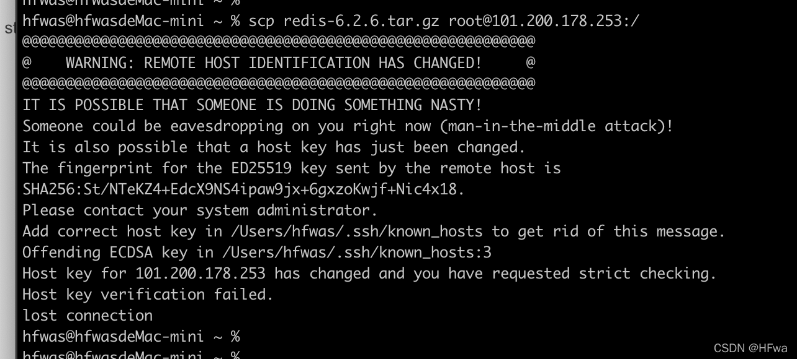
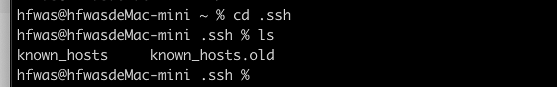
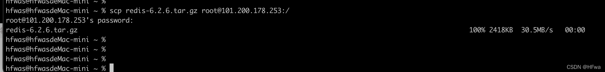

往阿里云服务器上复制文件，显示报错，

# 报错信息如下
```
@@@@@@@@@@@@@@@@@@@@@@@@@@@@@@@@@@@@@@@@@@@@@@@@@@@@@@@@@@@
@    WARNING: REMOTE HOST IDENTIFICATION HAS CHANGED!     @
@@@@@@@@@@@@@@@@@@@@@@@@@@@@@@@@@@@@@@@@@@@@@@@@@@@@@@@@@@@
IT IS POSSIBLE THAT SOMEONE IS DOING SOMETHING NASTY!
Someone could be eavesdropping on you right now (man-in-the-middle attack)!
It is also possible that a host key has just been changed.
The fingerprint for the ED25519 key sent by the remote host is
SHA256:St/NTeKZ4+EdcX9NS4ipaw9jx+6gxzoKwjf+Nic4x18.
Please contact your system administrator.
Add correct host key in /Users/hfwas/.ssh/known_hosts to get rid of this message.
Offending ECDSA key in /Users/hfwas/.ssh/known_hosts:3
Host key for 101.200.178.253 has changed and you have requested strict checking.
Host key verification failed.
lost connection
```
# 截图如下

# 问题原因
刚才阿里云服务器重装了系统，导致所有与原系统建立过ssh连接的系统都无法再建立连接，因为在于原系统建立首次连接时，双方相互记录了对方的公钥（ssh基于非对称密钥技术），在ssh服务主机重装系统后，公钥改变了，任以旧版本公钥的主机自然是无法与新系统连接的。

# 解决办法
在 `~/.ssh`下删除 `known_hosts`即可。执行`rm known_hosts`

再次尝试传输文件，显示传输成功，没有报错。

