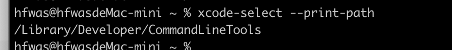
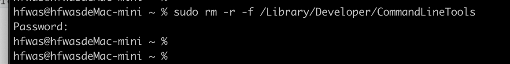
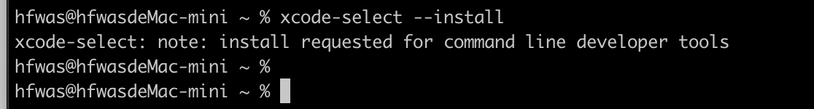
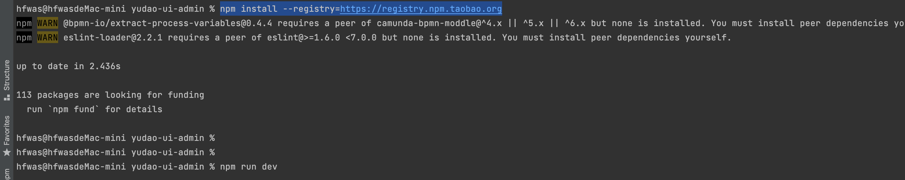
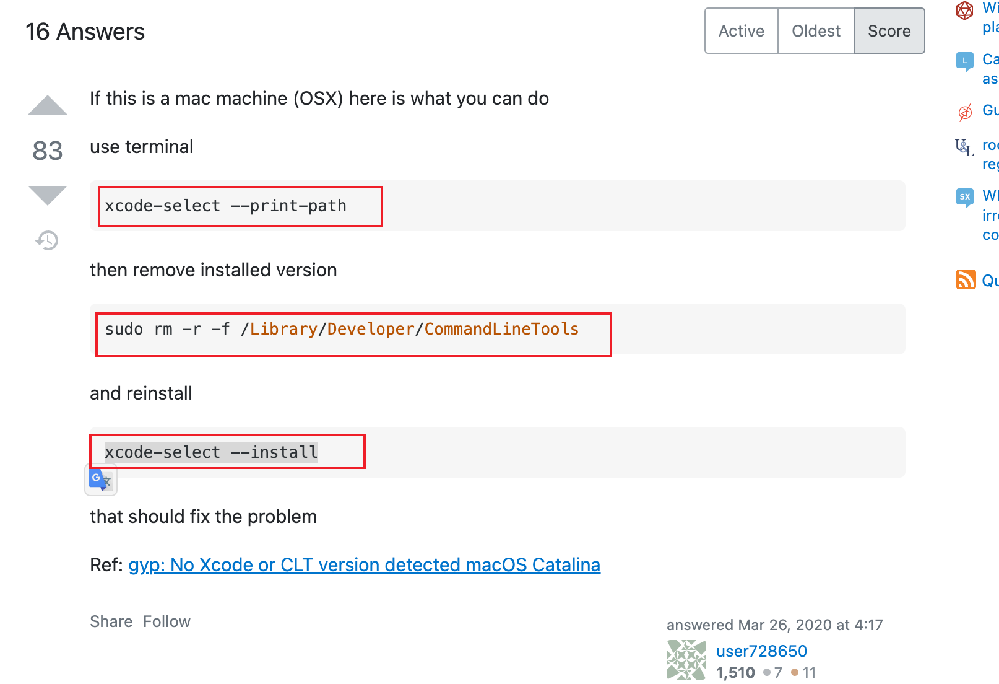

# stack Error: `gyp` failed with exit code: 1

# 详细错误信息

```bash
gyp: No Xcode or CLT version detected!
gyp ERR! configure error 
gyp ERR! stack Error: `gyp` failed with exit code: 1
gyp ERR! stack     at ChildProcess.onCpExit (/usr/local/lib/node_modules/npm/node_modules/node-gyp/lib/configure.js:351:16)
gyp ERR! stack     at ChildProcess.emit (node:events:394:28)
gyp ERR! stack     at Process.ChildProcess._handle.onexit (node:internal/child_process:290:12)
gyp ERR! System Darwin 21.1.0
gyp ERR! command "/usr/local/bin/node" "/usr/local/lib/node_modules/npm/node_modules/node-gyp/bin/node-gyp.js" "rebuild"
gyp ERR! cwd /usr/local/workspace/ruoyi-vue-pro/yudao-ui-admin/node_modules/watchpack-chokidar2/node_modules/fsevents
gyp ERR! node -v v16.4.0
gyp ERR! node-gyp -v v5.1.0
gyp ERR! not ok 

> fsevents@1.2.13 install /usr/local/workspace/ruoyi-vue-pro/yudao-ui-admin/node_modules/webpack-dev-server/node_modules/fsevents
> node install.js

(node:21421) [DEP0150] DeprecationWarning: Setting process.config is deprecated. In the future the property will be read-only.
(Use `node --trace-deprecation ...` to show where the warning was created)
No receipt for 'com.apple.pkg.CLTools_Executables' found at '/'.

No receipt for 'com.apple.pkg.DeveloperToolsCLILeo' found at '/'.

No receipt for 'com.apple.pkg.DeveloperToolsCLI' found at '/'.

gyp: No Xcode or CLT version detected!
gyp ERR! configure error 
gyp ERR! stack Error: `gyp` failed with exit code: 1
gyp ERR! stack     at ChildProcess.onCpExit (/usr/local/lib/node_modules/npm/node_modules/node-gyp/lib/configure.js:351:16)
gyp ERR! stack     at ChildProcess.emit (node:events:394:28)
gyp ERR! stack     at Process.ChildProcess._handle.onexit (node:internal/child_process:290:12)
gyp ERR! System Darwin 21.1.0
gyp ERR! command "/usr/local/bin/node" "/usr/local/lib/node_modules/npm/node_modules/node-gyp/bin/node-gyp.js" "rebuild"
gyp ERR! cwd /usr/local/workspace/ruoyi-vue-pro/yudao-ui-admin/node_modules/webpack-dev-server/node_modules/fsevents
gyp ERR! node -v v16.4.0
gyp ERR! node-gyp -v v5.1.0
gyp ERR! not ok
```

# 错误原因

- `gyp`是一个编译工具，相似于`makefile`这种命令，它主要用来编译`C++`的，`node`里面集成了它，叫作`node-gyp`
- `npm`分发的都是源码，`npm install`的时候都是拉取源码后在本地编译，这个时候由于不可避免的，源码里面用到其余语言，好比`C`或者`C++`，因此编译的时候，就须要其余语言的编译工具好比`node-gyp`，但这些编译工具其实在不一样系统中也是依赖不一样系统的编译工具的，好比在mac中，这个`node-gyp`实际上是依赖`xcode`提供的那些编译工具来具体执行的。
- 这里的问题是因为：`xcode`的工具出了问题，`xcode`的工具管理是`xcode-select`，须要从新设置或者安装或者重置一下

# 错误解决

mac环境下：

- 先执行：`xcode-select --print-path`



- 在执行：`sudo rm -r -f /Library/Developer/CommandLineTools`



- 最后执行：`xcode-select --install`



- 最后会弹出软件的安装框，点击安装，一直下一步即可。
- 最后会到前端项目，再次执行：`npm install --registry=https://registry.npm.taobao.org`，会出现以下截图：



- 执行:`npm run dev`，启动前端访问即可

# 参考资料

- https://stackoverflow.com/questions/49348482/npm-install-with-error-gyp-failed-with-exit-code-1
- https://anansewaa.com/gyp-no-xcode-or-clt-version-detected-macos-catalina/

# 具体位置

截图如下：


