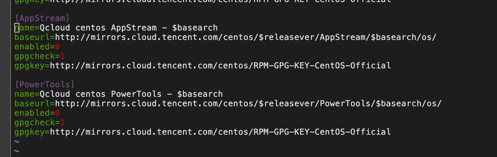
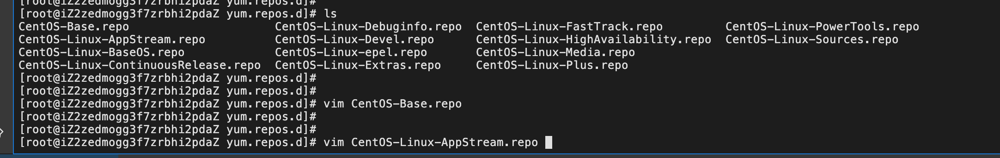

```
[AppStream]
name=Qcloud centos AppStream - $basearch
baseurl=http://mirrors.cloud.tencent.com/centos/$releasever/AppStream/$basearch/os/
enabled=0
gpgcheck=1
gpgkey=http://mirrors.cloud.tencent.com/centos/RPM-GPG-KEY-CentOS-Official
```





