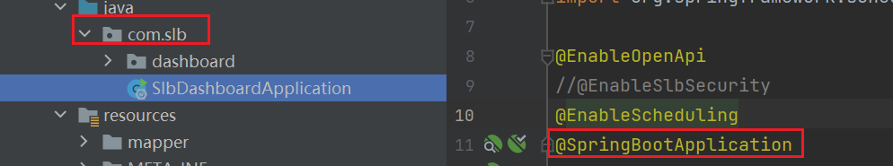

# springboot配置@aspect不生效

# 缘由

再写一个权限和日志的依赖jar包，关于日志模块，使用了@aspect注解，使用切面去获取错误日志，记录错误日志，但是install了这个jar包之后，项目当中使用，提示


# 排查

## 第一：查看全局扫描

- 配置的全局扫描路径是`com.slb`路径下的所有包



## 第二：查看切点

- 配置的是对于Operation注解的拦截

```java
@Around("@annotation(apiOperation)")
    public Object around(ProceedingJoinPoint joinPoint, Operation apiOperation) throws Throwable {
        // 可能也添加了 @Operation 注解
        OperateLog operateLog = getMethodAnnotation(joinPoint, OperateLog.class);
        return around0(joinPoint, operateLog, apiOperation);
    }
```

## 第三：检查依赖

```java
<dependency>
            <groupId>org.aspectj</groupId>
            <artifactId>aspectjweaver</artifactId>
        </dependency>
```

# 解决

最后发现了一个解决办法，将使用到jar包的服务，添加aspect的依赖就可以了