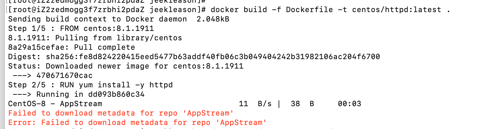
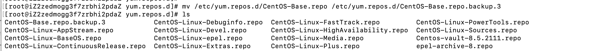
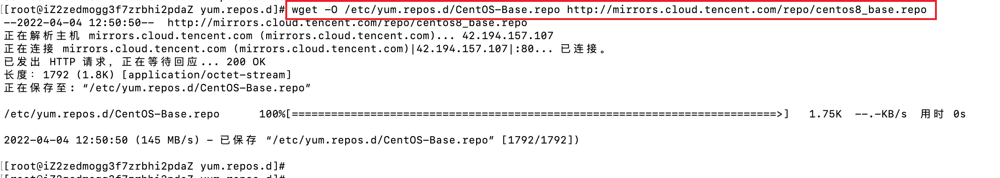
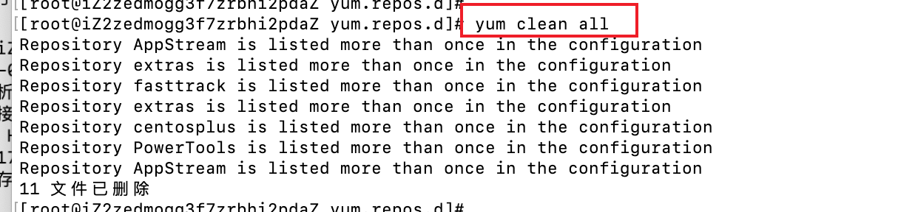
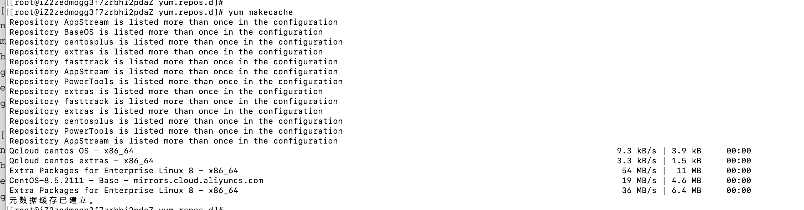

# Failed to download metadata for repo 'AppStream'

报错如下：

```
Failed to download metadata for repo 'AppStream'
Error: Failed to download metadata for repo 'AppStream'
```

截图如下：



解决方法：

- 先备份文件，执行`mv /etc/yum.repos.d/CentOS-Base.repo /etc/yum.repos.d/CentOS-Base.repo.backup.3`



- 执行`wget -O /etc/yum.repos.d/CentOS-Base.repo http://mirrors.cloud.tencent.com/repo/centos8_base.repo`



- 清理yum缓存



- 最后查看cat CentOS-Linux-BaseOS.repo 
  - 我这里执行了wget没有更新这个文件，所以我手动输入这个一下内容，正常的更新之后会有这些内容的，然后复制`AppStream`的内容

```
[root@iZ2zedmogg3f7zrbhi2pdaZ yum.repos.d]# cat CentOS-Linux-BaseOS.repo 
# CentOS-Linux-BaseOS.repo
#
# The mirrorlist system uses the connecting IP address of the client and the
# update status of each mirror to pick current mirrors that are geographically
# close to the client.  You should use this for CentOS updates unless you are
# manually picking other mirrors.
#
# If the mirrorlist does not work for you, you can try the commented out
# baseurl line instead.

#[baseos]
#name=CentOS Linux $releasever - BaseOS
#mirrorlist=http://mirrorlist.centos.org/?release=$releasever&arch=$basearch&repo=BaseOS&infra=$infra
#baseurl=http://mirrors.cloud.aliyuncs.com/$contentdir/$releasever/BaseOS/$basearch/os/
#baseurl=https://mirrors.aliyun.com/centos/$releasever/BaseOS/$basearch/os/
#gpgcheck=1
#enabled=1
#gpgkey=file:///etc/pki/rpm-gpg/RPM-GPG-KEY-centosofficial


[BaseOS]
name=Qcloud centos OS - $basearch
baseurl=http://mirrors.cloud.tencent.com/centos/$releasever/BaseOS/$basearch/os/
enabled=1
gpgcheck=1
gpgkey=http://mirrors.cloud.tencent.com/centos/RPM-GPG-KEY-CentOS-Official

[centosplus]
name=Qcloud centosplus - $basearch
baseurl=http://mirrors.cloud.tencent.com/centos/$releasever/centosplus/$basearch/os/
enabled=0
gpgcheck=1
gpgkey=http://mirrors.cloud.tencent.com/centos/RPM-GPG-KEY-CentOS-Official

[extras]
name=Qcloud centos extras - $basearch
baseurl=http://mirrors.cloud.tencent.com/centos/$releasever/extras/$basearch/os/
enabled=1
gpgcheck=1
gpgkey=http://mirrors.cloud.tencent.com/centos/RPM-GPG-KEY-CentOS-Official

[fasttrack]
name=Qcloud centos fasttrack - $basearch
baseurl=http://mirrors.cloud.tencent.com/centos/$releasever/fasttrack/$basearch/os/
enabled=0
gpgcheck=1
gpgkey=http://mirrors.cloud.tencent.com/centos/RPM-GPG-KEY-CentOS-Official

[AppStream]
name=Qcloud centos AppStream - $basearch
baseurl=http://mirrors.cloud.tencent.com/centos/$releasever/AppStream/$basearch/os/
enabled=0
gpgcheck=1
gpgkey=http://mirrors.cloud.tencent.com/centos/RPM-GPG-KEY-CentOS-Official

[PowerTools]
name=Qcloud centos PowerTools - $basearch
baseurl=http://mirrors.cloud.tencent.com/centos/$releasever/PowerTools/$basearch/os/
enabled=0
gpgcheck=1
gpgkey=http://mirrors.cloud.tencent.com/centos/RPM-GPG-KEY-CentOS-Official
```

- 更新AppStream的内容，执行`vim CentOS-Linux-AppStream.repo`

```
[root@iZ2zedmogg3f7zrbhi2pdaZ yum.repos.d]# cat CentOS-Linux-AppStream.repo 
# CentOS-Linux-AppStream.repo
#
# The mirrorlist system uses the connecting IP address of the client and the
# update status of each mirror to pick current mirrors that are geographically
# close to the client.  You should use this for CentOS updates unless you are
# manually picking other mirrors.
#
# If the mirrorlist does not work for you, you can try the commented out
# baseurl line instead.

#[appstream]
#name=CentOS Linux $releasever - AppStream
#mirrorlist=http://mirrorlist.centos.org/?release=$releasever&arch=$basearch&repo=AppStream&infra=$infra
#baseurl=http://mirrors.cloud.aliyuncs.com/$contentdir/$releasever/AppStream/$basearch/os/
#gpgcheck=1
#enabled=1
#gpgkey=file:///etc/pki/rpm-gpg/RPM-GPG-KEY-centosofficial

#[AppStream]
#name=Qcloud centos AppStream - $basearch
#baseurl=https://mirrors.aliyun.com/centos/$releasever/BaseOS/$basearch/os/
#enabled=0
#gpgcheck=1
#gpgkey=file:///etc/pki/rpm-gpg/RPM-GPG-KEY-centosofficial


[AppStream]
name=Qcloud centos AppStream - $basearch
baseurl=http://mirrors.cloud.tencent.com/centos/$releasever/AppStream/$basearch/os/
enabled=0
gpgcheck=1
gpgkey=http://mirrors.cloud.tencent.com/centos/RPM-GPG-KEY-CentOS-Official
```

- 然后重新执行。`yum makecache `



问题解决

