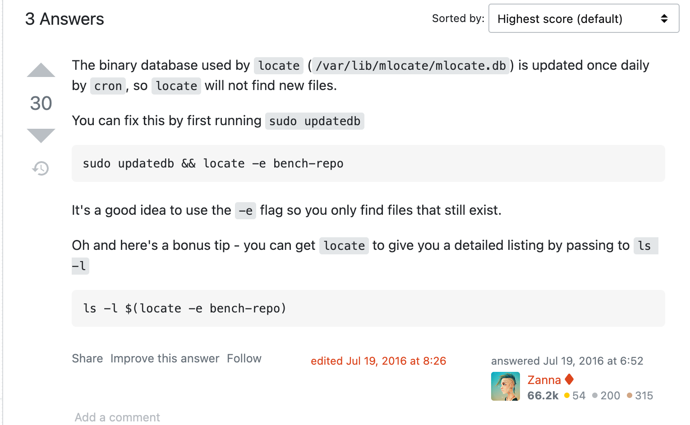

# /var/lib/mlocate/mlocate.db': 没有那个文件或目录

# 问题描述：

```bash
[root@iZ2zedmogg3f7zrbhi2pdaZ /]# locate /data
locate: 无法执行 stat () `/var/lib/mlocate/mlocate.db': 没有那个文件或目录
```

# 问题截图：


# 问题解决：

```
updatedb
```

解决截图：


参考链接

- https://askubuntu.com/questions/800347/cant-locate-a-directory-using-locate

截图：




# locate命令

- locate命令通过updatedb命令生成的数据库文件搜索给定模式，找到的结果显示在屏幕上，每行一个。在安装mlocate软件包期间，会创建一个每24小时运行updatedb命令的cron作业，这可确保定期更新数据库，有关cron作业的更多信息，请检查/etc/cron.daily/mlocate文件

- 更新过程将需要一些时间，具体取决于文件和目录的数量以及系统的速度。数据库更新后创建的文件不会显示在定位结果中。与搜索文件系统的更强大的find命令相比（参考：[在Linux系统中使用ls、tree和find快速定位文件](https://ywnz.com/linuxml/3628.html)），locate运行速度更快但缺少许多功能，并且只能通过文件名进行搜

  

  