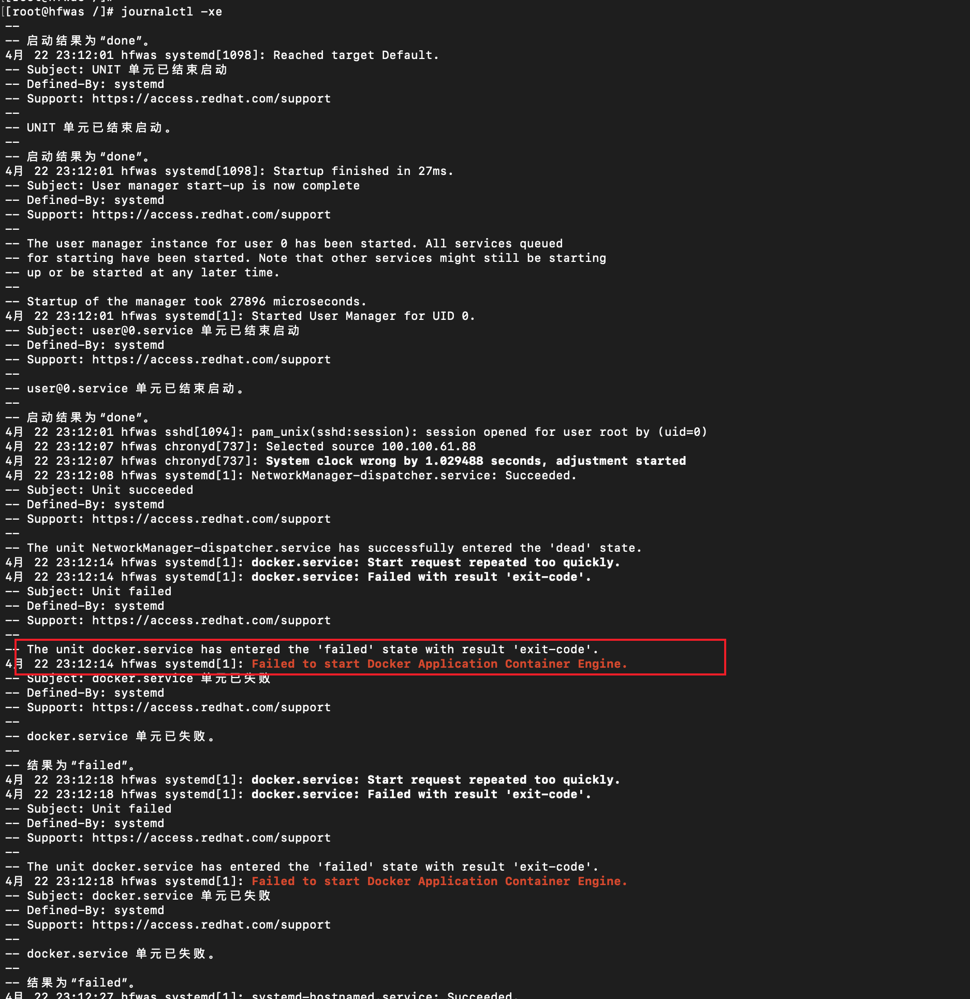
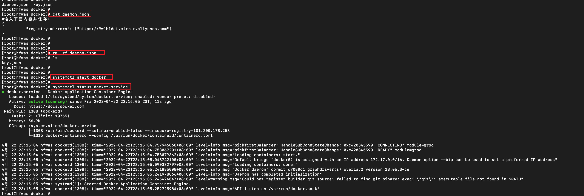
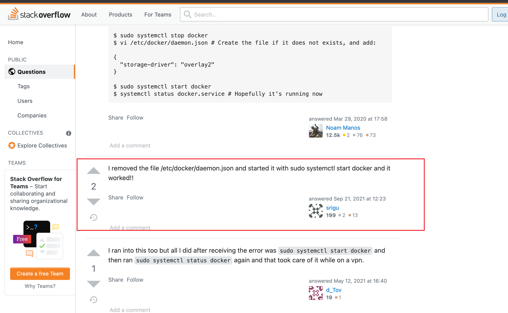

# Failed to start Docker Application Container Engine.

今天突然发现docker暂停了，启动不起来，文字描述如下：

```bash
[root@hfwas /]# docker ps 
Cannot connect to the Docker daemon at unix:///var/run/docker.sock. Is the docker daemon running?
[root@hfwas /]# 
[root@hfwas /]# 
[root@hfwas /]# 
[root@hfwas /]# systemctl start docker 
Job for docker.service failed because the control process exited with error code.
See "systemctl status docker.service" and "journalctl -xe" for details.
[root@hfwas /]# 
[root@hfwas /]# 
[root@hfwas /]# systemctl start docker 
Job for docker.service failed because the control process exited with error code.
See "systemctl status docker.service" and "journalctl -xe" for details.
```

执行`jouranalctl -xe `查看具体的报错信息如下所示：

```bash
[root@hfwas /]# journalctl -xe 
-- 
-- 启动结果为“done”。
4月 22 23:12:01 hfwas systemd[1098]: Reached target Default.
-- Subject: UNIT 单元已结束启动
-- Defined-By: systemd
-- Support: https://access.redhat.com/support
-- 
-- UNIT 单元已结束启动。
-- 
-- 启动结果为“done”。
4月 22 23:12:01 hfwas systemd[1098]: Startup finished in 27ms.
-- Subject: User manager start-up is now complete
-- Defined-By: systemd
-- Support: https://access.redhat.com/support
-- 
-- The user manager instance for user 0 has been started. All services queued
-- for starting have been started. Note that other services might still be starting
-- up or be started at any later time.
-- 
-- Startup of the manager took 27896 microseconds.
4月 22 23:12:01 hfwas systemd[1]: Started User Manager for UID 0.
-- Subject: user@0.service 单元已结束启动
-- Defined-By: systemd
-- Support: https://access.redhat.com/support
-- 
-- user@0.service 单元已结束启动。
-- 
-- 启动结果为“done”。
4月 22 23:12:01 hfwas sshd[1094]: pam_unix(sshd:session): session opened for user root by (uid=0)
4月 22 23:12:07 hfwas chronyd[737]: Selected source 100.100.61.88
4月 22 23:12:07 hfwas chronyd[737]: System clock wrong by 1.029488 seconds, adjustment started
4月 22 23:12:08 hfwas systemd[1]: NetworkManager-dispatcher.service: Succeeded.
-- Subject: Unit succeeded
-- Defined-By: systemd
-- Support: https://access.redhat.com/support
-- 
-- The unit NetworkManager-dispatcher.service has successfully entered the 'dead' state.
4月 22 23:12:14 hfwas systemd[1]: docker.service: Start request repeated too quickly.
4月 22 23:12:14 hfwas systemd[1]: docker.service: Failed with result 'exit-code'.
-- Subject: Unit failed
-- Defined-By: systemd
-- Support: https://access.redhat.com/support
-- 
-- The unit docker.service has entered the 'failed' state with result 'exit-code'.
4月 22 23:12:14 hfwas systemd[1]: Failed to start Docker Application Container Engine.
-- Subject: docker.service 单元已失败
-- Defined-By: systemd
-- Support: https://access.redhat.com/support
-- 
-- docker.service 单元已失败。
-- 
-- 结果为“failed”。
4月 22 23:12:18 hfwas systemd[1]: docker.service: Start request repeated too quickly.
4月 22 23:12:18 hfwas systemd[1]: docker.service: Failed with result 'exit-code'.
-- Subject: Unit failed
-- Defined-By: systemd
-- Support: https://access.redhat.com/support
-- 
-- The unit docker.service has entered the 'failed' state with result 'exit-code'.
4月 22 23:12:18 hfwas systemd[1]: Failed to start Docker Application Container Engine.
-- Subject: docker.service 单元已失败
-- Defined-By: systemd
-- Support: https://access.redhat.com/support
-- 
-- docker.service 单元已失败。
-- 
-- 结果为“failed”。
4月 22 23:12:27 hfwas systemd[1]: systemd-hostnamed.service: Succeeded.
-- Subject: Unit succeeded
-- Defined-By: systemd
-- Support: https://access.redhat.com/support
-- 
-- The unit systemd-hostnamed.service has successfully entered the 'dead' state.
```

截图如下：



经过谷歌搜索得到结局办法：

- 删除`/etc/docker/daemon.json`文件，然后重启dock er
- 在执行`systemctl start docker.service`



资料链接：

- https://stackoverflow.com/questions/49110092/failed-to-start-docker-application-container-engine
- 截图如下：

