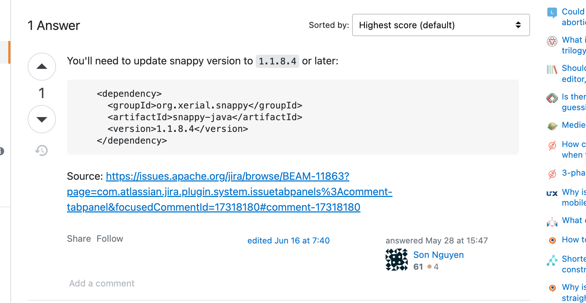

# 2022-07-10-报错no native library is found for os.name=Mac and os.arch=aarch64

# 报错信息

```java
[main] INFO org.apache.kafka.clients.producer.KafkaProducer - [Producer clientId=producer-1] Instantiated an idempotent producer.
[main] INFO org.apache.kafka.common.utils.AppInfoParser - Kafka version: 3.0.1
[main] INFO org.apache.kafka.common.utils.AppInfoParser - Kafka commitId: 8e30984f43e64d8b
[main] INFO org.apache.kafka.common.utils.AppInfoParser - Kafka startTimeMs: 1657442005031
[kafka-producer-network-thread | producer-1] INFO org.apache.kafka.clients.Metadata - [Producer clientId=producer-1] Resetting the last seen epoch of partition slyun-test-0 to 0 since the associated topicId changed from null to JtebY2IqR8-y5aIxRp5GAQ
[kafka-producer-network-thread | producer-1] INFO org.apache.kafka.clients.Metadata - [Producer clientId=producer-1] Cluster ID: mM1lllVkTS2hRbdXKyS3xA
[kafka-producer-network-thread | producer-1] INFO org.apache.kafka.clients.producer.internals.TransactionManager - [Producer clientId=producer-1] ProducerId set to 14 with epoch 0
Exception in thread "main" org.apache.kafka.common.KafkaException: org.xerial.snappy.SnappyError: [FAILED_TO_LOAD_NATIVE_LIBRARY] no native library is found for os.name=Mac and os.arch=aarch64
	at org.apache.kafka.common.compress.SnappyFactory.wrapForOutput(SnappyFactory.java:38)
	at org.apache.kafka.common.record.CompressionType$3.wrapForOutput(CompressionType.java:89)
	at org.apache.kafka.common.record.MemoryRecordsBuilder.<init>(MemoryRecordsBuilder.java:135)
	at org.apache.kafka.common.record.MemoryRecordsBuilder.<init>(MemoryRecordsBuilder.java:171)
	at org.apache.kafka.common.record.MemoryRecords.builder(MemoryRecords.java:524)
	at org.apache.kafka.common.record.MemoryRecords.builder(MemoryRecords.java:506)
	at org.apache.kafka.common.record.MemoryRecords.builder(MemoryRecords.java:454)
	at org.apache.kafka.clients.producer.internals.RecordAccumulator.recordsBuilder(RecordAccumulator.java:253)
	at org.apache.kafka.clients.producer.internals.RecordAccumulator.append(RecordAccumulator.java:229)
	at org.apache.kafka.clients.producer.KafkaProducer.doSend(KafkaProducer.java:940)
	at org.apache.kafka.clients.producer.KafkaProducer.send(KafkaProducer.java:861)
	at org.apache.kafka.clients.producer.KafkaProducer.send(KafkaProducer.java:747)
	at com.hfwas.produceer.CustomProducerParameters.main(CustomProducerParameters.java:28)
Caused by: org.xerial.snappy.SnappyError: [FAILED_TO_LOAD_NATIVE_LIBRARY] no native library is found for os.name=Mac and os.arch=aarch64
	at org.xerial.snappy.SnappyLoader.findNativeLibrary(SnappyLoader.java:361)
	at org.xerial.snappy.SnappyLoader.loadNativeLibrary(SnappyLoader.java:195)
	at org.xerial.snappy.SnappyLoader.loadSnappyApi(SnappyLoader.java:167)
	at org.xerial.snappy.Snappy.init(Snappy.java:69)
	at org.xerial.snappy.Snappy.<clinit>(Snappy.java:46)
	at org.xerial.snappy.SnappyOutputStream.<init>(SnappyOutputStream.java:99)
	at org.xerial.snappy.SnappyOutputStream.<init>(SnappyOutputStream.java:91)
	at org.xerial.snappy.SnappyOutputStream.<init>(SnappyOutputStream.java:81)
	at org.apache.kafka.common.compress.SnappyFactory.wrapForOutput(SnappyFactory.java:36)
	... 12 more
Disconnected from the target VM, address: '127.0.0.1:58357', transport: 'socket'

Process finished with exit code 1

```

# 报错截图


# 报错代码

```java
package com.hfwas.produceer;

import org.apache.kafka.clients.producer.KafkaProducer;
import org.apache.kafka.clients.producer.ProducerConfig;
import org.apache.kafka.clients.producer.ProducerRecord;
import org.apache.kafka.common.serialization.StringSerializer;

import java.util.Properties;

public class CustomProducerParameters {
    public static void main(String[] args) {
        Properties properties = new Properties();
        properties.setProperty(ProducerConfig.BOOTSTRAP_SERVERS_CONFIG, "127.0.0.1:9092");
        properties.setProperty(ProducerConfig.KEY_SERIALIZER_CLASS_CONFIG, StringSerializer.class.getName());
        properties.setProperty(ProducerConfig.VALUE_SERIALIZER_CLASS_CONFIG,StringSerializer.class.getName());
        // 配置缓冲区大小
        properties.setProperty(ProducerConfig.BUFFER_MEMORY_CONFIG, "33554432");
        // 配置批次大小
        properties.setProperty(ProducerConfig.BATCH_SIZE_CONFIG, "16384");
        // 配置压缩
        // compression.type：压缩，默认 none，可配置值 gzip、snappy、lz4 和 zstd
        properties.setProperty(ProducerConfig.COMPRESSION_TYPE_CONFIG,"snappy");
        // linger.ns
        properties.setProperty(ProducerConfig.LINGER_MS_CONFIG, "1");

        KafkaProducer<String, String> kafkaProducer = new KafkaProducer<String, String>(properties);
        for (int i = 0; i < 3; i++) {
            kafkaProducer.send(new ProducerRecord<>("slyun-test","hhhh"+i));
        }

        kafkaProducer.close();
    }
}
```

# 解决办法

- 目前pom.xml只添加了一个依赖，依赖如下：

```xml
<dependencies>
        <dependency>
            <groupId>org.springframework.kafka</groupId>
            <artifactId>spring-kafka</artifactId>
            <version>2.8.6</version>
        </dependency>
        <dependency>
            <groupId>org.slf4j</groupId>
            <artifactId>slf4j-simple</artifactId>
            <version>1.7.30</version>
        </dependency>
    </dependencies>
```

- 添加

```xml
<!--解决kafka配置compression.type，程序启动报错的问题-->
        <dependency>
            <groupId>org.xerial.snappy</groupId>
            <artifactId>snappy-java</artifactId>
            <version>1.1.8.4</version>
        </dependency>
```

# 解决截图


# 参考资料

- https://stackoverflow.com/questions/71707903/org-xerial-snappy-snappyerror-failed-to-load-native-library-no-native-library

