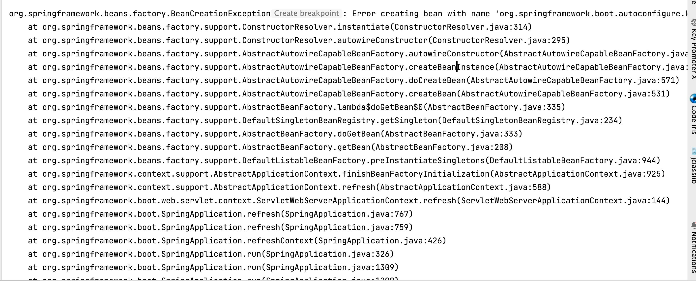
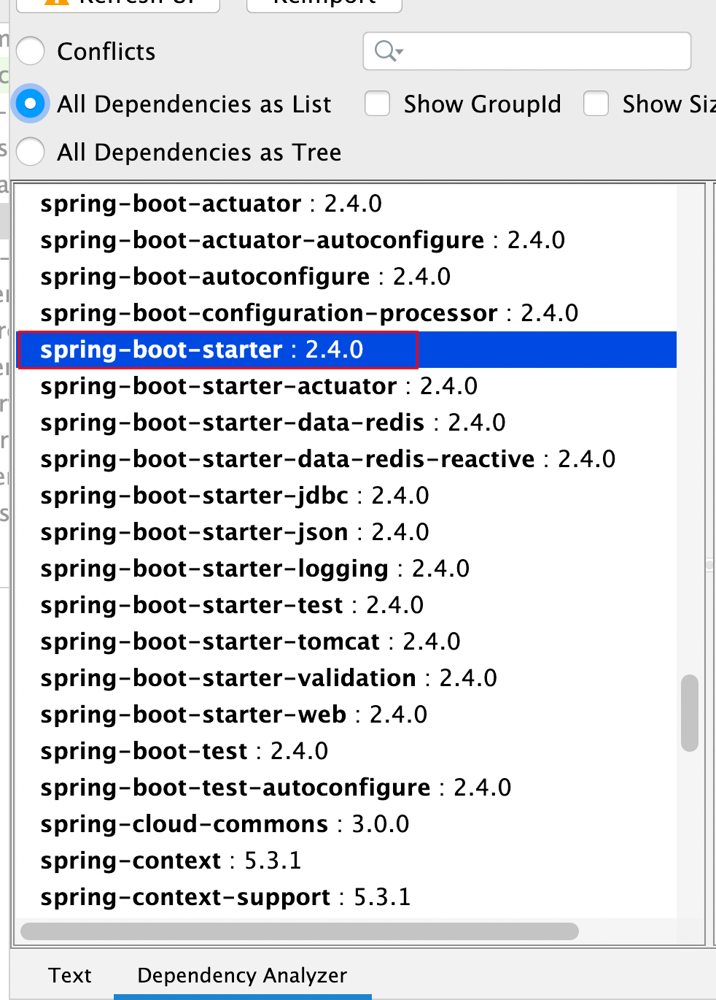

# 2022-07-11-


# 报错截图



# 报错详情

```
/Library/Java/JavaVirtualMachines/zulu-8.jdk/Contents/Home/bin/java -agentlib:jdwp=transport=dt_socket,address=127.0.0.1:49720,suspend=y,server=n -XX:TieredStopAtLevel=1 -noverify -Dspring.profiles.active=slb -Dspring.output.ansi.enabled=always -Dcom.sun.management.jmxremote -Dspring.jmx.enabled=true -Dspring.liveBeansView.mbeanDomain -Dspring.application.admin.enabled=true -javaagent:/Users/houfei/Library/Caches/JetBrains/IntelliJIdea2022.1/captureAgent/debugger-agent.jar -Dfile.encoding=UTF-8 -classpath /Library/Java/JavaVirtualMachines/zulu-8.jdk/Contents/Home/jre/lib/charsets.jar:/Library/Java/JavaVirtualMachines/zulu-8.jdk/Contents/Home/jre/lib/ext/cldrdata.jar:/Library/Java/JavaVirtualMachines/zulu-8.jdk/Contents/Home/jre/lib/ext/dnsns.jar:/Library/Java/JavaVirtualMachines/zulu-8.jdk/Contents/Home/jre/lib/ext/jaccess.jar:/Library/Java/JavaVirtualMachines/zulu-8.jdk/Contents/Home/jre/lib/ext/legacy8ujsse.jar:/Library/Java/JavaVirtualMachines/zulu-8.jdk/Contents/Home/jre/lib/ext/localedata.jar:/Library/Java/JavaVirtualMachines/zulu-8.jdk/Contents/Home/jre/lib/ext/nashorn.jar:/Library/Java/JavaVirtualMachines/zulu-8.jdk/Contents/Home/jre/lib/ext/openjsse.jar:/Library/Java/JavaVirtualMachines/zulu-8.jdk/Contents/Home/jre/lib/ext/sunec.jar:/Library/Java/JavaVirtualMachines/zulu-8.jdk/Contents/Home/jre/lib/ext/sunjce_provider.jar:/Library/Java/JavaVirtualMachines/zulu-8.jdk/Contents/Home/jre/lib/ext/sunpkcs11.jar:/Library/Java/JavaVirtualMachines/zulu-8.jdk/Contents/Home/jre/lib/ext/zipfs.jar:/Library/Java/JavaVirtualMachines/zulu-8.jdk/Contents/Home/jre/lib/jce.jar:/Library/Java/JavaVirtualMachines/zulu-8.jdk/Contents/Home/jre/lib/jfr.jar:/Library/Java/JavaVirtualMachines/zulu-8.jdk/Contents/Home/jre/lib/jsse.jar:/Library/Java/JavaVirtualMachines/zulu-8.jdk/Contents/Home/jre/lib/management-agent.jar:/Library/Java/JavaVirtualMachines/zulu-8.jdk/Contents/Home/jre/lib/resources.jar:/Library/Java/JavaVirtualMachines/zulu-8.jdk/Contents/Home/jre/lib/rt.jar:/Library/Java/JavaVirtualMachines/zulu-8.jdk/Contents/Home/lib/dt.jar:/Library/Java/JavaVirtualMachines/zulu-8.jdk/Contents/Home/lib/jconsole.jar:/Library/Java/JavaVirtualMachines/zulu-8.jdk/Contents/Home/lib/tools.jar:/Users/houfei/workspace/slb-microservice/target/classes:/Users/houfei/repository/org/springframework/kafka/spring-kafka/2.3.3.RELEASE/spring-kafka-2.3.3.RELEASE.jar:/Users/houfei/repository/org/apache/kafka/kafka-clients/2.6.0/kafka-clients-2.6.0.jar:/Users/houfei/repository/com/github/luben/zstd-jni/1.4.4-7/zstd-jni-1.4.4-7.jar:/Users/houfei/repository/org/lz4/lz4-java/1.7.1/lz4-java-1.7.1.jar:/Users/houfei/repository/org/xerial/snappy/snappy-java/1.1.7.3/snappy-java-1.1.7.3.jar:/Users/houfei/repository/org/slf4j/slf4j-api/1.7.30/slf4j-api-1.7.30.jar:/Users/houfei/repository/org/springframework/retry/spring-retry/1.3.0/spring-retry-1.3.0.jar:/Users/houfei/repository/org/springframework/spring-context/5.3.1/spring-context-5.3.1.jar:/Users/houfei/repository/org/springframework/spring-aop/5.3.1/spring-aop-5.3.1.jar:/Users/houfei/repository/org/springframework/spring-beans/5.3.1/spring-beans-5.3.1.jar:/Users/houfei/repository/org/springframework/spring-expression/5.3.1/spring-expression-5.3.1.jar:/Users/houfei/repository/org/springframework/spring-messaging/5.3.1/spring-messaging-5.3.1.jar:/Users/houfei/repository/org/springframework/spring-tx/5.3.1/spring-tx-5.3.1.jar:/Users/houfei/repository/org/springframework/boot/spring-boot-starter-json/2.4.0/spring-boot-starter-json-2.4.0.jar:/Users/houfei/repository/org/springframework/spring-web/5.3.1/spring-web-5.3.1.jar:/Users/houfei/repository/com/fasterxml/jackson/core/jackson-databind/2.11.3/jackson-databind-2.11.3.jar:/Users/houfei/repository/com/fasterxml/jackson/core/jackson-annotations/2.11.3/jackson-annotations-2.11.3.jar:/Users/houfei/repository/com/fasterxml/jackson/core/jackson-core/2.11.3/jackson-core-2.11.3.jar:/Users/houfei/repository/com/fasterxml/jackson/datatype/jackson-datatype-jdk8/2.11.3/jackson-datatype-jdk8-2.11.3.jar:/Users/houfei/repository/com/fasterxml/jackson/datatype/jackson-datatype-jsr310/2.11.3/jackson-datatype-jsr310-2.11.3.jar:/Users/houfei/repository/com/fasterxml/jackson/module/jackson-module-parameter-names/2.11.3/jackson-module-parameter-names-2.11.3.jar:/Users/houfei/repository/org/postgresql/postgresql/42.2.18/postgresql-42.2.18.jar:/Users/houfei/repository/org/checkerframework/checker-qual/3.5.0/checker-qual-3.5.0.jar:/Users/houfei/repository/cn/harmonycloud/harmony-redis-starter/1.0.0-8/harmony-redis-starter-1.0.0-8.jar:/Users/houfei/repository/org/springframework/boot/spring-boot-starter-data-redis/2.4.0/spring-boot-starter-data-redis-2.4.0.jar:/Users/houfei/repository/org/springframework/data/spring-data-redis/2.4.1/spring-data-redis-2.4.1.jar:/Users/houfei/repository/org/springframework/data/spring-data-keyvalue/2.4.1/spring-data-keyvalue-2.4.1.jar:/Users/houfei/repository/org/springframework/spring-oxm/5.3.1/spring-oxm-5.3.1.jar:/Users/houfei/repository/org/springframework/spring-context-support/5.3.1/spring-context-support-5.3.1.jar:/Users/houfei/repository/io/lettuce/lettuce-core/6.0.1.RELEASE/lettuce-core-6.0.1.RELEASE.jar:/Users/houfei/repository/io/netty/netty-common/4.1.54.Final/netty-common-4.1.54.Final.jar:/Users/houfei/repository/io/netty/netty-handler/4.1.54.Final/netty-handler-4.1.54.Final.jar:/Users/houfei/repository/io/netty/netty-resolver/4.1.54.Final/netty-resolver-4.1.54.Final.jar:/Users/houfei/repository/io/netty/netty-buffer/4.1.54.Final/netty-buffer-4.1.54.Final.jar:/Users/houfei/repository/io/netty/netty-codec/4.1.54.Final/netty-codec-4.1.54.Final.jar:/Users/houfei/repository/io/netty/netty-transport/4.1.54.Final/netty-transport-4.1.54.Final.jar:/Users/houfei/repository/io/projectreactor/reactor-core/3.4.0/reactor-core-3.4.0.jar:/Users/houfei/repository/org/reactivestreams/reactive-streams/1.0.3/reactive-streams-1.0.3.jar:/Users/houfei/repository/org/springframework/boot/spring-boot-starter-data-redis-reactive/2.4.0/spring-boot-starter-data-redis-reactive-2.4.0.jar:/Users/houfei/repository/com/squareup/okhttp/okhttp/2.5.0/okhttp-2.5.0.jar:/Users/houfei/repository/com/squareup/okio/okio/1.6.0/okio-1.6.0.jar:/Users/houfei/repository/com/github/javadev/okio/1.6.0/okio-1.6.0.jar:/Users/houfei/repository/com/google/code/gson/gson/2.8.7/gson-2.8.7.jar:/Users/houfei/repository/javax/xml/bind/jaxb-api/2.3.0/jaxb-api-2.3.0.jar:/Users/houfei/repository/com/tcecloudapi/tcecloud-sdk-java/3.1.6/tcecloud-sdk-java-3.1.6.jar:/Users/houfei/repository/cn/harmonycloud/harmony-web-starter/1.0.0-8/harmony-web-starter-1.0.0-8.jar:/Users/houfei/repository/org/springframework/boot/spring-boot-starter-web/2.4.0/spring-boot-starter-web-2.4.0.jar:/Users/houfei/repository/org/springframework/boot/spring-boot-starter-tomcat/2.4.0/spring-boot-starter-tomcat-2.4.0.jar:/Users/houfei/repository/org/apache/tomcat/embed/tomcat-embed-core/9.0.39/tomcat-embed-core-9.0.39.jar:/Users/houfei/repository/org/apache/tomcat/embed/tomcat-embed-websocket/9.0.39/tomcat-embed-websocket-9.0.39.jar:/Users/houfei/repository/cn/harmonycloud/harmony-openapi-starter/1.0.0-8/harmony-openapi-starter-1.0.0-8.jar:/Users/houfei/repository/org/springdoc/springdoc-openapi-data-rest/1.5.2/springdoc-openapi-data-rest-1.5.2.jar:/Users/houfei/repository/org/springdoc/springdoc-openapi-hateoas/1.5.2/springdoc-openapi-hateoas-1.5.2.jar:/Users/houfei/repository/org/springdoc/springdoc-openapi-common/1.5.2/springdoc-openapi-common-1.5.2.jar:/Users/houfei/repository/io/swagger/core/v3/swagger-models/2.1.6/swagger-models-2.1.6.jar:/Users/houfei/repository/io/swagger/core/v3/swagger-integration/2.1.6/swagger-integration-2.1.6.jar:/Users/houfei/repository/io/swagger/core/v3/swagger-core/2.1.6/swagger-core-2.1.6.jar:/Users/houfei/repository/com/fasterxml/jackson/dataformat/jackson-dataformat-yaml/2.11.3/jackson-dataformat-yaml-2.11.3.jar:/Users/houfei/repository/io/github/classgraph/classgraph/4.8.69/classgraph-4.8.69.jar:/Users/houfei/repository/org/springframework/hateoas/spring-hateoas/1.2.1/spring-hateoas-1.2.1.jar:/Users/houfei/repository/org/springframework/data/spring-data-rest-core/3.4.1/spring-data-rest-core-3.4.1.jar:/Users/houfei/repository/org/springframework/data/spring-data-commons/2.4.1/spring-data-commons-2.4.1.jar:/Users/houfei/repository/org/springframework/plugin/spring-plugin-core/2.0.0.RELEASE/spring-plugin-core-2.0.0.RELEASE.jar:/Users/houfei/repository/org/atteo/evo-inflector/1.2.2/evo-inflector-1.2.2.jar:/Users/houfei/repository/org/springdoc/springdoc-openapi-ui/1.5.2/springdoc-openapi-ui-1.5.2.jar:/Users/houfei/repository/org/springdoc/springdoc-openapi-webmvc-core/1.5.2/springdoc-openapi-webmvc-core-1.5.2.jar:/Users/houfei/repository/org/webjars/swagger-ui/3.38.0/swagger-ui-3.38.0.jar:/Users/houfei/repository/org/webjars/webjars-locator-core/0.46/webjars-locator-core-0.46.jar:/Users/houfei/repository/com/slb/slb-auth-service/1.0.0/slb-auth-service-1.0.0.jar:/Users/houfei/repository/org/springframework/boot/spring-boot-starter-logging/2.4.0/spring-boot-starter-logging-2.4.0.jar:/Users/houfei/repository/ch/qos/logback/logback-classic/1.2.3/logback-classic-1.2.3.jar:/Users/houfei/repository/ch/qos/logback/logback-core/1.2.3/logback-core-1.2.3.jar:/Users/houfei/repository/org/apache/logging/log4j/log4j-to-slf4j/2.13.3/log4j-to-slf4j-2.13.3.jar:/Users/houfei/repository/org/apache/logging/log4j/log4j-api/2.13.3/log4j-api-2.13.3.jar:/Users/houfei/repository/org/slf4j/jul-to-slf4j/1.7.30/jul-to-slf4j-1.7.30.jar:/Users/houfei/repository/com/auth0/java-jwt/3.8.3/java-jwt-3.8.3.jar:/Users/houfei/repository/commons-codec/commons-codec/1.15/commons-codec-1.15.jar:/Users/houfei/repository/com/alibaba/fastjson/1.2.75/fastjson-1.2.75.jar:/Users/houfei/repository/com/slb/slb-auth-core/1.0.0/slb-auth-core-1.0.0.jar:/Users/houfei/repository/eu/bitwalker/UserAgentUtils/1.21/UserAgentUtils-1.21.jar:/Users/houfei/repository/cn/hutool/hutool-all/5.7.15/hutool-all-5.7.15.jar:/Users/houfei/repository/io/swagger/core/v3/swagger-annotations/2.1.6/swagger-annotations-2.1.6.jar:/Users/houfei/repository/cn/harmonycloud/harmony-mybatis-starter/1.0.0-8/harmony-mybatis-starter-1.0.0-8.jar:/Users/houfei/repository/cn/harmonycloud/harmony-sequence-starter/1.0.0-8/harmony-sequence-starter-1.0.0-8.jar:/Users/houfei/repository/mysql/mysql-connector-java/8.0.22/mysql-connector-java-8.0.22.jar:/Users/houfei/repository/com/baomidou/mybatis-plus-boot-starter/3.4.0/mybatis-plus-boot-starter-3.4.0.jar:/Users/houfei/repository/com/baomidou/mybatis-plus/3.4.0/mybatis-plus-3.4.0.jar:/Users/houfei/repository/com/baomidou/mybatis-plus-extension/3.4.0/mybatis-plus-extension-3.4.0.jar:/Users/houfei/repository/com/baomidou/mybatis-plus-core/3.4.0/mybatis-plus-core-3.4.0.jar:/Users/houfei/repository/com/github/jsqlparser/jsqlparser/3.2/jsqlparser-3.2.jar:/Users/houfei/repository/org/mybatis/mybatis/3.5.5/mybatis-3.5.5.jar:/Users/houfei/repository/org/mybatis/mybatis-spring/2.0.5/mybatis-spring-2.0.5.jar:/Users/houfei/repository/org/springframework/boot/spring-boot-starter-jdbc/2.4.0/spring-boot-starter-jdbc-2.4.0.jar:/Users/houfei/repository/com/zaxxer/HikariCP/3.4.5/HikariCP-3.4.5.jar:/Users/houfei/repository/org/springframework/spring-jdbc/5.3.1/spring-jdbc-5.3.1.jar:/Users/houfei/repository/org/springframework/spring-webmvc/5.3.1/spring-webmvc-5.3.1.jar:/Users/houfei/repository/org/aspectj/aspectjweaver/1.9.6/aspectjweaver-1.9.6.jar:/Users/houfei/repository/cn/harmonycloud/harmony-common-core/1.0.0-8/harmony-common-core-1.0.0-8.jar:/Users/houfei/repository/com/alibaba/transmittable-thread-local/2.12.0/transmittable-thread-local-2.12.0.jar:/Users/houfei/repository/io/swagger/swagger-annotations/1.5.22/swagger-annotations-1.5.22.jar:/Users/houfei/repository/org/apache/commons/commons-lang3/3.11/commons-lang3-3.11.jar:/Users/houfei/repository/commons-io/commons-io/2.7/commons-io-2.7.jar:/Users/houfei/repository/org/apache/poi/poi-ooxml/4.1.2/poi-ooxml-4.1.2.jar:/Users/houfei/repository/org/apache/poi/poi/4.1.2/poi-4.1.2.jar:/Users/houfei/repository/org/apache/commons/commons-collections4/4.4/commons-collections4-4.4.jar:/Users/houfei/repository/org/apache/commons/commons-math3/3.6.1/commons-math3-3.6.1.jar:/Users/houfei/repository/com/zaxxer/SparseBitSet/1.2/SparseBitSet-1.2.jar:/Users/houfei/repository/org/apache/poi/poi-ooxml-schemas/4.1.2/poi-ooxml-schemas-4.1.2.jar:/Users/houfei/repository/org/apache/xmlbeans/xmlbeans/3.1.0/xmlbeans-3.1.0.jar:/Users/houfei/repository/org/apache/commons/commons-compress/1.19/commons-compress-1.19.jar:/Users/houfei/repository/com/github/virtuald/curvesapi/1.06/curvesapi-1.06.jar:/Users/houfei/repository/org/yaml/snakeyaml/1.27/snakeyaml-1.27.jar:/Users/houfei/repository/com/baomidou/mybatis-plus-annotation/3.4.1/mybatis-plus-annotation-3.4.1.jar:/Users/houfei/repository/com/google/guava/guava/29.0-jre/guava-29.0-jre.jar:/Users/houfei/repository/com/google/guava/failureaccess/1.0.1/failureaccess-1.0.1.jar:/Users/houfei/repository/com/google/guava/listenablefuture/9999.0-empty-to-avoid-conflict-with-guava/listenablefuture-9999.0-empty-to-avoid-conflict-with-guava.jar:/Users/houfei/repository/com/google/code/findbugs/jsr305/3.0.2/jsr305-3.0.2.jar:/Users/houfei/repository/com/google/errorprone/error_prone_annotations/2.3.4/error_prone_annotations-2.3.4.jar:/Users/houfei/repository/com/google/j2objc/j2objc-annotations/1.3/j2objc-annotations-1.3.jar:/Users/houfei/repository/org/aspectj/aspectjrt/1.9.6/aspectjrt-1.9.6.jar:/Users/houfei/repository/javax/servlet/javax.servlet-api/4.0.1/javax.servlet-api-4.0.1.jar:/Users/houfei/repository/org/springframework/boot/spring-boot-starter-validation/2.4.0/spring-boot-starter-validation-2.4.0.jar:/Users/houfei/repository/org/glassfish/jakarta.el/3.0.3/jakarta.el-3.0.3.jar:/Users/houfei/repository/org/hibernate/validator/hibernate-validator/6.1.6.Final/hibernate-validator-6.1.6.Final.jar:/Users/houfei/repository/jakarta/validation/jakarta.validation-api/2.0.2/jakarta.validation-api-2.0.2.jar:/Users/houfei/repository/org/jboss/logging/jboss-logging/3.4.1.Final/jboss-logging-3.4.1.Final.jar:/Users/houfei/repository/com/fasterxml/classmate/1.5.1/classmate-1.5.1.jar:/Users/houfei/repository/org/springframework/boot/spring-boot-starter-test/2.4.0/spring-boot-starter-test-2.4.0.jar:/Users/houfei/repository/org/springframework/boot/spring-boot-test/2.4.0/spring-boot-test-2.4.0.jar:/Users/houfei/repository/org/springframework/boot/spring-boot-test-autoconfigure/2.4.0/spring-boot-test-autoconfigure-2.4.0.jar:/Users/houfei/repository/com/jayway/jsonpath/json-path/2.4.0/json-path-2.4.0.jar:/Users/houfei/repository/net/minidev/json-smart/2.3/json-smart-2.3.jar:/Users/houfei/repository/net/minidev/accessors-smart/1.2/accessors-smart-1.2.jar:/Users/houfei/repository/org/ow2/asm/asm/5.0.4/asm-5.0.4.jar:/Users/houfei/repository/jakarta/xml/bind/jakarta.xml.bind-api/2.3.3/jakarta.xml.bind-api-2.3.3.jar:/Users/houfei/repository/jakarta/activation/jakarta.activation-api/1.2.2/jakarta.activation-api-1.2.2.jar:/Users/houfei/repository/org/assertj/assertj-core/3.18.1/assertj-core-3.18.1.jar:/Users/houfei/repository/org/hamcrest/hamcrest/2.2/hamcrest-2.2.jar:/Users/houfei/repository/org/junit/jupiter/junit-jupiter/5.7.0/junit-jupiter-5.7.0.jar:/Users/houfei/repository/org/junit/jupiter/junit-jupiter-api/5.7.0/junit-jupiter-api-5.7.0.jar:/Users/houfei/repository/org/apiguardian/apiguardian-api/1.1.0/apiguardian-api-1.1.0.jar:/Users/houfei/repository/org/opentest4j/opentest4j/1.2.0/opentest4j-1.2.0.jar:/Users/houfei/repository/org/junit/platform/junit-platform-commons/1.7.0/junit-platform-commons-1.7.0.jar:/Users/houfei/repository/org/junit/jupiter/junit-jupiter-params/5.7.0/junit-jupiter-params-5.7.0.jar:/Users/houfei/repository/org/junit/jupiter/junit-jupiter-engine/5.7.0/junit-jupiter-engine-5.7.0.jar:/Users/houfei/repository/org/junit/platform/junit-platform-engine/1.7.0/junit-platform-engine-1.7.0.jar:/Users/houfei/repository/org/mockito/mockito-core/3.6.0/mockito-core-3.6.0.jar:/Users/houfei/repository/net/bytebuddy/byte-buddy/1.10.18/byte-buddy-1.10.18.jar:/Users/houfei/repository/net/bytebuddy/byte-buddy-agent/1.10.18/byte-buddy-agent-1.10.18.jar:/Users/houfei/repository/org/objenesis/objenesis/3.1/objenesis-3.1.jar:/Users/houfei/repository/org/mockito/mockito-junit-jupiter/3.6.0/mockito-junit-jupiter-3.6.0.jar:/Users/houfei/repository/org/skyscreamer/jsonassert/1.5.0/jsonassert-1.5.0.jar:/Users/houfei/repository/com/vaadin/external/google/android-json/0.0.20131108.vaadin1/android-json-0.0.20131108.vaadin1.jar:/Users/houfei/repository/org/springframework/spring-test/5.3.1/spring-test-5.3.1.jar:/Users/houfei/repository/org/xmlunit/xmlunit-core/2.7.0/xmlunit-core-2.7.0.jar:/Users/houfei/repository/org/springframework/cloud/spring-cloud-commons/3.0.0/spring-cloud-commons-3.0.0.jar:/Users/houfei/repository/org/springframework/security/spring-security-crypto/5.4.1/spring-security-crypto-5.4.1.jar:/Users/houfei/repository/cn/harmonycloud/harmony-pipeline-helper-starter/1.0.0-8/harmony-pipeline-helper-starter-1.0.0-8.jar:/Users/houfei/repository/org/springframework/boot/spring-boot-starter/2.4.0/spring-boot-starter-2.4.0.jar:/Users/houfei/repository/org/springframework/boot/spring-boot/2.4.0/spring-boot-2.4.0.jar:/Users/houfei/repository/org/springframework/boot/spring-boot-autoconfigure/2.4.0/spring-boot-autoconfigure-2.4.0.jar:/Users/houfei/repository/jakarta/annotation/jakarta.annotation-api/1.3.5/jakarta.annotation-api-1.3.5.jar:/Users/houfei/repository/org/springframework/spring-core/5.3.1/spring-core-5.3.1.jar:/Users/houfei/repository/org/springframework/spring-jcl/5.3.1/spring-jcl-5.3.1.jar:/Users/houfei/repository/org/springframework/boot/spring-boot-starter-actuator/2.4.0/spring-boot-starter-actuator-2.4.0.jar:/Users/houfei/repository/org/springframework/boot/spring-boot-actuator-autoconfigure/2.4.0/spring-boot-actuator-autoconfigure-2.4.0.jar:/Users/houfei/repository/org/springframework/boot/spring-boot-actuator/2.4.0/spring-boot-actuator-2.4.0.jar:/Users/houfei/repository/io/micrometer/micrometer-core/1.6.1/micrometer-core-1.6.1.jar:/Users/houfei/repository/org/hdrhistogram/HdrHistogram/2.1.12/HdrHistogram-2.1.12.jar:/Users/houfei/repository/org/latencyutils/LatencyUtils/2.0.3/LatencyUtils-2.0.3.jar:/Users/houfei/repository/org/springframework/boot/spring-boot-configuration-processor/2.4.0/spring-boot-configuration-processor-2.4.0.jar:/Users/houfei/repository/org/projectlombok/lombok/1.18.16/lombok-1.18.16.jar:/Users/houfei/Library/Application Support/JetBrains/Toolbox/apps/IDEA-U/ch-0/221.5787.30/IntelliJ IDEA.app/Contents/lib/idea_rt.jar com.slb.SlbDashboardApplication
Connected to the target VM, address: '127.0.0.1:49720', transport: 'socket'

  .   ____          _            __ _ _
 /\\ / ___'_ __ _ _(_)_ __  __ _ \ \ \ \
( ( )\___ | '_ | '_| | '_ \/ _` | \ \ \ \
 \\/  ___)| |_)| | | | | || (_| |  ) ) ) )
  '  |____| .__|_| |_|_| |_\__, | / / / /
 =========|_|==============|___/=/_/_/_/
 :: Spring Boot ::                (v2.4.0)

2022-07-11 09:51:53.947  INFO 74640 --- [kground-preinit] o.h.validator.internal.util.Version      : HV000001: Hibernate Validator 6.1.6.Final
2022-07-11 09:51:53.948  INFO 74640 --- [           main] com.slb.SlbDashboardApplication          : Starting SlbDashboardApplication using Java 1.8.0_332 on houfeideMacBook-Pro.local with PID 74640 (/Users/houfei/workspace/slb-microservice/target/classes started by houfei in /Users/houfei/workspace/slb-microservice)
2022-07-11 09:51:53.949  INFO 74640 --- [           main] com.slb.SlbDashboardApplication          : The following profiles are active: slb
2022-07-11 09:51:54.659  INFO 74640 --- [           main] .s.d.r.c.RepositoryConfigurationDelegate : Multiple Spring Data modules found, entering strict repository configuration mode!
2022-07-11 09:51:54.660  INFO 74640 --- [           main] .s.d.r.c.RepositoryConfigurationDelegate : Bootstrapping Spring Data Redis repositories in DEFAULT mode.
2022-07-11 09:51:54.685  INFO 74640 --- [           main] .s.d.r.c.RepositoryConfigurationDelegate : Finished Spring Data repository scanning in 16 ms. Found 0 Redis repository interfaces.
2022-07-11 09:51:55.178  INFO 74640 --- [           main] o.s.b.w.embedded.tomcat.TomcatWebServer  : Tomcat initialized with port(s): 8082 (http)
2022-07-11 09:51:55.182  INFO 74640 --- [           main] o.a.coyote.http11.Http11NioProtocol      : Initializing ProtocolHandler ["http-nio-8082"]
2022-07-11 09:51:55.183  INFO 74640 --- [           main] o.apache.catalina.core.StandardService   : Starting service [Tomcat]
2022-07-11 09:51:55.183  INFO 74640 --- [           main] org.apache.catalina.core.StandardEngine  : Starting Servlet engine: [Apache Tomcat/9.0.39]
2022-07-11 09:51:55.223  INFO 74640 --- [           main] o.a.c.c.C.[Tomcat].[localhost].[/]       : Initializing Spring embedded WebApplicationContext
2022-07-11 09:51:55.223  INFO 74640 --- [           main] w.s.c.ServletWebServerApplicationContext : Root WebApplicationContext: initialization completed in 1237 ms
2022-07-11 09:51:55.420  INFO 74640 --- [           main] c.h.s.builder.SnowflakeSeqBuilder        : Sequence workId init success: 1
 _ _   |_  _ _|_. ___ _ |    _ 
| | |\/|_)(_| | |_\  |_)||_|_\ 
     /               |         
                        3.4.0 
2022-07-11 09:51:55.883  INFO 74640 --- [           main] c.s.a.c.s.AuthServiceConfiguration       : token验证已启动
2022-07-11 09:51:55.885  INFO 74640 --- [           main] c.s.a.c.s.AuthServiceConfiguration       : 业务日志开始打印：
2022-07-11 09:51:55.995  INFO 74640 --- [           main] o.s.s.concurrent.ThreadPoolTaskExecutor  : Initializing ExecutorService 'applicationTaskExecutor'
2022-07-11 09:51:56.289  INFO 74640 --- [           main] c.h.s.builder.SnowflakeSeqBuilder        : Sequence workId init success: 1
2022-07-11 09:51:56.298  INFO 74640 --- [           main] c.h.c.pipelineHelper.AutoBuildConfig     : ProjectInfo{name='slb-dashboard', version='1.0.0-8', time=2022-07-06T02:54:38.462Z, artifact='slb-dashboard', group='cn.harmonycloud', javaVersion='8', activeProfiles='slb', gitCommitId='1a4e009605835aac00f5af397dbe4f2fce17805c', gitBranch='new-interface', getCommitMsg='add:获取所有服务列表', getCommitIdAbbrev='1a4e009}
2022-07-11 09:51:56.632  WARN 74640 --- [           main] ConfigServletWebServerApplicationContext : Exception encountered during context initialization - cancelling refresh attempt: org.springframework.beans.factory.BeanCreationException: Error creating bean with name 'org.springframework.boot.autoconfigure.kafka.KafkaAnnotationDrivenConfiguration': Bean instantiation via constructor failed; nested exception is org.springframework.beans.BeanInstantiationException: Failed to instantiate [org.springframework.boot.autoconfigure.kafka.KafkaAnnotationDrivenConfiguration]: Constructor threw exception; nested exception is org.springframework.beans.factory.UnsatisfiedDependencyException: Error creating bean with name 'kafkaTemplate' defined in class path resource [org/springframework/boot/autoconfigure/kafka/KafkaAutoConfiguration.class]: Unsatisfied dependency expressed through method 'kafkaTemplate' parameter 0; nested exception is org.springframework.beans.factory.BeanCreationException: Error creating bean with name 'kafkaProducerFactory' defined in class path resource [org/springframework/boot/autoconfigure/kafka/KafkaAutoConfiguration.class]: Bean instantiation via factory method failed; nested exception is org.springframework.beans.BeanInstantiationException: Failed to instantiate [org.springframework.kafka.core.ProducerFactory]: Factory method 'kafkaProducerFactory' threw exception; nested exception is java.lang.NoClassDefFoundError: org/springframework/kafka/core/MicrometerProducerListener
2022-07-11 09:51:56.633  INFO 74640 --- [           main] o.s.s.concurrent.ThreadPoolTaskExecutor  : Shutting down ExecutorService 'applicationTaskExecutor'
2022-07-11 09:51:56.645  INFO 74640 --- [           main] o.apache.catalina.core.StandardService   : Stopping service [Tomcat]
2022-07-11 09:51:56.655  INFO 74640 --- [           main] ConditionEvaluationReportLoggingListener : 

Error starting ApplicationContext. To display the conditions report re-run your application with 'debug' enabled.
2022-07-11 09:51:56.760 ERROR 74640 --- [           main] o.s.boot.SpringApplication               : Application run failed

org.springframework.beans.factory.BeanCreationException: Error creating bean with name 'org.springframework.boot.autoconfigure.kafka.KafkaAnnotationDrivenConfiguration': Bean instantiation via constructor failed; nested exception is org.springframework.beans.BeanInstantiationException: Failed to instantiate [org.springframework.boot.autoconfigure.kafka.KafkaAnnotationDrivenConfiguration]: Constructor threw exception; nested exception is org.springframework.beans.factory.UnsatisfiedDependencyException: Error creating bean with name 'kafkaTemplate' defined in class path resource [org/springframework/boot/autoconfigure/kafka/KafkaAutoConfiguration.class]: Unsatisfied dependency expressed through method 'kafkaTemplate' parameter 0; nested exception is org.springframework.beans.factory.BeanCreationException: Error creating bean with name 'kafkaProducerFactory' defined in class path resource [org/springframework/boot/autoconfigure/kafka/KafkaAutoConfiguration.class]: Bean instantiation via factory method failed; nested exception is org.springframework.beans.BeanInstantiationException: Failed to instantiate [org.springframework.kafka.core.ProducerFactory]: Factory method 'kafkaProducerFactory' threw exception; nested exception is java.lang.NoClassDefFoundError: org/springframework/kafka/core/MicrometerProducerListener
	at org.springframework.beans.factory.support.ConstructorResolver.instantiate(ConstructorResolver.java:314)
	at org.springframework.beans.factory.support.ConstructorResolver.autowireConstructor(ConstructorResolver.java:295)
	at org.springframework.beans.factory.support.AbstractAutowireCapableBeanFactory.autowireConstructor(AbstractAutowireCapableBeanFactory.java:1356)
	at org.springframework.beans.factory.support.AbstractAutowireCapableBeanFactory.createBeanInstance(AbstractAutowireCapableBeanFactory.java:1206)
	at org.springframework.beans.factory.support.AbstractAutowireCapableBeanFactory.doCreateBean(AbstractAutowireCapableBeanFactory.java:571)
	at org.springframework.beans.factory.support.AbstractAutowireCapableBeanFactory.createBean(AbstractAutowireCapableBeanFactory.java:531)
	at org.springframework.beans.factory.support.AbstractBeanFactory.lambda$doGetBean$0(AbstractBeanFactory.java:335)
	at org.springframework.beans.factory.support.DefaultSingletonBeanRegistry.getSingleton(DefaultSingletonBeanRegistry.java:234)
	at org.springframework.beans.factory.support.AbstractBeanFactory.doGetBean(AbstractBeanFactory.java:333)
	at org.springframework.beans.factory.support.AbstractBeanFactory.getBean(AbstractBeanFactory.java:208)
	at org.springframework.beans.factory.support.DefaultListableBeanFactory.preInstantiateSingletons(DefaultListableBeanFactory.java:944)
	at org.springframework.context.support.AbstractApplicationContext.finishBeanFactoryInitialization(AbstractApplicationContext.java:925)
	at org.springframework.context.support.AbstractApplicationContext.refresh(AbstractApplicationContext.java:588)
	at org.springframework.boot.web.servlet.context.ServletWebServerApplicationContext.refresh(ServletWebServerApplicationContext.java:144)
	at org.springframework.boot.SpringApplication.refresh(SpringApplication.java:767)
	at org.springframework.boot.SpringApplication.refresh(SpringApplication.java:759)
	at org.springframework.boot.SpringApplication.refreshContext(SpringApplication.java:426)
	at org.springframework.boot.SpringApplication.run(SpringApplication.java:326)
	at org.springframework.boot.SpringApplication.run(SpringApplication.java:1309)
	at org.springframework.boot.SpringApplication.run(SpringApplication.java:1298)
	at com.slb.SlbDashboardApplication.main(SlbDashboardApplication.java:16)
Caused by: org.springframework.beans.BeanInstantiationException: Failed to instantiate [org.springframework.boot.autoconfigure.kafka.KafkaAnnotationDrivenConfiguration]: Constructor threw exception; nested exception is org.springframework.beans.factory.UnsatisfiedDependencyException: Error creating bean with name 'kafkaTemplate' defined in class path resource [org/springframework/boot/autoconfigure/kafka/KafkaAutoConfiguration.class]: Unsatisfied dependency expressed through method 'kafkaTemplate' parameter 0; nested exception is org.springframework.beans.factory.BeanCreationException: Error creating bean with name 'kafkaProducerFactory' defined in class path resource [org/springframework/boot/autoconfigure/kafka/KafkaAutoConfiguration.class]: Bean instantiation via factory method failed; nested exception is org.springframework.beans.BeanInstantiationException: Failed to instantiate [org.springframework.kafka.core.ProducerFactory]: Factory method 'kafkaProducerFactory' threw exception; nested exception is java.lang.NoClassDefFoundError: org/springframework/kafka/core/MicrometerProducerListener
	at org.springframework.beans.BeanUtils.instantiateClass(BeanUtils.java:225)
	at org.springframework.beans.factory.support.SimpleInstantiationStrategy.instantiate(SimpleInstantiationStrategy.java:117)
	at org.springframework.beans.factory.support.ConstructorResolver.instantiate(ConstructorResolver.java:310)
	... 20 common frames omitted
Caused by: org.springframework.beans.factory.UnsatisfiedDependencyException: Error creating bean with name 'kafkaTemplate' defined in class path resource [org/springframework/boot/autoconfigure/kafka/KafkaAutoConfiguration.class]: Unsatisfied dependency expressed through method 'kafkaTemplate' parameter 0; nested exception is org.springframework.beans.factory.BeanCreationException: Error creating bean with name 'kafkaProducerFactory' defined in class path resource [org/springframework/boot/autoconfigure/kafka/KafkaAutoConfiguration.class]: Bean instantiation via factory method failed; nested exception is org.springframework.beans.BeanInstantiationException: Failed to instantiate [org.springframework.kafka.core.ProducerFactory]: Factory method 'kafkaProducerFactory' threw exception; nested exception is java.lang.NoClassDefFoundError: org/springframework/kafka/core/MicrometerProducerListener
	at org.springframework.beans.factory.support.ConstructorResolver.createArgumentArray(ConstructorResolver.java:798)
	at org.springframework.beans.factory.support.ConstructorResolver.instantiateUsingFactoryMethod(ConstructorResolver.java:539)
	at org.springframework.beans.factory.support.AbstractAutowireCapableBeanFactory.instantiateUsingFactoryMethod(AbstractAutowireCapableBeanFactory.java:1336)
	at org.springframework.beans.factory.support.AbstractAutowireCapableBeanFactory.createBeanInstance(AbstractAutowireCapableBeanFactory.java:1179)
	at org.springframework.beans.factory.support.AbstractAutowireCapableBeanFactory.doCreateBean(AbstractAutowireCapableBeanFactory.java:571)
	at org.springframework.beans.factory.support.AbstractAutowireCapableBeanFactory.createBean(AbstractAutowireCapableBeanFactory.java:531)
	at org.springframework.beans.factory.support.AbstractBeanFactory.lambda$doGetBean$0(AbstractBeanFactory.java:335)
	at org.springframework.beans.factory.support.DefaultSingletonBeanRegistry.getSingleton(DefaultSingletonBeanRegistry.java:234)
	at org.springframework.beans.factory.support.AbstractBeanFactory.doGetBean(AbstractBeanFactory.java:333)
	at org.springframework.beans.factory.support.AbstractBeanFactory.getBean(AbstractBeanFactory.java:208)
	at org.springframework.beans.factory.config.DependencyDescriptor.resolveCandidate(DependencyDescriptor.java:276)
	at org.springframework.beans.factory.support.DefaultListableBeanFactory.doResolveDependency(DefaultListableBeanFactory.java:1367)
	at org.springframework.beans.factory.support.DefaultListableBeanFactory$DependencyObjectProvider.getIfUnique(DefaultListableBeanFactory.java:2050)
	at org.springframework.boot.autoconfigure.kafka.KafkaAnnotationDrivenConfiguration.<init>(KafkaAnnotationDrivenConfiguration.java:90)
	at sun.reflect.NativeConstructorAccessorImpl.newInstance0(Native Method)
	at sun.reflect.NativeConstructorAccessorImpl.newInstance(NativeConstructorAccessorImpl.java:62)
	at sun.reflect.DelegatingConstructorAccessorImpl.newInstance(DelegatingConstructorAccessorImpl.java:45)
	at java.lang.reflect.Constructor.newInstance(Constructor.java:423)
	at org.springframework.beans.BeanUtils.instantiateClass(BeanUtils.java:212)
	... 22 common frames omitted
Caused by: org.springframework.beans.factory.BeanCreationException: Error creating bean with name 'kafkaProducerFactory' defined in class path resource [org/springframework/boot/autoconfigure/kafka/KafkaAutoConfiguration.class]: Bean instantiation via factory method failed; nested exception is org.springframework.beans.BeanInstantiationException: Failed to instantiate [org.springframework.kafka.core.ProducerFactory]: Factory method 'kafkaProducerFactory' threw exception; nested exception is java.lang.NoClassDefFoundError: org/springframework/kafka/core/MicrometerProducerListener
	at org.springframework.beans.factory.support.ConstructorResolver.instantiate(ConstructorResolver.java:656)
	at org.springframework.beans.factory.support.ConstructorResolver.instantiateUsingFactoryMethod(ConstructorResolver.java:636)
	at org.springframework.beans.factory.support.AbstractAutowireCapableBeanFactory.instantiateUsingFactoryMethod(AbstractAutowireCapableBeanFactory.java:1336)
	at org.springframework.beans.factory.support.AbstractAutowireCapableBeanFactory.createBeanInstance(AbstractAutowireCapableBeanFactory.java:1179)
	at org.springframework.beans.factory.support.AbstractAutowireCapableBeanFactory.doCreateBean(AbstractAutowireCapableBeanFactory.java:571)
	at org.springframework.beans.factory.support.AbstractAutowireCapableBeanFactory.createBean(AbstractAutowireCapableBeanFactory.java:531)
	at org.springframework.beans.factory.support.AbstractBeanFactory.lambda$doGetBean$0(AbstractBeanFactory.java:335)
	at org.springframework.beans.factory.support.DefaultSingletonBeanRegistry.getSingleton(DefaultSingletonBeanRegistry.java:234)
	at org.springframework.beans.factory.support.AbstractBeanFactory.doGetBean(AbstractBeanFactory.java:333)
	at org.springframework.beans.factory.support.AbstractBeanFactory.getBean(AbstractBeanFactory.java:208)
	at org.springframework.beans.factory.config.DependencyDescriptor.resolveCandidate(DependencyDescriptor.java:276)
	at org.springframework.beans.factory.support.DefaultListableBeanFactory.doResolveDependency(DefaultListableBeanFactory.java:1367)
	at org.springframework.beans.factory.support.DefaultListableBeanFactory.resolveDependency(DefaultListableBeanFactory.java:1287)
	at org.springframework.beans.factory.support.ConstructorResolver.resolveAutowiredArgument(ConstructorResolver.java:885)
	at org.springframework.beans.factory.support.ConstructorResolver.createArgumentArray(ConstructorResolver.java:789)
	... 40 common frames omitted
Caused by: org.springframework.beans.BeanInstantiationException: Failed to instantiate [org.springframework.kafka.core.ProducerFactory]: Factory method 'kafkaProducerFactory' threw exception; nested exception is java.lang.NoClassDefFoundError: org/springframework/kafka/core/MicrometerProducerListener
	at org.springframework.beans.factory.support.SimpleInstantiationStrategy.instantiate(SimpleInstantiationStrategy.java:185)
	at org.springframework.beans.factory.support.ConstructorResolver.instantiate(ConstructorResolver.java:651)
	... 54 common frames omitted
Caused by: java.lang.NoClassDefFoundError: org/springframework/kafka/core/MicrometerProducerListener
	at org.springframework.boot.actuate.autoconfigure.metrics.KafkaMetricsAutoConfiguration.addListener(KafkaMetricsAutoConfiguration.java:71)
	at org.springframework.boot.actuate.autoconfigure.metrics.KafkaMetricsAutoConfiguration.lambda$kafkaProducerMetrics$0(KafkaMetricsAutoConfiguration.java:58)
	at org.springframework.boot.autoconfigure.kafka.KafkaAutoConfiguration.lambda$kafkaProducerFactory$1(KafkaAutoConfiguration.java:102)
	at java.util.stream.ForEachOps$ForEachOp$OfRef.accept(ForEachOps.java:183)
	at java.util.ArrayList.forEach(ArrayList.java:1259)
	at java.util.stream.SortedOps$RefSortingSink.end(SortedOps.java:395)
	at java.util.stream.Sink$ChainedReference.end(Sink.java:258)
	at java.util.stream.Sink$ChainedReference.end(Sink.java:258)
	at java.util.stream.AbstractPipeline.copyInto(AbstractPipeline.java:483)
	at java.util.stream.AbstractPipeline.wrapAndCopyInto(AbstractPipeline.java:472)
	at java.util.stream.ForEachOps$ForEachOp.evaluateSequential(ForEachOps.java:150)
	at java.util.stream.ForEachOps$ForEachOp$OfRef.evaluateSequential(ForEachOps.java:173)
	at java.util.stream.AbstractPipeline.evaluate(AbstractPipeline.java:234)
	at java.util.stream.ReferencePipeline.forEach(ReferencePipeline.java:485)
	at org.springframework.boot.autoconfigure.kafka.KafkaAutoConfiguration.kafkaProducerFactory(KafkaAutoConfiguration.java:102)
	at sun.reflect.NativeMethodAccessorImpl.invoke0(Native Method)
	at sun.reflect.NativeMethodAccessorImpl.invoke(NativeMethodAccessorImpl.java:62)
	at sun.reflect.DelegatingMethodAccessorImpl.invoke(DelegatingMethodAccessorImpl.java:43)
	at java.lang.reflect.Method.invoke(Method.java:498)
	at org.springframework.beans.factory.support.SimpleInstantiationStrategy.instantiate(SimpleInstantiationStrategy.java:154)
	... 55 common frames omitted
Caused by: java.lang.ClassNotFoundException: org.springframework.kafka.core.MicrometerProducerListener
	at java.net.URLClassLoader.findClass(URLClassLoader.java:387)
	at java.lang.ClassLoader.loadClass(ClassLoader.java:419)
	at sun.misc.Launcher$AppClassLoader.loadClass(Launcher.java:352)
	at java.lang.ClassLoader.loadClass(ClassLoader.java:352)
	... 75 common frames omitted

Disconnected from the target VM, address: '127.0.0.1:49720', transport: 'socket'

Process finished with exit code 1

```

# 问题原因

- spring

```
<dependency>
            <groupId>org.springframework.kafka</groupId>
            <artifactId>spring-kafka</artifactId>
            <version>2.3.3.RELEASE</version>
        </dependency>
```


- pom



- 


# 解决方法

```
<!--kafka推送trace日志数据-->
        <!-- 引入 Spring-Kafka 依赖 -->
        <!-- 已经内置 kafka-clients 依赖，所以无需重复引入 -->
        <dependency>
            <groupId>org.springframework.kafka</groupId>
            <artifactId>spring-kafka</artifactId>
        </dependency>
```


# 参考资料


