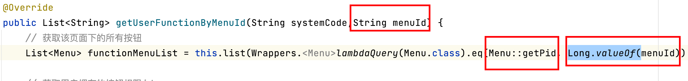

# 20221130-No operator matches the given name and argument types

前置环境：

- postgresql数据库
- Mybatis-plus ORM 框架

报错具体信息：

```
### Error querying database. Cause: org.postgresql.util.PSQLException: ERROR: operator does not exist: bigint = character varying 建议：No operator matches the given name and argument types. You might need to add explicit type casts. 位置：215 ### The error may exist in com/slb/support/outbound/db/mapper/MenuMapper.java (best guess) ### The error may involve defaultParameterMap ### The error occurred while setting parameters ### SQL: SELECT id,system_code,name,service_key,path,http_method,api_path,"level",pid,sort,type,kind,permission,icon,label,flag,del_flag,create_time,update_time,create_by,update_by FROM menu WHERE del_flag=0 AND (pid = ? AND type = ?) ### Cause: org.postgresql.util.PSQLException: ERROR: operator does not exist: bigint = character varying 建议：No operator matches the given name and argument types. You might need to add explicit type casts. 位置：215 ; bad SQL grammar []; nested exception is org.postgresql.util.PSQLException: ERROR: operator does not exist: bigint = character varying 建议：No operator matches the given name and argument types. You might need to add explicit type casts. 位置：215
```

解决办法：

- 传入参数类型是string, 实际参数类型是long，将参数转换为long类型即可。



问题原因：

- 传入参数类型和实体类当中定义的参数类型不一致导致的报错，参数类型转化即可。

参考文档：

- https://blog.csdn.net/qq_33833327/article/details/107693932

