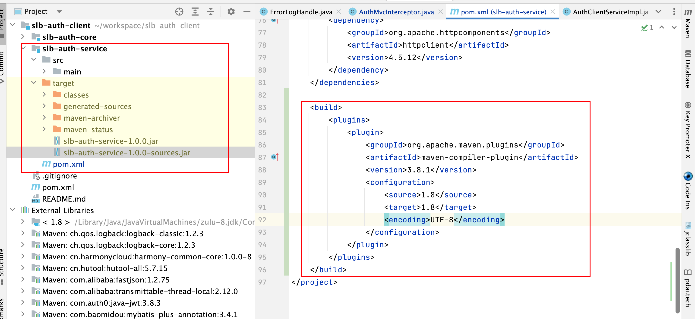
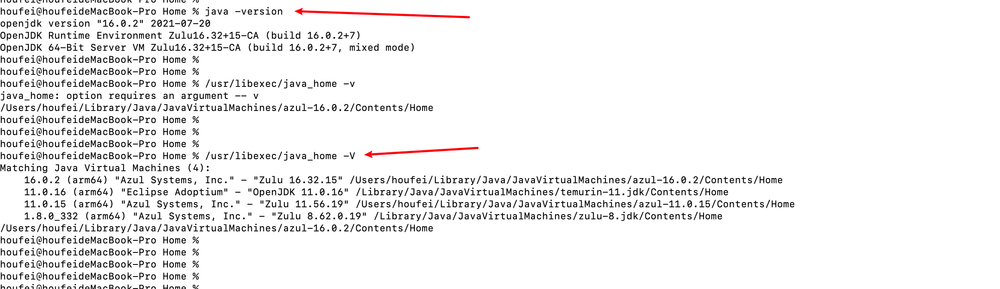
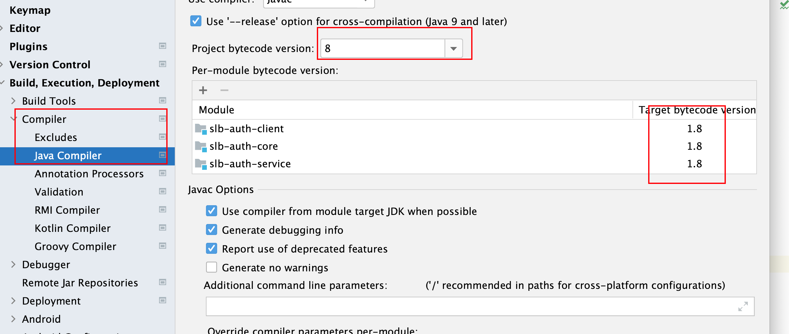
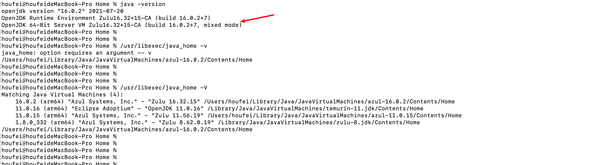
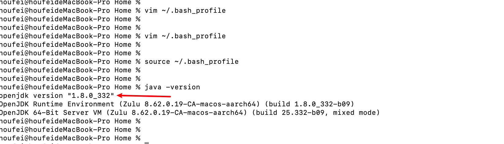
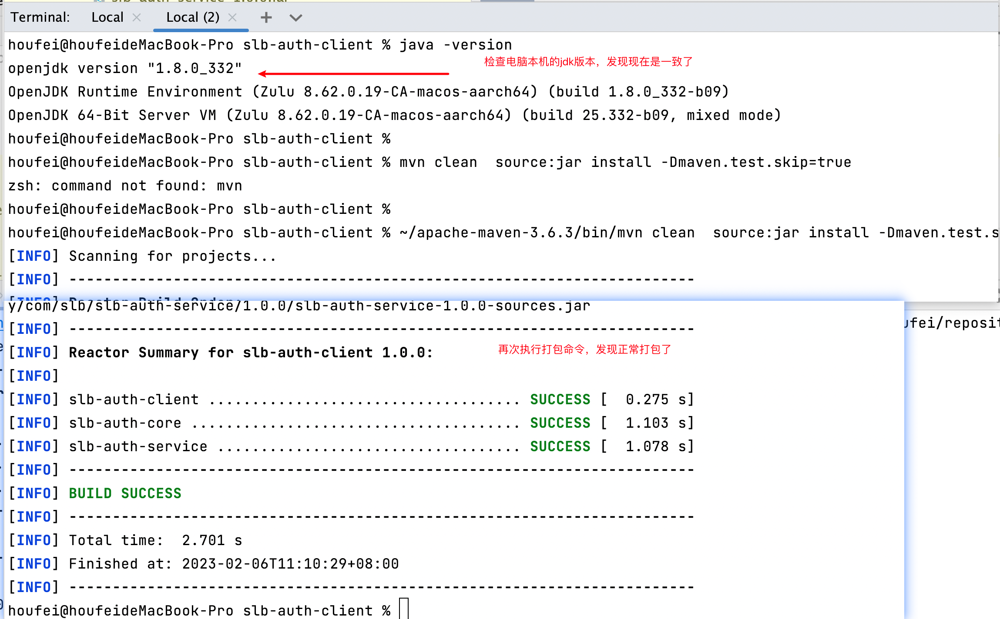

# Failed to execute goal org.apache.maven.plugins:maven-compiler-plugin:3.8.1:compile

- 执行了` ~/apache-maven-3.6.3/bin/mvn clean  source:jar install -Dmaven.test.skip=true`命令之后，控制台报错，报错信息如下。

# 报错具体信息

```java
[INFO] --- maven-compiler-plugin:3.8.1:compile (default-compile) @ slb-auth-service ---
[INFO] Changes detected - recompiling the module!
[INFO] Compiling 28 source files to /Users/houfei/workspace/slb-auth-client/slb-auth-service/target/classes
[INFO] ------------------------------------------------------------------------
[INFO] BUILD FAILURE
[INFO] ------------------------------------------------------------------------
[INFO] Total time:  1.290 s
[INFO] Finished at: 2023-02-06T10:58:07+08:00
[INFO] ------------------------------------------------------------------------
[ERROR] Failed to execute goal org.apache.maven.plugins:maven-compiler-plugin:3.8.1:compile (default-compile) on project slb-auth-service: Fatal error compiling: java.lang.IllegalAccessError: class lombok.javac.apt.LombokProcessor (in unnamed module @0x3855b27e) cannot access class com.sun.tools.javac.processing.JavacProcessingEnvironment (in module jdk.compiler) because module jdk.compiler does not export com.sun.tools.javac.processing to unnamed module @0x3855b27e -> [Help 1]
[ERROR] 
[ERROR] To see the full stack trace of the errors, re-run Maven with the -e switch.
[ERROR] Re-run Maven using the -X switch to enable full debug logging.
[ERROR] 
[ERROR] For more information about the errors and possible solutions, please read the following articles:
[ERROR] [Help 1] http://cwiki.apache.org/confluence/display/MAVEN/MojoExecutionException
houfei@houfeideMacBook-Pro slb-auth-service % 
```


# 前置环境介绍

- Auth-service服务依赖了打包插件
- 具体截图如下：




# 问题排查

- mac电脑本机的jdk版本是16，但是idea里边包括代码当中依赖的jdk版本都设置的是1.8

  - 电脑本机

  

  - idea当中。

  

  - 代码当中打包插件设置的版本也是1.8，如上图。

- 

# 解决办法

- 执行`/usr/libexec/java_home -V `发现，电脑上有多个jdk环境，而且电脑jdk版本是16



- 修改本地jdk版本，修改和idea当中版本一致。执行`vim ~/.bash_profile`，添加如下内容。

```
JAVA_HOME=/Library/Java/JavaVirtualMachines/jdk-17.0.2.jdk/Contents/Home
PATH=$JAVA_HOME/bin:$PATH:.
CLASSPATH=$JAVA_HOME/lib/tools.jar:$JAVA_HOME/lib/jrt-fs.jar:.
export JAVA_HOME
export PATH
export CLASSPATH
```

- 执行`source ~/.bash_profile `使配置生效



- 控制台再次执行打包命令，发现正常打包了。



- 问题解决。