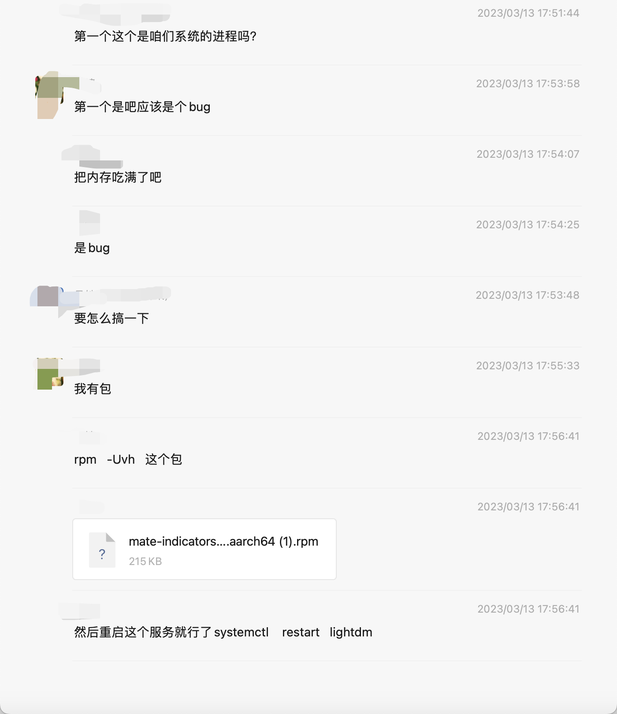

# 麒麟操作系统内存占用过高问题

# 问题背景

- 执行镜像推送脚本显示报错
  - 镜像推送脚本当中只有docker login , docker tag ,docker push三步骤

# 解决问题

- 执行推送镜像报错截图如下：

- 然后执行了命令，查看了内存占用，可以看到这个进程已经占用了内存79.4%

- 咨询了麒麟操作系统之后，说是操作系统的问题，提供了rpm包，安装重启
  - rpm包在同级目录下的software下。

- 问题解决。

