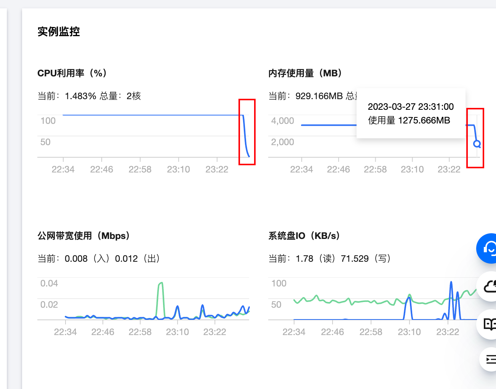

# 腾讯云服务器kswapd0病毒

- 记录一次腾讯云服务器发生病毒入侵的问题，下午四点多短信提示腾讯云服务器存在恶意文件等安全风险提示信息。
- 然后晚上回来之后登录查看服务器的内存占用一直很高。发现不正常。
  - 可以看到cpu和内存都基本上被占用完了。

- 进入服务器执行top命令查看了什么进程占用资源比较高，发现是一个叫做kswapd0的应用占用。

- 再次执行`netstat -anltp | grep kswapd0`查看访问ip，然后看到远端地址有两个45.9开头的。

- 使用ip归属地网站查看，发现这两个ip都是荷兰的，登录`https://tool.lu/ip/`地址查看ip归属地。
  - 这明显不符合常理，服务器只有我自己本人在用，而且上边也没有部署什么东西。

- 执行`ls -lah  /proc/21820/exe`，查看这个进程的可执行程序在哪儿。

- 发现在`/root/.configrc5/a/kswapd0`，这明显不正常，网上查找资料之后，发现还得查看下定时任务。执行`crontab -l`，发现还有好多定时任务。
  - 在` /root/.configrc5`和`/tmp/.X2p-unix`下都有。
  - 我自己没有配置过定时任务。

# 解决方案

- 直接kill进程，还需要删除定时任务，还要删除对应的文件夹。
- kill相关进程，执行`kill -9 `，再次执行top命令查看

- 删除对应的文件夹

- 删除对应的定时任务

- 修改服务器密码，使用`https://suijimimashengcheng.bmcx.com/`网站，生产随机密码，不要使用简单的密码，这样容易被破解。

- 再次查看服务器监控，cpu和内存占用是否降下来。
  - 服务器的cpu和内存占用正在降下来

# 结束！！

