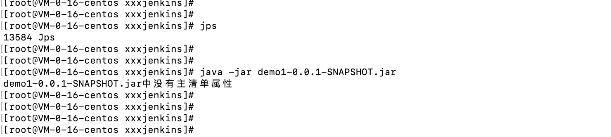
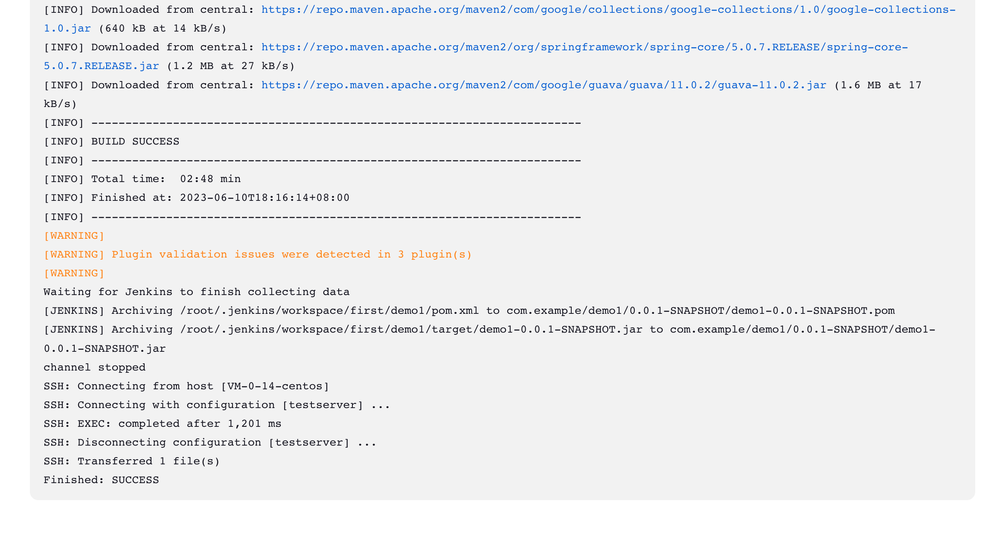
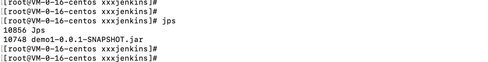

# 20230620-.jar中没有主清单属性

# 问题背景

- 使用jenkins打包Java项目，打包出来的jar部署失败，查看nohup.out文件日志显示demo1-0.0.1-SNAPSHOT.jar中没有主清单属性
- demo项目使用spring initialize初始化生成，没有修改任何文件

# 问题截图

- 问题报错截图



- 原来的pom文件当中的build页签当中的内容如下：

```xml
<build>
        <plugins>
            <plugin>
                <groupId>org.apache.maven.plugins</groupId>
                <artifactId>maven-compiler-plugin</artifactId>
                <version>3.8.1</version>
                <configuration>
                    <source>1.8</source>
                    <target>1.8</target>
                    <encoding>UTF-8</encoding>
                </configuration>
            </plugin>
            <plugin>
                <groupId>org.springframework.boot</groupId>
                <artifactId>spring-boot-maven-plugin</artifactId>
                <version>${spring-boot.version}</version>
                <configuration>
                    <mainClass>com.example.demo1.Demo1Application</mainClass>
                    <skip>true</skip>
                </configuration>
                <executions>
                    <execution>
                        <id>repackage</id>
                        <goals>
                            <goal>repackage</goal>
                        </goals>
                    </execution>
                </executions>
            </plugin>
        </plugins>
    </build>
```

# 解决办法

- 修改pom.xml文件build页签内容为：

```xml
<build>
        <plugins>
            <plugin>
                <groupId>org.apache.maven.plugins</groupId>
                <artifactId>maven-compiler-plugin</artifactId>
                <configuration>
                    <source>1.8</source>
                    <target>1.8</target>
                </configuration>
            </plugin>
            <plugin>
                <groupId>org.springframework.boot</groupId>
                <artifactId>spring-boot-maven-plugin</artifactId>
                <version>2.0.3.RELEASE</version>
                <configuration>
                    <mainClass>com.example.demo1.Demo1Application</mainClass>
                </configuration>
                <executions>
                    <execution>
                        <goals>
                            <goal>repackage</goal>
                        </goals>
                    </execution>
                </executions>
            </plugin>
        </plugins>
    </build>
```

- 重新执行jenkins流水线，然后可以看到执行成功，



- 登录目标服务器上查看服务是否通过jenkins部署成功，执行`jps`命令，可以看到demo进程



