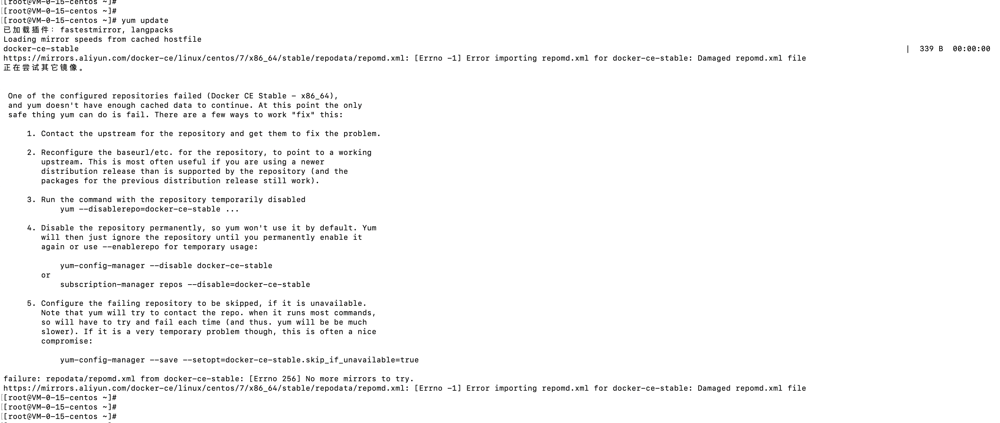
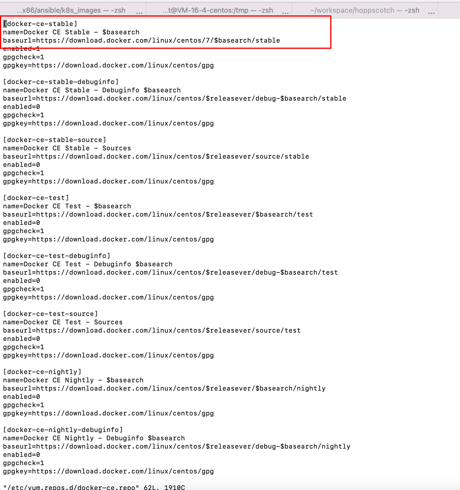
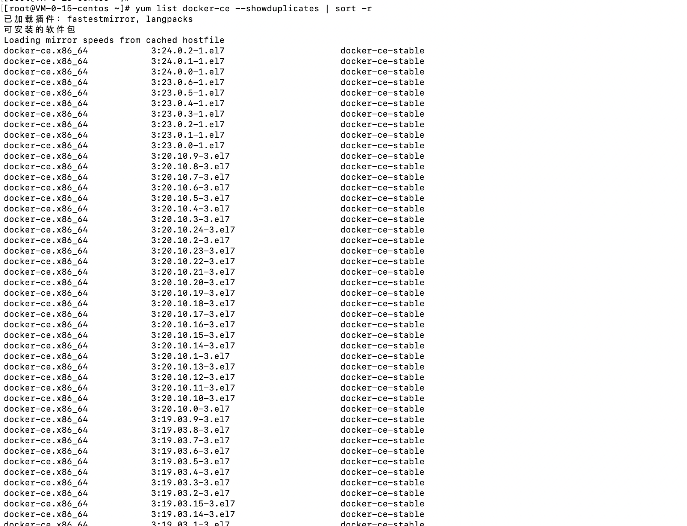

# 20230610-Error importing repomd.xml for docker-ce-stable: Damaged repomd.xml file

# 报错截图

- 执行`yum list docker-ce --showduplicates | sort -r`看不到docker的yum选择
- 执行`yum update`也报错，报错显示

# 解决办法

- 执行命令`yum-config-manager --add-repo https://download.docker.com/linux/centos/docker-ce.repo`
- 执行`vi /etc/yum.repos.d/docker-ce.repo`
- 修改文件内容：`baseurl=https://download.docker.com/linux/centos/7/$basearch/stable `

- 执行`yum list docker-ce --showduplicates | sort -r`，可以看到yum选择了

# 报错原因

- 