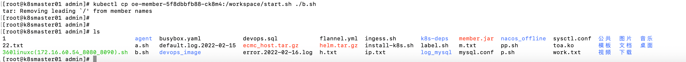
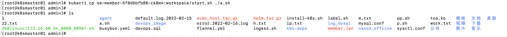
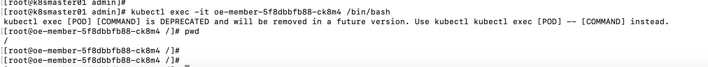

# 20230612-kubectl cp error tar removing leading /' from member names

在oe-member-5f8dbbfb88-ck8m4容器当中的/workspace下有一个start.sh文件

在master01上通过kubectl cp命令复制容器当中的文件到k8s master上。

执行`kubectl cp oe-member-5f8dbbfb88-ck8m4:/workspace/start.sh ./b.sh`报错，但是文件实际复制出来了。

执行`kubectl cp oe-member-5f8dbbfb88-ck8m4:workspace/start.sh ./a.sh`

oe-member容器的工作路径是`/`

结论：

- tar: Removing leading `/' from member names是k8s的一个bug