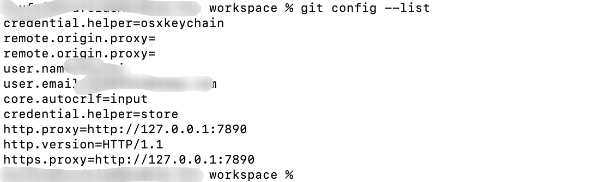

20230613-HTTP/2 stream 1 was not closed cleanly before end of the underlying stream

idea当中push代码，显示报错，报错日志为：`HTTP/2 stream 1 was not closed cleanly before end of the underlying stream`

查看目前git配置：执行`git config --list`

查找资料解决办法为：

执行`git config --global http.version HTTP/1.1 `

查看当前git配置列表，截图如下：

再次执行推送代码，发现不报错了。