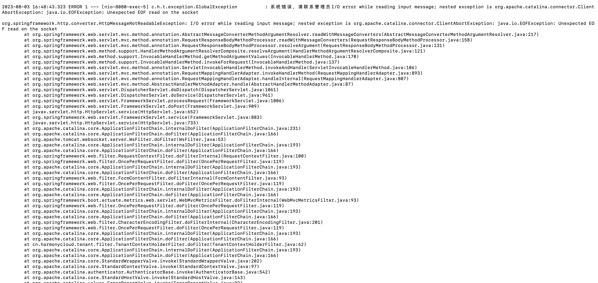

REMOTE_ISSUES_FAIL:too many bytes written executing POST 

报错信息：REMOTE_ISSUES_FAIL:too many bytes written executing POST http://track-issues-svc:8080/provider/track/issues/page"

报错截图：



解决办法：

```java
@Slf4j
@Configuration
public class CloudFeignConfiguration implements RequestInterceptor {

    @Override
    public void apply(RequestTemplate requestTemplate) {

        if (CloudFeignUtils.getTransferHeader() != null && !CloudFeignUtils.getTransferHeader()) {
            return;
        }
        ServletRequestAttributes servletRequestAttributes = (ServletRequestAttributes) RequestContextHolder.getRequestAttributes();
        // 定时任务触发
        if (servletRequestAttributes == null) {
            RequestContextHolder.setRequestAttributes(new ServletRequestAttributes(new MockHttpServletRequest()));
            servletRequestAttributes = (ServletRequestAttributes) RequestContextHolder.getRequestAttributes();
        }
        HttpServletRequest request = servletRequestAttributes.getRequest();
        Enumeration<String> headerNames = request.getHeaderNames();
        if (headerNames != null){
            //2、同步请求头的数据（主要是cookie）
            //把老请求的cookie值放到新请求上来，进行一个同步
            String cookie = request.getHeader("Cookie");
            requestTemplate.header("Cookie", cookie);
        }
        requestTemplate.header(SystemConstance.OAUTH_TOKEN_HEADER, request.getHeader(SystemConstance.OAUTH_TOKEN_HEADER));
        requestTemplate.header(SystemConstance.OAUTH_TENANT_HEADER, request.getHeader(SystemConstance.OAUTH_TENANT_HEADER));
        requestTemplate.header(SystemConstance.AMP_APP_ID, request.getHeader(SystemConstance.AMP_APP_ID));
        requestTemplate.header(SystemConstance.AMP_APP_CODE, request.getHeader(SystemConstance.AMP_APP_CODE));

    }

}
```

问题原因：

- 跳过content-length，不然可能会报too many bites written问题