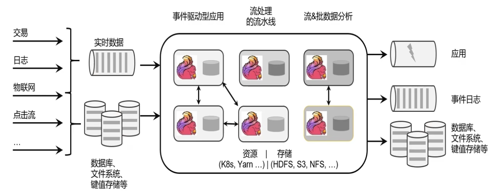
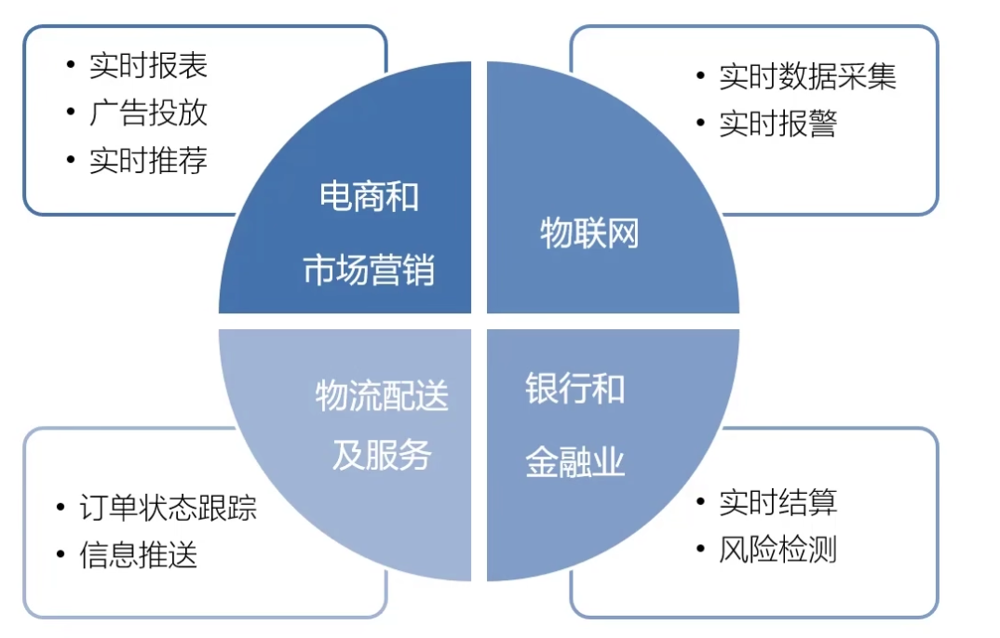

# Flink 流处理简介

## Flink 是什么

- Apache Flink is a framework and distributed processing engine for stateful computations over unbounded and bounded data streams.
- Apache Flink 是一个**框架**和**分布式处理引擎**,用于对**无界和有界数据流**进行**状态**计算。

### Flink发展时间线

- 2014年8月, Flink第一个版本0.6正式发布,与此同时Fink的几位核心 开发者创办了Data Artisans公司;
- 2014年12月, Flink项目完成孵化;
- 2015年4月, Flink发布了里程碑式的重要版本0.9.0;
- 2019年1月,长期对Flink投入研发的阿里巴巴,以9000万欧元的价格 收购了Data Artisans 公司;
- 2019年8月,阿里巴巴将内部版本Blink开源,合并入Flink 1.9.0版本。

### Flink框架处理流程

### Flink 在企业中的应用

###  Flink 的应用场景

## 为什么要用Flink

- 批处理和流处理
- 流数据更真实地反映了我们的生活方式
- 我们的目标
  - 低延迟
  - 高吞吐
  - 结果的准确性和良好的容错性

## 流处理的发展和演变

## Flink 的主要特点

## Flink vs Spark Streaming