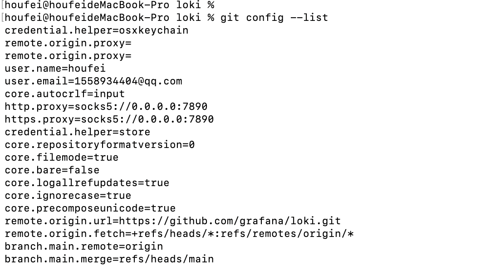

# GIT相关操作

具体参数

详细示例

- 设置代理
  - 配置http代理，执行`git config --global http.proxy http://127.0.0.1:7890`
  - 配置https代理，执行`git config --global https.proxy http://127.0.0.1:7890`
  - 或者
    - git config --global https.https://github.com.proxy https://127.0.0.1:7890
    - git config --global http.https://github.com.proxy https://127.0.0.1:7890
- 取消代理
  - 取消http代理，执行`git config --global --unset http.proxy`
  - 取消https代理，执行`git config --global --unset https.proxy`
- 查看全部配置列表，执行`git config --list`

- 配置远程仓库，执行`git remote add upstream https://github.com/YunaiV/ruoyi-vue-pro.git`
  - git remote add 别名 仓库地址
  - 后续可以使用别名去操作这个仓库
  - 获取远程仓库更新，执行`git fetch upstream`
  - 将远程仓库更新到本地分支，执行`git merge upstream/master`
  - 撤回提交，执行`git rebase upstream/master`
  
- 从远程仓库抓取和拉取，执行`git fetch 远程仓库别名或者地址`

  