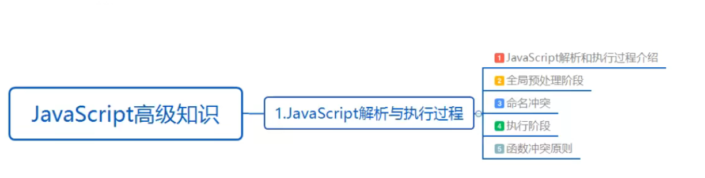

# JavaScript高级知识

# 1.JavaScript解析与执行过程

## 1.1.学习目标

## 1.2. JavaScript解析和执行过程介绍

- javascript是一种描述型的脚本语言,是一种解析语言,由浏览器动态解析,不同种类的浏览器不同版本的浏览器对于js的解析有着微小的差别,不同浏览器的js解析引擎效率也有高低。
- js的执行过程分为两大部分:
  - 第一部分,解析过程,也称预编译期。主要工作就是对于js的代码中声明的所有变量和函数进行预处理。需要注意的是,再此进行处理的仅是声明函数,而对于变量的处理仅是声明,并开辟出一块内存空间,不进行赋值操作。
  - 第二部分,执行过程,在执行过程中,浏览器的js引擎对于每个代码块进行顺序执行,如果有外部引用的js,且js有相互关联,此时就要注意,不同js的引入顺序,如果声明代码块在调用代码块后调用则将不会达到预期的效果。
- 总的来说,JS的执行分为两部分,解析过程和执行过程。解析时按照代码块,一段一段进行解析,执行时按照代码块顺序逐行执行,解析一个代码块,执行一个代码块。
- 因为是解释性语言,所以js如果在解析过程有错误,则不会提示,也可以理解为js不会出现编译错误,但如果出现了运行时错误,出现错误一下的所有javascript代码将不会继续执行。

## 1.3.全局预处理阶段

- 预处理:创建一个词法环境(LexicalEnvironment,在后面简写为LE),扫描S中的用声明的方式声明的函数,用var定义的变量并将它们加到预处理阶段的词法环境中去。
- 预处理阶段先读取代码块,不是一行一行的解析执行定义的方法和用var定义的变量,会放到一个(不同的环境,会有对应的词法环境)词法环境中。
- 