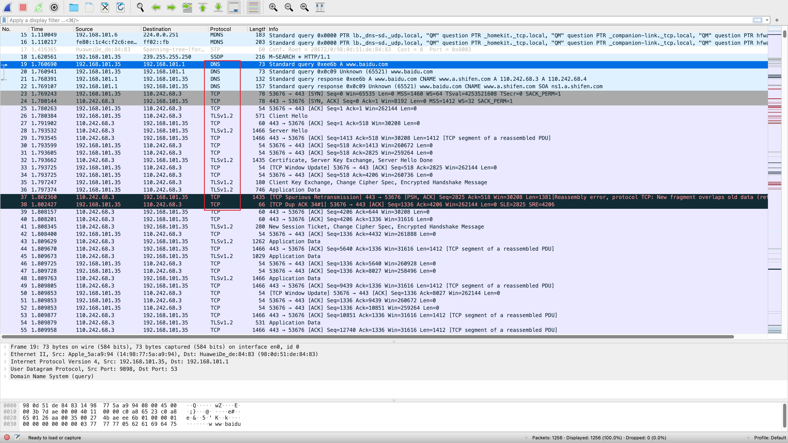
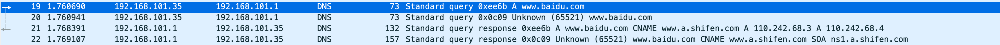
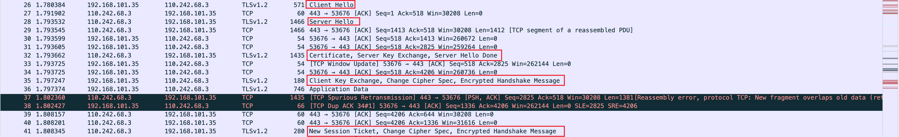
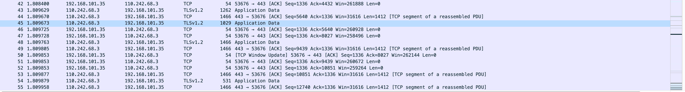

# 浏览器输入URL发生了什么？

# 测试环境

- macOS系统
- wireshark抓包工具
- google chrome浏览器

# 抓包信息

# 大概流程

- 输入Baidu.com，DNS解析Baidu.com的IP地址
- TCP建立三次握手
- TLS建立和服务器的通信
- 传输数据
- TCP四次挥手

# 详细分析

- 输入Baidu.com，DNS解析baidu.com的IP地址

  - wireshark截图当中的19-22号包

  

  - `192.168.101.35`是我电脑的IP地址，`192.168.101.1`是我电脑的DNS服务器地址
  - 向本地网关发起请求，查询baidu.com的IP地址，本地网关回复baidu.com两个地址，分别是`110.242.68.3，110.242.68.4`，我们这里使用的是第一个，在后续抓包信息当中也可以看到`110.242.68.3`这个地址。

- TCP建立三次握手

  - wireshark当中23-25号包

  

  - 23号包，第一次握手，客户端发起请求，SYN置1
  - 24号包，第二次握手，服务器响应，SYN,ACK置1
  - 25号包，第三次握手，客户端发起请求，ACK置1

- TLS建立和服务器的通信

  - wireshark当中26-41号包

  

  - TLS/SSL通信涉及到四次通信

  - 详细信息查看`2022-03-13-wireshark07-SSL/TLS协议文档`

- 传输数据

  - wireshark当中42号包往下

  

- 四次挥手

  - wireshark截图当中并没有显示四次挥手的包，不影响理解