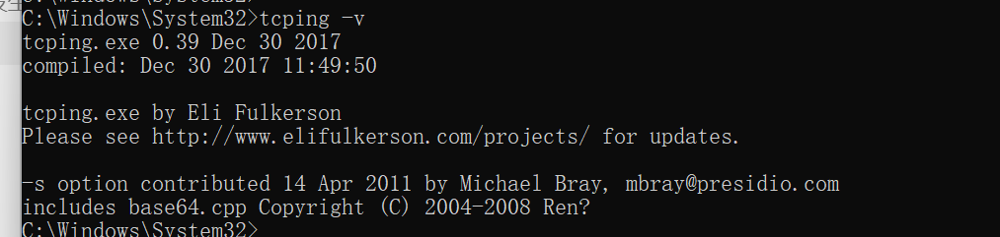

# tcping

# 介绍

- 

# 下载

- 地址：windows版：https://download.elifulkerson.com/files/tcping/0.39/x64/
- 选择tcping64下载软件安装包

# 安装

- 64版本的exe版本需要修改软件名称，修改为tcping.exe，
- 截图如下：

- 将tcping.exe文件移动到`C:\Windows\System32\cmd.exe`
- 检查安装，执行`tcping -v`，如下图，则表示安装成功

# 使用

- tcping ip地址 端口

- 

抓包效果如下：

