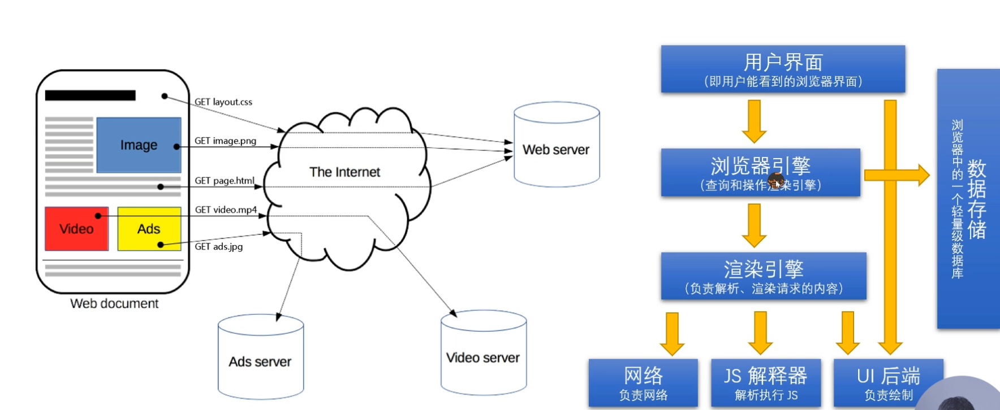
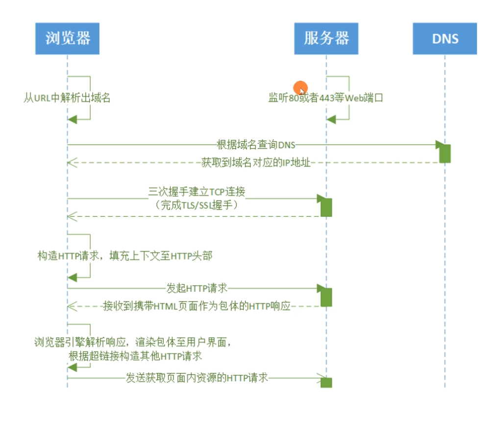

# 浏览器发起HTTP 请求的典型场景

流程图：

# Hypertext Transfer Protocol (HTTP) 协议

- a stateless application-level request/response protocol that uses extensible semantics and self-descriptive message payloads for flexible interaction with network-based hypertext information systemsRFC7230 2014.6)
- 一种无状态的、应用层的、以请求/应答方式运行的协议,它使用可扩展的语义和自描述消息格式,与基于网络的超文本信息系统灵活的互动