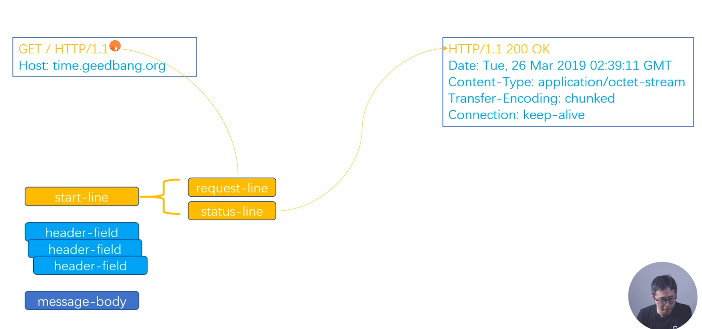
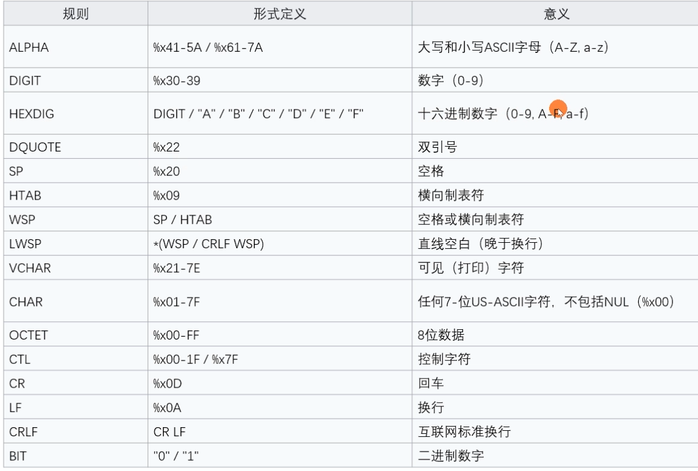

# 基于ABNF语义定义的HTTP消息格式

# HTTP 协议格式

# ABNF (扩充巴科斯-瑙尔范式)操作符

- 空白字符:用来分隔定义中的各个元素
  - method SP request-target SP HTTP-version CRLF
- 选择 / : 表示多个规则都是可供选择的规则
  - start-line = request-line / status-line
- 值范围 %c##-##:
  - OCTAL = “0" / "1" / "2" / "3" / "4" / "5" / "6" / "7" 与 OCTAL = %x30-37 等价
- 序列组合（）:将规则组合起来,视为单个元素
- 不定量重复m*n:
  - \*元素表示零个或更多元素:*(header-field CRLF)
  - 1\*元素表示一个或更多元素,2*4元素表示两个至四个元素
- 可选序列[]:
  - [ message-body]

# ABNF (扩充巴科斯-瑙尔范式)核心规则

# 基于ABNF描述的HTTP协议格式

- HTTP-message = start-line *( header-field CRLF ) CRLF [ message-body ]
- start-line = request-line / status-line
  - request-line = method SP request-target SP HTTP-version CRLF
  - status-line = HTTP-version SP status-code SP reason-phrase CRLF
- header-field = field-name ":" OWS  field-value OWS
  - Sp:空格， HTAB：横向制表符
  - OWS = *( SP / HTAB)
  - field-name = token
  - field-value = *( field-content / obs-fold)
- message-body = *OCTET
  - OCTET：二进制

## telnet查看

## wireshark查看

