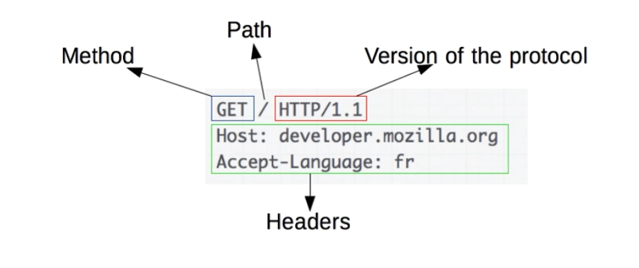
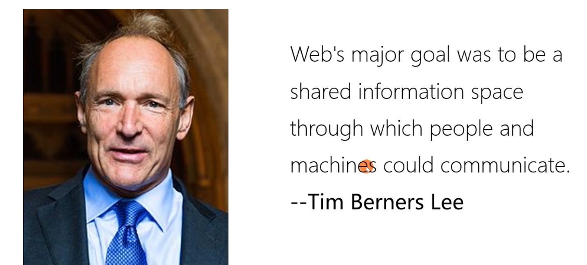
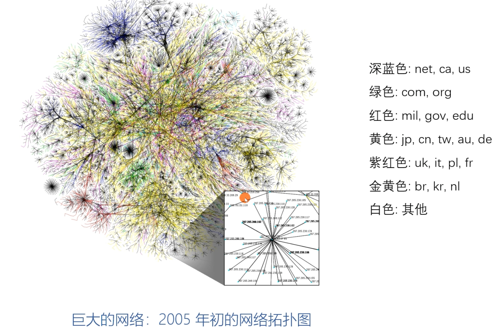

# Roy Thomas Fielding 与HTTP/1.1

- 参与制订HTTP/1.0规范(1996.5)
- 参与制订URI规范(1998.8)
- 主导制订HTTP/1.1规范(1999.6)
- 2000年发布指导HTTP/1.1规范制订的论文
  - 《Architectural Style and the Design of Network-based Software Architectures》 ,即我常谈的Representational State Transfer (REST)架构
- Apache基金a(The Apache Software Foundation)共同创始人
  - 参与开发Apache httpd服务

# Form Follows Function: HTTP 协议为什么是现在这个样子

- HTTP 协议
  	Roy Thomas Fielding: HTTP 主要作者, REST 架构作者
- URI:统一资源标识符

# HTTP 解决了什么问题?

解决WWW信息交互必须面对的需求:

- 低门槛
- 可扩展性:巨大的用户群体,超长的寿命
- 分布式系统下的Hypermedia:大粒度数据的网络传输
- Internet 规模
  - 无法控制的scalability
    - 不可预测的负载、非法格式的数据、恶意消息
    - 客户端不能保持所有服务器信息,服务器不能保持多个请求间的状态信息
  - 独立的组件部署:新老组件并存
- 向前兼容:自1993年起HTTP0.9\1.0 (1996)已经被广泛使用

