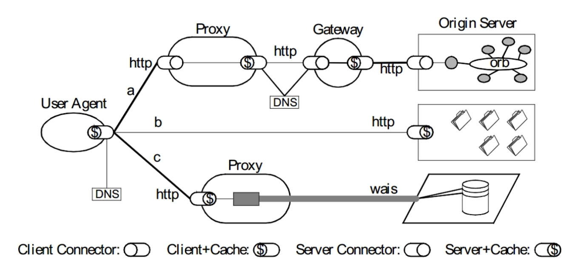

# 评估Web架构的关键属性

HTTP 协议应当在以下属性中取得可接受的均衡:

- 性能Performance:影响高可用的关键因素
- 可伸缩性Scalability:支持部署可以互相交互的大量组件
- 简单性Simplicity:易理解、易实现、易验证
- 可见性Visiable:对两个组件间的交互进行监视或者仲裁的能力。如缓存、分层设计等
- 可移植性Portability:在不同的环境下运行的能力
- 可靠性Reliability:出现部分故障时,对整体影响的程度
- 可修改性 Modifiability:对系统作出修改的难易程度,由可进化性、可定制性、可扩展性、可配置性、可重用性构成

# 架构属性:性能

- 网络性能 Network Performance
  - Throughput 吞吐量:小于等于带宽 bandwidth
  - Overhead开销:首次开销,每次开销
- 用户感知到的性能User-perceived Performance
  - Latency延迟:发起请求到接收到响应的时间
  - Completion 完成时间:完成一个应用动作所花费的时间
- 网络效率 Network Efficiency
  - 重用缓存、减少交互次数、数据传输距离更近、COD

# 架构属性:可修改性

- 可进化性Evolvability:一个组件独立升级而不影响其他组件
- 可扩展性Extensibility:向系统添加功能,而不会影响到系统的其他部分
- 可定制性Customizability:临时性、定制性地更改某一要素来提供服务,不对常规客户产生影响
- 可配置性Configurability :应用部署后可通过修改配置提供新的功能
- 可重用性Reusabilit:组件可以不做修改在其他应用在使用

# REST架构下的Web

