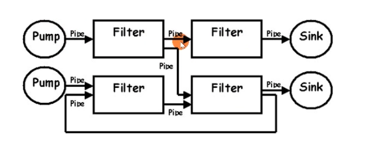
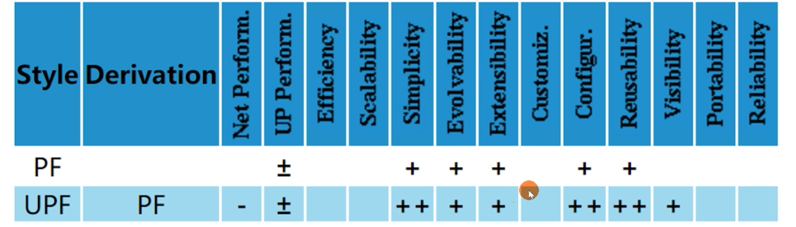
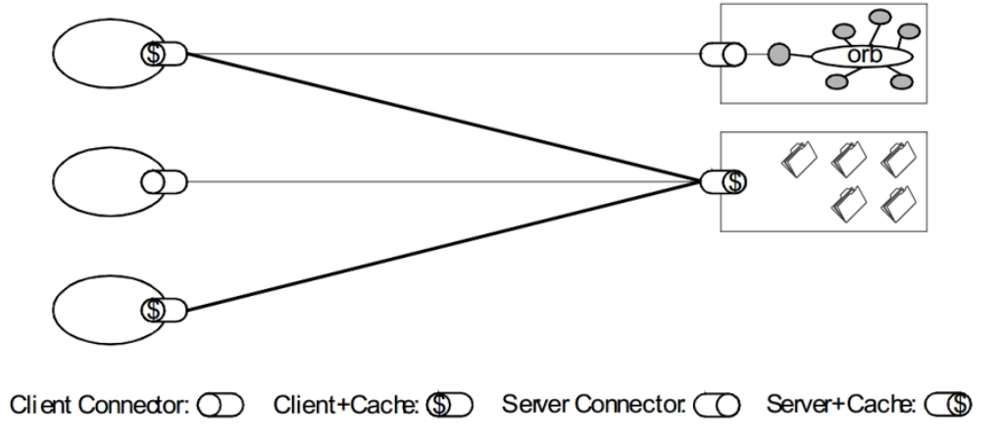
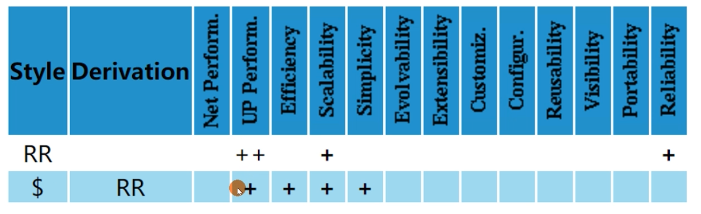

# 5种架构风格

- 数据流风格Data-flow Styles
  - 优点:简单性、可进化性、可扩展性、可配置性、可重用性
- 复制风格 Replication Styles
  - 优点:用户可察觉的性能、可伸缩性,网络效率、可靠性也可以提到提升
- 分层风格Hierarchical Styles
  - 优点:简单性、可进化性、可伸缩性
- 移动代码风格 Mobile Code Styles
  - 优点:可移植性、可扩展性、网络效率
- 点对点风格 Peer-to-Peer Styles
  - 优点:可进化性、可重用性、可扩展性、可配置性

# 数据流风格 Data-flow Styles

- 管道与过滤器 Pipe And Filter, PF
  - 每个Filter都有输入端和输出端,只能从输入端读取数据,处理后再从输出端产生数据

- 统一接口的管道与过滤器Uniform Pipe And Filter, UPF
  - 在PF上增加了统一接口的约束,所有Filter过滤器必须具备同样的接口

# 复制风格 Replication Styles

- 复制仓库 Replicated Repository, RR
  - 多个进程提供相同的服务,通过反向代理对外提供集中服务
- 缓存$
  - RR的变体,通过复制请求的结果,为后续请求复用

# 分层风格Hierarchical Styles

- 客户端服务器 Client-Server, CS
  - 由Client触发请求, Server监听到请求后产生响应, Client一直等待收到响应后,会话结束
  - 分离关注点隐藏细节,良好的简单性、可伸缩性、可进化性,
- 分层系统 Layered System, LS
  - 每一层为其之上的层服务,并使用在其之下的层所提供的服务,例如TCP/IP
- 分层客户端服务器 Layered Client-Server, LCS
  - LS+CS,例如正向代理和反向代理,从空间上分为外部层与内部层
- 无状态、客户端服务器 Client-Stateless-Server CSS
  - 基于CS,服务器上不允许有session state会话状态
  - 提升了可见性、可伸缩性、可靠性,但重复数据导致降低网络性能
- 缓存、无状态、客户端服务器 Client-Cache-Stateless-Server C$SS
  - 提升性能
- 分层、缓存、无状态、客户端服务器 Layered-Client-Cache-Stateless-Server,LC$SS

# 移动代码风格 Mobile Code Styles

# 点对点风格 Peer-to-Peer Styles