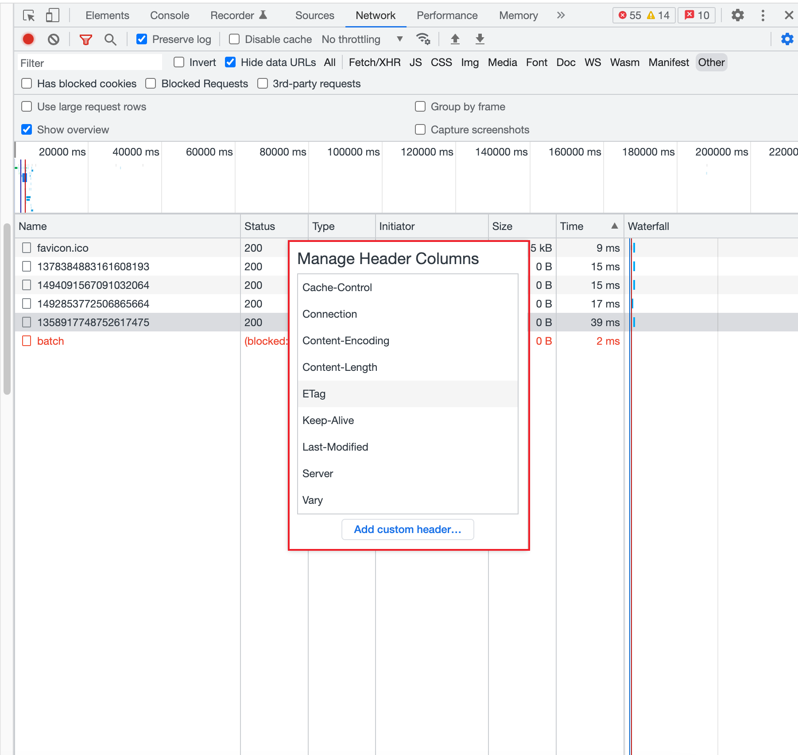

# Network 面板

- 控制器:控制面板的外观与功能
- 过滤器:过滤请求列表中显示的资源
  - 按住Command (Mac)或 Ctrl (Window/Linux),然后点击过滤器可以
- 同时选择多个过滤器
- 概览:显示HTTP请求、响应的时间轴
- 请求列表:默认时间排序,可选择显示列
- 概要:请求总数、总数据量、总花费时间等

# 控制器

- 抓包
- 停止抓包
- 清除请求
- 要跨页面加载保存请求: Preserve log
- 屏幕截图: Capture screenshots
- 重新执行XHR 请求:右键点击请求选择Replay XHR
- 停用浏览器缓存
- 手动清除浏览器缓存:右键点击请求选择Clear Browser Cache
- 离线模拟: Offline
- 模拟慢速网络连接: Network Throttling,可自定义网速
- 手动清除浏览器 Cookie:右键点击请求选择Clear Browser Cookies
- 隐藏Filters窗格
- 隐藏Overview窗格

# 过滤器:按类型

- XHR, JS, CSS, Img, Media, Font, Doc, WS (WebSocket), Manifest 或 Other
- 多类型,按住Command (Mac) 或 Ctrl (Windows, Linux)
- 按时间过滤:概览面板,拖动滚动条
- 隐藏Data URLs: CSS图片等小文件以BASE64格式嵌入HTML中,以减少HTTP请求数

# 过滤器:属性过滤

- domain:仅显示来自指定域的资源。您可以使用通配符字符(*)纳入多个域
- has-response-header:显示包含指定HTTP响应标头的资源
- is:使用is:running 可以查找 WebSocket资源, is:from-cache可查找缓存读出的资源
- larger-than: 显示大于指定大小的资源(以字节为单位)。将值设为1000等同于设置为1k
- method:显示通过指定HTTP方法类型检索的资源
- mime-type:显示指定MIME类型的资源
- 多属性间通过空格实现AND操作

# 过滤器:属性过滤(二

- mixed-content:显示所有混合内容资源(mixed-content:all),或者仅显示当前显示的资源 (mixed-content:displayed)。
- scheme:显示通过未保护HTTP (scheme:http)或受保护HTTPS (scheme:https)检索的资源。
- set-cookie-domain:显示具有 Set-Cookie 标头并且Domain 属性与指定值匹配的资源。 set-cookie-name:显示具有 Set-
- Cookie 标头并且名称与指定值匹配的资源。
- set-cookie-value:显示具有Set-Cookie 标头并且值与指定值匹配的资源。status-code:仅显示 HTTP 状态代码与指定代码匹配的资源。
- 多属性间通过空格实现AND操作

# 请求列表的排序

- 时间排序,默认
- 按列排序
- 按活动时间排序
  - Start Time:发出的第一个请求位于顶部
  - Response Time:开始下载的第一个请求位于顶部
  - End Time:完成的第一个请求位于顶部
  - Total Duration:连接设置时间和请求/响应时间最短的请求位于顶部
  - Latency:等特最短响应时间的请求位于顶部

# 请求列表

- Name :资源的名称
- Status : HTTP 状态代码 Type :请求的资源的MIME类型
- Initiator:发起请求的对象或进程。它可能有以下几种值:
- Parser (解析器) : Chrome的HTML 解析器发起了请求鼠标悬停显示JS脚
- Redirect (重定向) : HTTP 重定向启动了请求
- Script (脚本) :脚本启动了请求
- Other (其他) :一些其他进程或动作发起请求,例如用户点击链接跳转到页面或在地址栏中输入网址
- Size :服务器返回的响应大小(包括头部和包体),可显示解压后大小
- Time :总持续时间,从请求的开始到接收响应中的最后一个字节
- Waterfall:各请求相关活动的直观分析图
- 添加其他列
- 添加响应列
- 添加自定义列

- 

# 预览请求内容

- 查看头部
- 查看 cookie
- 预览响应正文:查看图像用
- 查看响应正文
- 时间详细分布
- 导出数据为HAR格式
- 查看未压缩的资源大小: Use Large Request Rows
- 浏览器加载时间(概览、概要、请求列表)
  - DOMContentLoaded 事件的颜色设置为蓝色,而load 事件设置为红色
- 将请求数据复制到剪贴版
  - Copy Link Address:将请求的网址复制到剪贴板
  - Copy Response: 将响应包体复制到剪S板
  - Copy as cURL: 以 cURL 命令形式复制请求
  - Copy All as cURL: 以一系列 cURL 命令形式复制所有请求 
  - Copy All as HAR: 以HAR数据形式复制所有请求
- 查看请求上下游:按住shift键悬停请求上,绿色是上游,红色是下游

# 浏览器加载时间

- 触发流程
  - 解析HTML结构
  - 加载外部脚本和样式表文件
  - 解析并执行脚本代码//部分脚本会阻塞页面的加载
  - DOM 树构建完成 // DOMContentLoaded 事件
  - 加载图片等外部文件
  - 页面加载完毕// load 事件

# 请求时间详细分布

- Queueing:浏览器在以下情况下对请求排队
  - 存在更高优先级的请求
  - 此源已打开六个TCP连接,达到限值,仅适用于HTTP/1.0和HTTP/1.1
  - 浏览器正在短暂分配磁盘缓存中的空间
- Stalled: 请求可能会因 Queueing中描述的任何原因而停止
- DNS Lookup: 浏览器正在解析请求的IP地址
- Proxy Negotiation: 浏览器正在与代理服务器协商请求
- Request sent: 正在发送请求
- ServiceWorker Preparation: 浏览器正在启动 Service Worker
- Request to ServiceWorker: 正在将请求发送到 Service Worker
- Waiting (TTFB): 浏览器正在等待响应的第一个字节。TTFB 表示Time To First Byte(至第一字节的时间)。此时间包括1次往返延迟时间及服务器准备响应所用的时间
- Content Download: 浏览器正在接收响应
- Receiving Push: 浏览器正在通过HTTP/2服务器推送接收此响应的数据
- Reading Push: 浏览器正在读取之前收到的本地数据