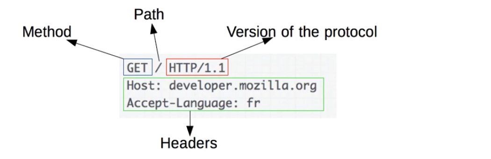
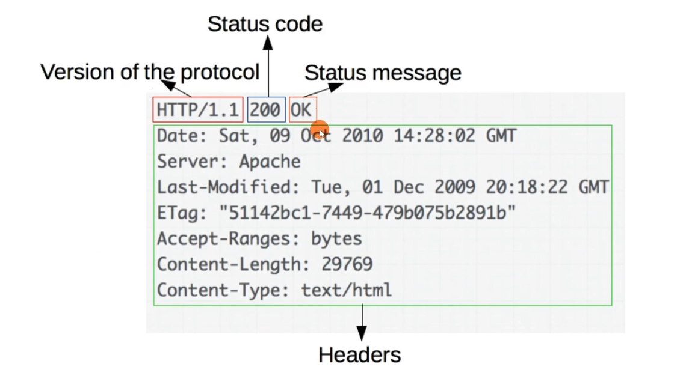

# 请求行

- request-line = method SP request-target SP HTTP-version CRLF

- method 方法:指明操作目的,动词
- request-target = origin-form / absolute-form / authority-form / asterisk-form
- request-target = origin-form / absolute-form I authority-form / asterisk-form
  - origin-form = absolute-path ["?" query ]
    - 向origin server发起的请求,path 为空时必须传递/
  - absolute-form = absolute-URI
    - 仅用于向正向代理proxy发起请求时,详见正向代理与隧道
  - authority-form = authority
    - 仅用于CONNECT 方法,例如 CONNECT www.example.com:80 HTTP/1.1
  - asterisk-form = "*"
    - 仅用于OPTIONS 方法

- HTTP-version 
- 版本号发展历史: https://www.w3.org/Protocols/History.html
  - HTTP/0.9:只支持GET 方法,过时
  - HTTP/1.0: RFC1945, 1996,常见使用于代理服务器(例如Nginx默认配置)
  - HTTP/1.1: RFC2616, 1999
  - HTTP/ 2.0: 2015.5 正式发布

# 常见方法(RFC7231)

- GET:主要的获取信息方法,大量的性能优化都针对该方法,幕等方法
- HEAD:类似GET方法,但服务器不发送BODY,用以获取HEAD元数据,幕等方法
- POST:常用于提交HTML FORM 表单、新增资源等
- PUT:更新资源,带条件时是幕等方法
- DELETE:删除资源,幕等方法
- CONNECT:建立 tunnel 隧道
- OPTIONS:显示服务器对访问资源支持的方法,幕等方法
- TRACE:回显服务器收到的请求,用于定位问题。有安全风险
- Changes with nginx 0.5.1702 Apr 2007 Change: now nginx always returns the 405 status for the TRACE method.

# 用于文档管理的WEBDAV 方法(RFC2518)

- PROPFIND: 从Web资源中检索以XML格式存储的属性。它也被重载,以允许一个检索远程系统的集合结构(也叫目录层次结构)
- PROPPATCH:在单个原子性动作中更改和删除资源的多个属性
- MKCOL:创建集合或者目录
- COPY:将资源从一个 URI复制到另一个URI
- MOVE:将资源从一个URI移动到另一个URI
- LOCK:锁定一个资源。WebDAV 支持共享锁和互斥锁。
- UNLOCK:解除资源的锁定

# WEBDAV 验证环境

- 服务器
  - Nginx
  - http_dav_module 模块
  - nginx-dav-ext-module 模块
- 客户端
  - winscp

# 测试

# HTTP 响应行

- status-line = HTTP-version SP status-code SP reason-phrase CRLF
- status-code = 3DIGIT
- reason-phrase = *( HTAB / SP / VCHAR / obs-text)

# 响应码分类: 1xx

- 响应码规范: RFC6585 (2012.4) 、RFC7231 (2014.6)
- 1xx:请求已接收到,需要进一步处理才能完成, HTTP1.0不支持
  - 100 Continue: 上传大文件前使用
    - 由客户端发起请求中携带Expect: 100-continue头部触发
  - 101 Switch Protocols:协议升级使用
    - 由客户端发起请求中携带Upgrade:头部触发,如升级websocket或者http/2.0
  - 102 Processing: WebDAV 请求可能包含许多涉及文件操作的子请求,需要很长时间才能完成请求。该代码表示服务器已经收到并正在处理请求,但无响应可用。这样可以防止客户端超时,并假设请求丢失

# 2xx:成功处理请求

- 200 OK:成功返回响应。
  - 201 Created:有新资源在服务器端被成功创建。
  - 202 Accepted: 服务器接收并开始处理请求,但请求未处理完成。这样一个模糊的概念是有意如此设计,可以覆盖更多的场景。例如异步、需要长时间处理的任务。
  - 203 Non-Authoritative Information:当代理服务器修改了 origin server的原始响应包体时(例如更换了HTML中的元素值),代理服务器可以通过修改200为203的方式告知客户端这一事实,方便客户端为这一行为作出相应的处理。203响应可以被缓存。
  - 204 No Content:成功执行了请求且不携带响应包体,并暗示客户端无需更新当前的页面视图。
  - 205 Reset Content:成功执行了请求且不携带响应包体,同时指明客户端需要更新当前页面视图。
  - 206 Partial Content:使用 range 协议时返回部分响应内容时的响应码 
  - 207 Multi-Status: RFC4918 ,在WEBDAV 协议中以XML返回多个资源的状态。
  - 208 Already Reported: RFC5842,为避免相同集合下资源在207响应码下重复上报,使用208可以使用父集合的响应码。
  - 

# 响应码分类:3xx

- 3xx:重定向使用Location指向的资源或者缓存中的资源。在RFC2068中规定客户端重定向次数不应超过5次,以防止死循环。
- 300 Multiple Choices:资源有多种表述,通过300返回给客户端后由其自行选择访问哪一种表述。由于缺乏明确的细节,300很少使用。
- 301 Moved Permanently:资源永久性的重定向到另一个URI中。
- 302 Found:资源临时的重定向到另一个URI中。

