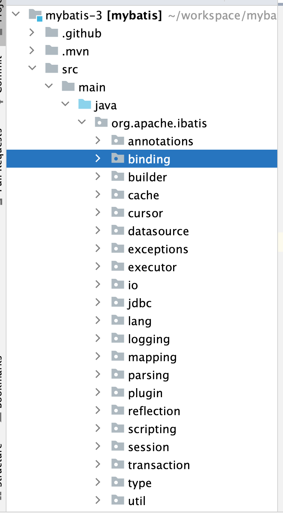
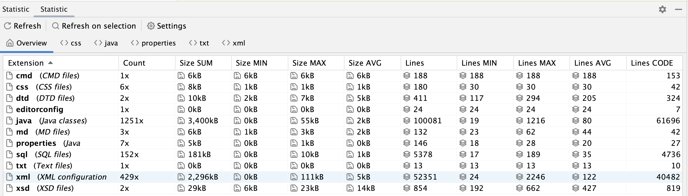

mybatis总体结构

- 如图所示：

表格统计如下图：

| 模块        | 功能                                                         |
| ----------- | ------------------------------------------------------------ |
| annotations | 注解模块。提供用户能够直接在mapper接口上使用注解编写SQL语句，但是实际使用当中，大家更倾向于使用xml文件。 |
| binding     | 连接器模块。在调用 SqlSession 相应方法执行数据库操作时，需要指定映射文件中定义的 SQL 节点，如果出现拼写错误，我们只能在运行时才能发现相应的异常。为了尽早发现这种错误，MyBatis 通过 Binding 模块，将用户自定义的 Mapper 接口与映射配置文件关联起来，系统可以通过调用自定义 Mapper 接口中的方法执行相应的 SQL 语句完成数据库操作，从而避免上述问题。值得读者注意的是，开发人员无须编写自定义 Mapper 接口的实现，MyBatis 会自动为其创建动态代理对象。在有些场景中，自定义 Mapper 接口可以完全代替映射配置文件，但有的映射规则和 SQL 语句的定义还是写在映射配置文件中比较方便，例如动态 SQL 语句的定义。 |
| builder     |                                                              |
| cache       | 缓存模块。mybatis提供了一级缓存和二级缓存，这两级缓存都是基于mybatis的缓存模块实现的。 |
| cursor      | 结果的游标模块。                                             |
| datasource  | 数据源模块。MyBatis自身提供了相应的数据源实现，当然 MyBatis 也提供了与第三方数据源集成的接口，这些功能都位于数据源模块之中 |
| exceptions  | 异常模块。定义了 MyBatis 专有的 PersistenceException 和 TooManyResultsException 异常 |
| execurot    | 执行器模块。                                                 |
| io          | io模块。资源加载模块，主要是对类加载器进行封装，确定类加载器的使用顺序，并提供了加载类文件以及其他资源文件的功能 。 |
| jdbc        |                                                              |
| lang        |                                                              |
| logging     |                                                              |
| parsing     |                                                              |
| plugin      |                                                              |
| reflecting  |                                                              |
| scripting   |                                                              |
| session     |                                                              |
| transaction |                                                              |
| type        |                                                              |
| Util        |                                                              |
|             |                                                              |

插件统计整个mybatis-3代码如下：

