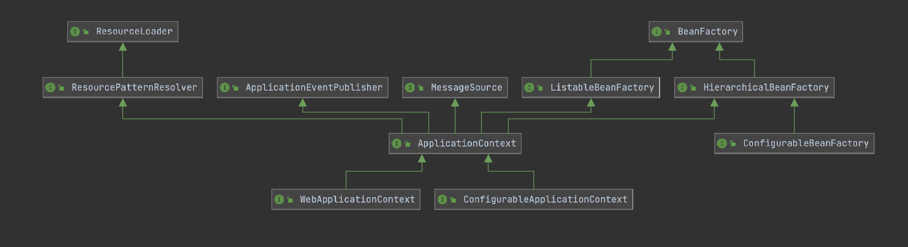

# IOC容器的接口设计图

上述图中有三条线：分别如下：

- 从BeanFactory到HierarchicalBeanFactory到ConfigurableBeanFactory是一条线。
  - 核心BeanFactory接口主要定义了容器拥有的基本能力
    - 核心BeanFactory接口参考
  - HierarchicalBeanFactory：主要的接口如下
    - 通过getParentBeanFactory获取父子容器
    - 通过containsLocalBean检测是否包含bean
  - ConfigurableBeanFactory：主要的接口如下
    - 通过setParentBeanFactory设置当前容器的父子容器
    - 通过setBeanClassLoader设置当前类的类加载器，也可以获取类加载器
    - 通过setBeanExpressionResolver设置当前累的bean表达式解析器，也可以获取当前类的表达式解析器
    - 通过addBeanPostProcessor设置be an的后置处理器。也可以获取bean的后置处理器数量
    - 通过registerAlias设置bean的别名，也可以通过
    - 通过isFactoryBean判断是否是FactoryBean，返回值是一个布尔值
    - 通过registerDependentBean设置beanName的dependentBeanName，也可以通过getDependentBeans获取beanName的依赖bean数组
    - 通过destroyBean销毁bean
  - 
- 以ApplicationContext为核心的接口。包括了BeanFactory到ListableBeanFactory到ApplicationContext，ConfigurableApplicationContext，WebApplicationContext
  - 
- 