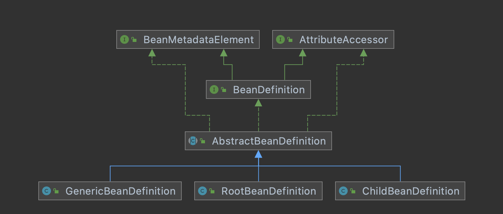

# 00-Spring相关类图

GitHub地址：

- https://github.com/HFwas
- 主要是[ notes](https://github.com/HFwas/notes)仓库下`Spring`文件夹和[spring-framework](https://github.com/HFwas/spring-framework)仓库的`hfwas`分支

[toc]

# 容器加载相关类图

上图分析：

- AliasRegistry：定义对alias的简单增删改等操作
- SimpleAliasRegistry：主要使用map作为alias的缓存，并对接口AliasRegistry进行实现
- SingletonBeanRegistry：定义对单例的注册及获取
- BeanFactory：定义获取bean及bean的各种属性。
- DefaultSingletonBeanRegistry：对接口SingletonBeanRegistry各函数的实现。
- HierarchicalBeanFactory：继承BeanFactory，也就是在BeanFactory定义的功能的基础上增加了对parentFactory的支持。主要增加了可以获取父子容器的功能
- BeanDefinitionRegistry：定义对BeanDefinition的各种增删改操作。
- FactoryBeanRegistrySupport：在DefaultSingletonBeanRegistry基础上增加了对FactoryBean的特殊处理功能。
- ConfigurableBeanFactory：提供配置Factory的各种方法。
- ListableBeanFactory：根据各种条件获取bean的配置清单。主要是一些涉及BeanDefinition，be an的功能
- AbstractBeanFactory：综合FactoryBeanRegistrySupport和ConfigurableBeanFactory的功能。
- AutowireCapableBeanFactory：提供创建bean、自动注入、初始化以及应用bean的后处理器。
- AbstractAutowireCapableBeanFactory：综合AbstractBeanFactory并对接口AutowireCapable BeanFactory进行实现
- ConfigurableListableBeanFactory：BeanFactory配置清单，指定忽略类型及接口等
- DefaultListableBeanFactory，而DefaultListableBeanFactory是整个bean加载的核心部分，是Spring注册及加载bean的默认实现。综合上面所有功能，主要是对Bean注册后的处理
- XmlBeanFactory对DefaultListableBeanFactory类进行了扩展，主要用于从XML文档中读取BeanDefinition，对于注册及获取Bean都是使用从父类DefaultListableBeanFactory继承的方法去实现，而唯独与父类不同的个性化实现就是增加了XmlBeanDefinitionReader类型的reader属性。在XmlBeanFactory中主要使用reader属性对资源文件进行读取和注册。

# 配置文件读取相关类图

上图分析：

- ResourceLoader：定义资源加载器，主要应用于根据给定的资源文件地址返回对应的Resource。
- BeanDefinitionReader：主要定义资源文件读取并转换为BeanDefinition的各个功能。
- EnvironmentCapable：定义获取Environment方法。
- DocumentLoader：定义从资源文件加载到转换为Document的功能。
- BeanDefinitionDocumentReader：定义读取Docuemnt并注册BeanDefinition功能。
- BeanDefinitionParserDelegate：定义解析Element的各种方法。

整个流程如下：

- 通过继承自AbstractBeanDefinitionReader中的方法，来使用ResourLoader将资源文件路径转换为对应的Resource文件。
- 通过DocumentLoader对Resource文件进行转换，将Resource文件转换为Document文件
- 通过实现接口BeanDefinitionDocumentReader的DefaultBeanDefinitionDocumentReader类对Document进行解析，并使用BeanDefinitionParserDelegate对Element进行解析。

# 资源文件处理相关类图

上图分析：

- 不同的资源文件都有相应的Resource实现,Spring提供了对于不同资源的抽象。
- 文件（FileSystemResource）
- Classpath资源（ClassPathResource）
- URL资源（UrlResource）
- InputStream资源（InputStreamResource）
- Byte数组（ByteArrayResource）

# 资源加载相关类图

上图分析：

- ResourceLoader，定义资源加载器，主要应用于根据给定的资源文件地址，返回对应的 Resource 。
- DefaultResourceLoader是ResourceLoader的默认实现
- FileSystemResourceLoader从文件系统加载资源

# Bean信息相关类图

- BeanDefinition是配置文件<bean>元素标签在容器中的内部表示形式
- 其中RootBeanDefinition是最常用的实现类，它对应一般性的<bean>元素标签，GenericBeanDefinition是自2.5版本以后新加入的bean文件配置属性定义类，是一站式服务类
- 在配置文件中可以定义父<bean>和子<bean>，父<bean>用RootBeanDefinition表示，而子<bean>用ChildBeanDefiniton表示，而没有父<bean>的<bean>就使用RootBeanDefinition表示。AbstractBeanDefinition对两者共同的类信息进行抽象。
- Spring通过BeanDefinition将配置文件中的<bean>配置信息转换为容器的内部表示，并将这些BeanDefiniton注册到BeanDefinitonRegistry中。Spring容器的BeanDefinitionRegistry就像是Spring配置信息的内存数据库，主要是以map的形式保存，后续操作直接从BeanDefinition Registry中读取配置信息

# 参考资料

- 《spring源码深度解析》
- 知识星球宇道源码《死磕Spring》
- 《Spring技术内幕》