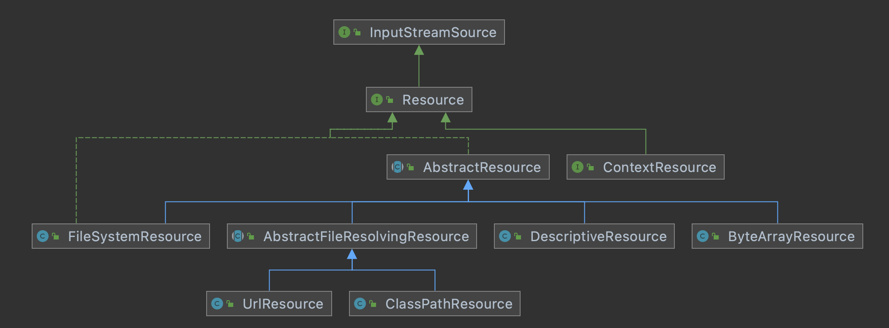

# Spring源码-资源的统一加载

# 1.目录

[toc]

# 2.前提介绍

spring对于资源对象做了统一封装，统一以Resource对外展示，

# 3.资源定义

## 3.1.资源定义类图




## 3.2.Resource接口方法

```java
public interface Resource extends InputStreamSource {

	/**
	 * 资源是否存在
	 */
	boolean exists();

	/**
	 * 资源是否可读
	 */
	default boolean isReadable() {
		return exists();
	}

	/**
	 * 资源代表的句柄是否被一个 stream 打开
	 */
	default boolean isOpen() {
		return false;
	}

	/**
	 * 是否为 file
	 */
	default boolean isFile() {
		return false;
	}

	/**
	 * 获取资源的 URL 句柄
	 */
	URL getURL() throws IOException;

	/**
	 * 获取资源的 URI 句柄
	 */
	URI getURI() throws IOException;

	/**
	 * 获取资源的 file 句柄
	 */
	File getFile() throws IOException;

	/**
	 * 返回 ReadableByteChannel
	 */
	default ReadableByteChannel readableChannel() throws IOException {
		return Channels.newChannel(getInputStream());
	}

	/**
	 * 获取资源内容的长度
	 */
	long contentLength() throws IOException;

	/**
	 * 获取资源的最后的修改时间
	 */
	long lastModified() throws IOException;

	/**
	 * 根据提供的相对路径创建 资源
	 */
	Resource createRelative(String relativePath) throws IOException;

	/**
	 * 获取资源的文件名称
	 */
	@Nullable
	String getFilename();

	/**
	 * 获取资源的描述内容
	 */
	String getDescription();

}
```

## 3.3.AbstractResource类

抽象类AbstractResource默认实现了Resource接口的大部分方法，接口实现如下：

```java
public abstract class AbstractResource implements Resource {

	/**
	 * 判断文件是否存在
	 */
	@Override
	public boolean exists() {
		// Try file existence: can we find the file in the file system?
		try {
			return getFile().exists();
		}
		catch (IOException ex) {
			// Fall back to stream existence: can we open the stream?
			try {
				getInputStream().close();
				return true;
			}
			catch (Throwable isEx) {
				return false;
			}
		}
	}

	/**
	 * 判断资源是否是可读的，
	 */
	@Override
	public boolean isReadable() {
		return exists();
	}

	/**
	 * 判断文件是否被打开， 默认返回 false
	 */
	@Override
	public boolean isOpen() {
		return false;
	}

	/**
	 * 判断是否为 file , 默认返回 
	 */
	@Override
	public boolean isFile() {
		return false;
	}

	/**
	 * 获取 URL
	 */
	@Override
	public URL getURL() throws IOException {
		throw new FileNotFoundException(getDescription() + " cannot be resolved to URL");
	}

	/**
	 * 获取 URI
	 */
	@Override
	public URI getURI() throws IOException {
		URL url = getURL();
		try {
			return ResourceUtils.toURI(url);
		}
		catch (URISyntaxException ex) {
			throw new NestedIOException("Invalid URI [" + url + "]", ex);
		}
	}

	/**
	 * 获取 file 对象， 交给子类实现
	 */
	@Override
	public File getFile() throws IOException {
		throw new FileNotFoundException(getDescription() + " cannot be resolved to absolute file path");
	}

	/**
	 * 获取 ReadableByteChannel 对象
	 */
	@Override
	public ReadableByteChannel readableChannel() throws IOException {
		return Channels.newChannel(getInputStream());
	}

	/**
	 * 获取资源的内容长度， 通过 getInputStream(); 获取输入流，遍历读取字节数， 返回实际是字节数
	 */
	@Override
	public long contentLength() throws IOException {
		InputStream is = getInputStream();
		try {
			long size = 0;
			byte[] buf = new byte[256];
			int read;
			while ((read = is.read(buf)) != -1) {
				size += read;
			}
			return size;
		}
		finally {
			try {
				is.close();
			}
			catch (IOException ex) {
			}
		}
	}

	/**
	 * 获取资源的最后修改时间
	 */
	@Override
	public long lastModified() throws IOException {
		File fileToCheck = getFileForLastModifiedCheck();
		long lastModified = fileToCheck.lastModified();
		if (lastModified == 0L && !fileToCheck.exists()) {
			throw new FileNotFoundException(getDescription() +
					" cannot be resolved in the file system for checking its last-modified timestamp");
		}
		return lastModified;
	}

	/**
	 *
	 */
	protected File getFileForLastModifiedCheck() throws IOException {
		return getFile();
	}

	/**
	 * 根据相对路径，创建资源对象。 如果不存在，抛出 FileNotFoundException 异常
	 */
	@Override
	public Resource createRelative(String relativePath) throws IOException {
		throw new FileNotFoundException("Cannot create a relative resource for " + getDescription());
	}

	/**
	 * 获取文件名称，默认返回 null ，交给子类实现
	 */
	@Override
	@Nullable
	public String getFilename() {
		return null;
	}


	/**
	 * 
	 */
	@Override
	public boolean equals(Object other) {
		return (this == other || (other instanceof Resource &&
				((Resource) other).getDescription().equals(getDescription())));
	}

	/**
	 * 基于资源的描述内容做 hash
	 */
	@Override
	public int hashCode() {
		return getDescription().hashCode();
	}

	/**
	 * 直接返回资源的描述内容
	 */
	@Override
	public String toString() {
		return getDescription();
	}

}
```

## 3.4.其他子类

- 


# 4.资源加载

## 4.1.ResourceLoader继承关系图


## 4.2.类图


## 4.3.ResourceLoader接口

- 主要包括两个方法：
  - 根据指定路径获取Resource对象，DefaultResourceLoader提供了方法的默认实现
  - 获取类加载器
- 

```java
public interface ResourceLoader {

	/** Pseudo URL prefix for loading from the class path: "classpath:". */
	String CLASSPATH_URL_PREFIX = ResourceUtils.CLASSPATH_URL_PREFIX;


	/**
	 * 根据提供的路径获取Resource对象
	 */
	Resource getResource(String location);

	/**
	 * 获取当前类的类加载器
	 */
	@Nullable
	ClassLoader getClassLoader();

}

```


## 4.4.实现类DefaultResourceLoader

```java
public class DefaultResourceLoader implements ResourceLoader {

	// 类加载器
	@Nullable
	private ClassLoader classLoader;

	// 协议解析器
	private final Set<ProtocolResolver> protocolResolvers = new LinkedHashSet<>(4);

	// 资源缓存
	private final Map<Class<?>, Map<Resource, ?>> resourceCaches = new ConcurrentHashMap<>(4);


	/**
	 * 无参构造器，提供ClassUtils.getDefaultClassLoader();获取类加载器
	 */
	public DefaultResourceLoader() {
		this.classLoader = ClassUtils.getDefaultClassLoader();
	}

	/**
	 * 有参构造器，可以自定义设置类加载器
	 */
	public DefaultResourceLoader(@Nullable ClassLoader classLoader) {
		this.classLoader = classLoader;
	}


	/**
	 * set方法，可以自定义设置类加载器
	 */
	public void setClassLoader(@Nullable ClassLoader classLoader) {
		this.classLoader = classLoader;
	}

	/**
	 * get方法，可以获取类加载器，
	 */
	@Override
	@Nullable
	public ClassLoader getClassLoader() {
		return (this.classLoader != null ? this.classLoader : ClassUtils.getDefaultClassLoader());
	}

	/**
	 * 添加 协议解析器
	 */
	public void addProtocolResolver(ProtocolResolver resolver) {
		Assert.notNull(resolver, "ProtocolResolver must not be null");
		this.protocolResolvers.add(resolver);
	}

	/**
	 * 获取协议解析器集合
	 */
	public Collection<ProtocolResolver> getProtocolResolvers() {
		return this.protocolResolvers;
	}

	/**
	 * 获取资源缓存
	 */
	@SuppressWarnings("unchecked")
	public <T> Map<Resource, T> getResourceCache(Class<T> valueType) {
		return (Map<Resource, T>) this.resourceCaches.computeIfAbsent(valueType, key -> new ConcurrentHashMap<>());
	}

	/**
	 * 清楚所有的资源集合
	 */
	public void clearResourceCaches() {
		this.resourceCaches.clear();
	}


	@Override
	public Resource getResource(String location) {
		Assert.notNull(location, "Location must not be null");

		for (ProtocolResolver protocolResolver : getProtocolResolvers()) {
			Resource resource = protocolResolver.resolve(location, this);
			if (resource != null) {
				return resource;
			}
		}

		// 以 / 开头， 则返回 ClassPathContextResource 对象
		if (location.startsWith("/")) {
			// 示例： /org/springframework/context/support/simpleContext.xml
			return getResourceByPath(location);
		}
		// 如果以 classpath: 开头， 返回 ClassPathResource 对象
		else if (location.startsWith(CLASSPATH_URL_PREFIX)) {
			return new ClassPathResource(location.substring(CLASSPATH_URL_PREFIX.length()), getClassLoader());
		}
		else {
			try {
				// 判断是否是 文件URL , 是返回 FileUrlResource 对象，否则返回 UrlResource
				// Try to parse the location as a URL...
				URL url = new URL(location);
				return (ResourceUtils.isFileURL(url) ? new FileUrlResource(url) : new UrlResource(url));
			}
			catch (MalformedURLException ex) {
				// 不是文件URL， 则返回 ClassPathContextResource 类型的对象
				// No URL -> resolve as resource path.
				return getResourceByPath(location);
			}
		}
	}

	/**
	 * 清洗 类路径 ， 设置 类加载器
	 */
	protected Resource getResourceByPath(String path) {
		return new ClassPathContextResource(path, getClassLoader());
	}


	/**
	 * 基于实现 ContextResource 接口显式表达上下文相关路径的 ClassPathResource
	 */
	protected static class ClassPathContextResource extends ClassPathResource implements ContextResource {

		public ClassPathContextResource(String path, @Nullable ClassLoader classLoader) {
			super(path, classLoader);
		}

		@Override
		public String getPathWithinContext() {
			return getPath();
		}

		@Override
		public Resource createRelative(String relativePath) {
			String pathToUse = StringUtils.applyRelativePath(getPath(), relativePath);
			return new ClassPathContextResource(pathToUse, getClassLoader());
		}
	}

}
```

详细解释：

- DefaultResourceLoader实现了ResourceLoader接口的大部分方法，
- DefaultResourceLoader可以指定类加载器，类加载器的获取通过两种方式
  - 一种是获取当前类的线程上下文，Thread.currentThread().getContextClassLoader();
  - 一种是通过ClassLoader.getSystemClassLoader();获取类加载器
- 

## 4.5.类ResourcePatternResolver

```java
public interface ResourcePatternResolver extends ResourceLoader {

	/**
	 * Pseudo URL prefix for all matching resources from the class path: "classpath*:"
	 * This differs from ResourceLoader's classpath URL prefix in that it
	 * retrieves all matching resources for a given name (e.g. "/beans.xml"),
	 * for example in the root of all deployed JAR files.
	 * @see org.springframework.core.io.ResourceLoader#CLASSPATH_URL_PREFIX
	 */
	String CLASSPATH_ALL_URL_PREFIX = "classpath*:";

	/**
	 * Resolve the given location pattern into Resource objects.
	 * <p>Overlapping resource entries that point to the same physical
	 * resource should be avoided, as far as possible. The result should
	 * have set semantics.
	 * @param locationPattern the location pattern to resolve
	 * @return the corresponding Resource objects
	 * @throws IOException in case of I/O errors
	 */
	Resource[] getResources(String locationPattern) throws IOException;

}
```

分析如下：

- ResourcePatternResolver继承了ResourceLoader接口，扩展了getResources方法，根据路径匹配，可以返回多个Resources对象
- 

## 4.6.PathMatchingResourcePatternResolver

```

```


# GitHub地址

- 个人 GitHub地址：https://github.com/HFwas
- spring源码学习：
  - [ notes](https://github.com/HFwas/notes)仓库下`Spring`文件夹
  - [spring-framework](https://github.com/HFwas/spring-framework)仓库的`hfwas`分支