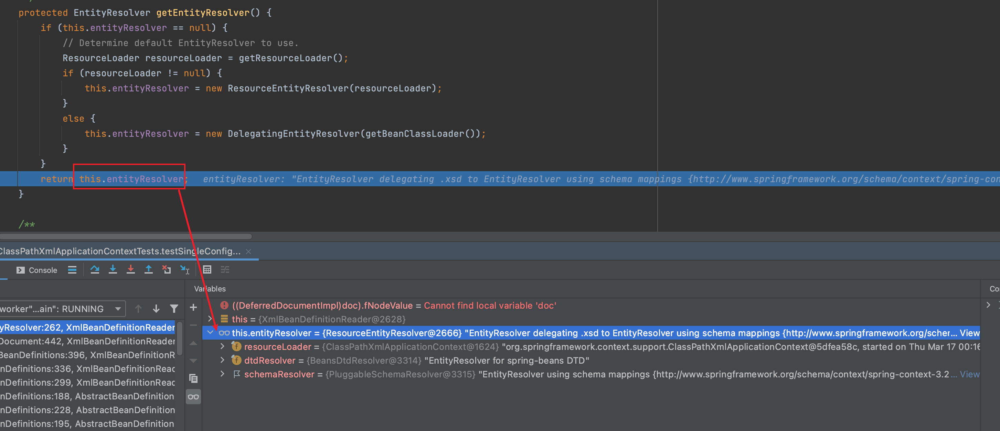

# 05-Spring加载Document

[toc]


# doLoadDocument

```java
/**
	 * Actually load the specified document using the configured DocumentLoader.
	 * @param inputSource the SAX InputSource to read from
	 * @param resource the resource descriptor for the XML file
	 * @return the DOM Document
	 * @throws Exception when thrown from the DocumentLoader
	 * @see #setDocumentLoader
	 * @see DocumentLoader#loadDocument
	 */
	protected Document doLoadDocument(InputSource inputSource, Resource resource) throws Exception {
		// 1. getValidationModeForResource(resource) : 获取执行xml文件的验证模式
		// 2. getEntityResolver() ： 获取实体解析器
		// 3. isNamespaceAware() ： 命名空间支持，如果提供命名空间支持，则为true
		return this.documentLoader.loadDocument(inputSource, getEntityResolver(), this.errorHandler,
				getValidationModeForResource(resource), isNamespaceAware());
	}
```

- 

# getEntityResolver

```java
/**
	 * Return the EntityResolver to use, building a default resolver
	 * if none specified.
	 */
	protected EntityResolver getEntityResolver() {
		if (this.entityResolver == null) {
			// Determine default EntityResolver to use.
			ResourceLoader resourceLoader = getResourceLoader();
			if (resourceLoader != null) {
				this.entityResolver = new ResourceEntityResolver(resourceLoader);
			}
			else {
				this.entityResolver = new DelegatingEntityResolver(getBeanClassLoader());
			}
		}
		return this.entityResolver;
	}
```

- dd 

资源解析器如下图所示：



- 

# getValidationModeForResource

```java
/**
	 * Determine the validation mode for the specified {@link Resource}.
	 * If no explicit validation mode has been configured, then the validation
	 * mode gets {@link #detectValidationMode detected} from the given resource.
	 * <p>Override this method if you would like full control over the validation
	 * mode, even when something other than {@link #VALIDATION_AUTO} was set.
	 * @see #detectValidationMode
	 */
	protected int getValidationModeForResource(Resource resource) {
		int validationModeToUse = getValidationMode();
		if (validationModeToUse != VALIDATION_AUTO) {
			return validationModeToUse;
		}
		int detectedMode = detectValidationMode(resource);
		if (detectedMode != VALIDATION_AUTO) {
			return detectedMode;
		}
		// Hmm, we didn't get a clear indication... Let's assume XSD,
		// since apparently no DTD declaration has been found up until
		// detection stopped (before finding the document's root tag).
		return VALIDATION_XSD;
	}
```

- dd 

# detectValidationMode

```
/**
	 * Detect which kind of validation to perform on the XML file identified
	 * by the supplied {@link Resource}. If the file has a {@code DOCTYPE}
	 * definition then DTD validation is used otherwise XSD validation is assumed.
	 * <p>Override this method if you would like to customize resolution
	 * of the {@link #VALIDATION_AUTO} mode.
	 */
	protected int detectValidationMode(Resource resource) {
		if (resource.isOpen()) {
			throw new BeanDefinitionStoreException(
					"Passed-in Resource [" + resource + "] contains an open stream: " +
					"cannot determine validation mode automatically. Either pass in a Resource " +
					"that is able to create fresh streams, or explicitly specify the validationMode " +
					"on your XmlBeanDefinitionReader instance.");
		}

		InputStream inputStream;
		try {
			inputStream = resource.getInputStream();
		}
		catch (IOException ex) {
			throw new BeanDefinitionStoreException(
					"Unable to determine validation mode for [" + resource + "]: cannot open InputStream. " +
					"Did you attempt to load directly from a SAX InputSource without specifying the " +
					"validationMode on your XmlBeanDefinitionReader instance?", ex);
		}

		try {
			return this.validationModeDetector.detectValidationMode(inputStream);
		}
		catch (IOException ex) {
			throw new BeanDefinitionStoreException("Unable to determine validation mode for [" +
					resource + "]: an error occurred whilst reading from the InputStream.", ex);
		}
	}
```


# isNamespaceAware