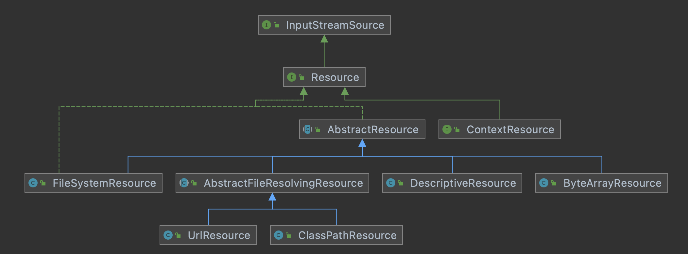
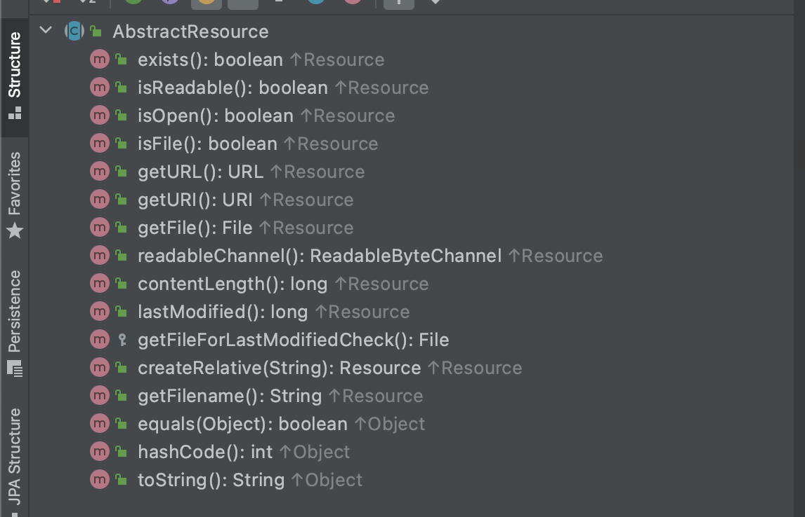
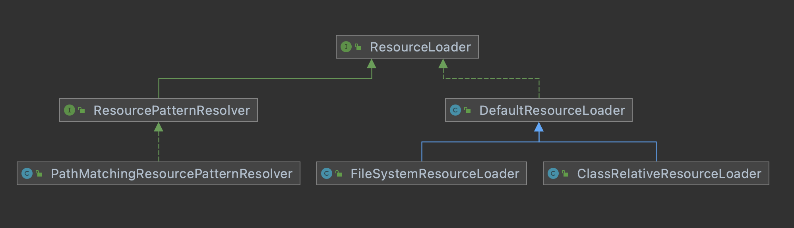

# 12-Spring资源体系


# 资源文件定义相关类图



上图分析：

- Spring对其内部使用到的资源实现了自己的抽象结构，提供了自己对于资源的默认接口Resource接口，Resource接口提供了一系列默认的方法，AbstractResource是Resource接口的默认实现
- 不同的资源文件都有相应的Resource实现，对于文件系统有FileSystemResource，对于Classpath资源有ClassPathResource
- URL资源（UrlResource）
- InputStream资源（InputStreamResource）
- Byte数组（ByteArrayResource）

## Resource接口

```java
package org.springframework.core.io;

import java.io.File;
import java.io.IOException;
import java.io.InputStream;
import java.net.URI;
import java.net.URL;
import java.nio.channels.Channels;
import java.nio.channels.ReadableByteChannel;

import org.springframework.lang.Nullable;

public interface Resource extends InputStreamSource {

	/**
	 * 资源是否存在
	 */
	boolean exists();

	/**
	 * 资源是否可读
	 */
	default boolean isReadable() {
		return exists();
	}

	/**
	 * 资源代表的句柄是否被一个 stream 打开
	 */
	default boolean isOpen() {
		return false;
	}

	/**
	 * 是否为 file
	 */
	default boolean isFile() {
		return false;
	}

	/**
	 * 获取资源的 URL 句柄
	 */
	URL getURL() throws IOException;

	/**
	 * 获取资源的 URI 句柄
	 */
	URI getURI() throws IOException;

	/**
	 * 获取资源的 file 句柄
	 */
	File getFile() throws IOException;

	/**
	 * 返回 ReadableByteChannel
	 */
	default ReadableByteChannel readableChannel() throws IOException {
		return Channels.newChannel(getInputStream());
	}

	/**
	 * 获取资源内容的长度
	 */
	long contentLength() throws IOException;

	/**
	 * 获取资源的最后的修改时间
	 * Determine the last-modified timestamp for this resource.
	 * @throws IOException if the resource cannot be resolved
	 * (in the file system or as some other known physical resource type)
	 */
	long lastModified() throws IOException;

	/**
	 * 根据提供的相对路径创建 资源
	 */
	Resource createRelative(String relativePath) throws IOException;

	/**
	 * 获取资源的文件名称
	 */
	@Nullable
	String getFilename();

	/**
	 * 获取资源的描述内容
	 */
	String getDescription();

}
```

- Spring对其内部使用到的资源实现了自己的抽象结构：Resource接口来封装底层资源
- Resource接口提供了资源文件通用的一些方法，包括：获取文件名称，获取内容长度，获取URL,URI，文件是否存在，是否是文件等等
- Resource接口抽象了所有Spring内部使用到的底层资源：File、URL、Classpath等

## AbstractResource抽象类

截图如下：



从上图可以看出，AbstractResource提供了Resource接口方法的默认实现

```java
package org.springframework.core.io;

import java.io.File;
import java.io.FileNotFoundException;
import java.io.IOException;
import java.io.InputStream;
import java.net.URI;
import java.net.URISyntaxException;
import java.net.URL;
import java.nio.channels.Channels;
import java.nio.channels.ReadableByteChannel;

import org.springframework.core.NestedIOException;
import org.springframework.lang.Nullable;
import org.springframework.util.ResourceUtils;

/**
 * 
 */
public abstract class AbstractResource implements Resource {

	/**
	 * 文件是否存在
	 */
	@Override
	public boolean exists() {
		// Try file existence: can we find the file in the file system?
		try {
			return getFile().exists();
		}
		catch (IOException ex) {
			// Fall back to stream existence: can we open the stream?
			try {
				getInputStream().close();
				return true;
			}
			catch (Throwable isEx) {
				return false;
			}
		}
	}

	/**
	 * 文件是否可读
	 */
	@Override
	public boolean isReadable() {
		return exists();
	}

	/**
	 * 文件是否是打开的， 默认为 false 
	 */
	@Override
	public boolean isOpen() {
		return false;
	}

	/**
	 * 是否是文件， 默认是 false 
	 */
	@Override
	public boolean isFile() {
		return false;
	}

	/**
	 * 获取 URL 地址
	 */
	@Override
	public URL getURL() throws IOException {
		throw new FileNotFoundException(getDescription() + " cannot be resolved to URL");
	}

	/**
	 * 获取 URI 地址
	 */
	@Override
	public URI getURI() throws IOException {
		URL url = getURL();
		try {
			return ResourceUtils.toURI(url);
		}
		catch (URISyntaxException ex) {
			throw new NestedIOException("Invalid URI [" + url + "]", ex);
		}
	}

	/**
	 * 获取 File 对象， 交给子类实现，默认抛出 FileNotFoundException 异常
	 */
	@Override
	public File getFile() throws IOException {
		throw new FileNotFoundException(getDescription() + " cannot be resolved to absolute file path");
	}

	/**
	 * This implementation returns {@link Channels#newChannel(InputStream)}
	 * with the result of {@link #getInputStream()}.
	 * <p>This is the same as in {@link Resource}'s corresponding default method
	 * but mirrored here for efficient JVM-level dispatching in a class hierarchy.
	 */
	@Override
	public ReadableByteChannel readableChannel() throws IOException {
		return Channels.newChannel(getInputStream());
	}

	/**
	 * This implementation reads the entire InputStream to calculate the
	 * content length. Subclasses will almost always be able to provide
	 * a more optimal version of this, e.g. checking a File length.
	 * @see #getInputStream()
	 */
	@Override
	public long contentLength() throws IOException {
		InputStream is = getInputStream();
		try {
			long size = 0;
			byte[] buf = new byte[256];
			int read;
			while ((read = is.read(buf)) != -1) {
				size += read;
			}
			return size;
		}
		finally {
			try {
				is.close();
			}
			catch (IOException ex) {
			}
		}
	}

	/**
	 * This implementation checks the timestamp of the underlying File,
	 * if available.
	 * @see #getFileForLastModifiedCheck()
	 */
	@Override
	public long lastModified() throws IOException {
		File fileToCheck = getFileForLastModifiedCheck();
		long lastModified = fileToCheck.lastModified();
		if (lastModified == 0L && !fileToCheck.exists()) {
			throw new FileNotFoundException(getDescription() +
					" cannot be resolved in the file system for checking its last-modified timestamp");
		}
		return lastModified;
	}

	/**
	 * Determine the File to use for timestamp checking.
	 * <p>The default implementation delegates to {@link #getFile()}.
	 * @return the File to use for timestamp checking (never {@code null})
	 * @throws FileNotFoundException if the resource cannot be resolved as
	 * an absolute file path, i.e. is not available in a file system
	 * @throws IOException in case of general resolution/reading failures
	 */
	protected File getFileForLastModifiedCheck() throws IOException {
		return getFile();
	}

	/**
	 * This implementation throws a FileNotFoundException, assuming
	 * that relative resources cannot be created for this resource.
	 */
	@Override
	public Resource createRelative(String relativePath) throws IOException {
		throw new FileNotFoundException("Cannot create a relative resource for " + getDescription());
	}

	/**
	 * This implementation always returns {@code null},
	 * assuming that this resource type does not have a filename.
	 */
	@Override
	@Nullable
	public String getFilename() {
		return null;
	}


	/**
	 * This implementation compares description strings.
	 * @see #getDescription()
	 */
	@Override
	public boolean equals(Object other) {
		return (this == other || (other instanceof Resource &&
				((Resource) other).getDescription().equals(getDescription())));
	}

	/**
	 * This implementation returns the description's hash code.
	 * @see #getDescription()
	 */
	@Override
	public int hashCode() {
		return getDescription().hashCode();
	}

	/**
	 * This implementation returns the description of this resource.
	 * @see #getDescription()
	 */
	@Override
	public String toString() {
		return getDescription();
	}

}
```


# 资源加载相关类图



上图分析：

- ResourceLoader接口
  - 通过指定的路径文件地址，返回指定资源的资源对象Resource。
  - 获取当前类的类加载器

- DefaultResourceLoader是ResourceLoader的默认实现，对于不同的文件提供了不同的实现
- FileSystemResourceLoader从文件系统加载资源

## ResourceLoader接口

```java
package org.springframework.core.io;

import org.springframework.lang.Nullable;
import org.springframework.util.ResourceUtils;

/**
 * ResourceLoader接口主要解决了
 		1. 根据路径，获取Resource文件
 		2. 获取类加载器
 */
public interface ResourceLoader {

	/** Pseudo URL prefix for loading from the class path: "classpath:". */
	String CLASSPATH_URL_PREFIX = ResourceUtils.CLASSPATH_URL_PREFIX;


	/**
	 * 根据路径获取 资源对象
	 */
	Resource getResource(String location);

	/**
	 * 获取类加载器
	 */
	@Nullable
	ClassLoader getClassLoader();

}
```

## DefaultResourceLoader类

```java
package org.springframework.core.io;

import java.net.MalformedURLException;
import java.net.URL;
import java.util.Collection;
import java.util.LinkedHashSet;
import java.util.Map;
import java.util.Set;
import java.util.concurrent.ConcurrentHashMap;

import org.springframework.lang.Nullable;
import org.springframework.util.Assert;
import org.springframework.util.ClassUtils;
import org.springframework.util.ResourceUtils;
import org.springframework.util.StringUtils;

/**
 * ResourceLoader 接口的默认实现
 */
public class DefaultResourceLoader implements ResourceLoader {

	// 类加载器
	@Nullable
	private ClassLoader classLoader;

	// 协议解析器
	private final Set<ProtocolResolver> protocolResolvers = new LinkedHashSet<>(4);

	// 资源缓存
	private final Map<Class<?>, Map<Resource, ?>> resourceCaches = new ConcurrentHashMap<>(4);


	public DefaultResourceLoader() {
		this.classLoader = ClassUtils.getDefaultClassLoader();
	}

	public DefaultResourceLoader(@Nullable ClassLoader classLoader) {
		this.classLoader = classLoader;
	}

	public void setClassLoader(@Nullable ClassLoader classLoader) {
		this.classLoader = classLoader;
	}

	@Override
	@Nullable
	public ClassLoader getClassLoader() {
		return (this.classLoader != null ? this.classLoader : ClassUtils.getDefaultClassLoader());
	}

	/**
	 * 添加 协议解析器
	 */
	public void addProtocolResolver(ProtocolResolver resolver) {
		Assert.notNull(resolver, "ProtocolResolver must not be null");
		this.protocolResolvers.add(resolver);
	}

	/**
	 * 
	 */
	public Collection<ProtocolResolver> getProtocolResolvers() {
		return this.protocolResolvers;
	}

	/**
	 * 获取资源缓存
	 */
	@SuppressWarnings("unchecked")
	public <T> Map<Resource, T> getResourceCache(Class<T> valueType) {
		return (Map<Resource, T>) this.resourceCaches.computeIfAbsent(valueType, key -> new ConcurrentHashMap<>());
	}

	/**
	 * Clear all resource caches in this resource loader.
	 * @since 5.0
	 * @see #getResourceCache
	 */
	public void clearResourceCaches() {
		this.resourceCaches.clear();
	}


	

	/**
	 * 
	 */
	protected Resource getResourceByPath(String path) {
		return new ClassPathContextResource(path, getClassLoader());
	}


	/**
	 * ClassPathResource that explicitly expresses a context-relative path
	 * through implementing the ContextResource interface.
	 */
	protected static class ClassPathContextResource extends ClassPathResource implements ContextResource {

		public ClassPathContextResource(String path, @Nullable ClassLoader classLoader) {
			super(path, classLoader);
		}

		@Override
		public String getPathWithinContext() {
			return getPath();
		}

		@Override
		public Resource createRelative(String relativePath) {
			String pathToUse = StringUtils.applyRelativePath(getPath(), relativePath);
			return new ClassPathContextResource(pathToUse, getClassLoader());
		}
	}
}
```

- 默认的构造器，通过 ClassUtils.getDefaultClassLoader(); 方法去获取类加载器
- 有参数构造器，通过传入的 ClassLoader 对象， 设置类加载器， 也可以通过 setClassLoader 方法去设置类加载器

## getResource方法

```java
@Override
	public Resource getResource(String location) {
		Assert.notNull(location, "Location must not be null");
    // 1.1.
		for (ProtocolResolver protocolResolver : getProtocolResolvers()) {
			Resource resource = protocolResolver.resolve(location, this);
			if (resource != null) {
				return resource;
			}
		}

		// 以 / 开头， 则返回 ClassPathContextResource 对象
		if (location.startsWith("/")) {
			return getResourceByPath(location);
		}
		// 如果以 classpath: 开头， 返回 ClassPathResource 对象
		else if (location.startsWith(CLASSPATH_URL_PREFIX)) {
			return new ClassPathResource(location.substring(CLASSPATH_URL_PREFIX.length()), getClassLoader());
		}
		else {
			try {
				// 判断是否是 URL , 是返回 FileUrlResource 对象
				// Try to parse the location as a URL...
				URL url = new URL(location);
				return (ResourceUtils.isFileURL(url) ? new FileUrlResource(url) : new UrlResource(url));
			}
			catch (MalformedURLException ex) {
				// 不是文件URL， 则返回 ClassPathContextResource 类型的对象
				// No URL -> resolve as resource path.
				return getResourceByPath(location);
			}
		}
	}
```

- DefaultResourceLoader类的核心方法是 `getResource(String location) `,根据传入的路径做解析
  - 首先，获取协议解析器， 通过协议解析器，解析指定路径的文件， 得到 Resource 对象
  - 先判断是否以 / 开头，是则返回 ClassPathContextResource 对象
  - 在判断是否以 classpath开头的， 是则返回 ClassPathResource 对象 
  - 后判断是否是URL，判断是否是 文件URL , 是返回 FileUrlResource 对象，否则返回 UrlResource 
  - 最后返回ClassPathContextResource 类型的对象
- 

## ResourcePatternResolver

```java
package org.springframework.core.io.support;

import java.io.IOException;

import org.springframework.core.io.Resource;
import org.springframework.core.io.ResourceLoader;

/**
 * 
 */
public interface ResourcePatternResolver extends ResourceLoader {

	/**
	 * 
	 */
	String CLASSPATH_ALL_URL_PREFIX = "classpath*:";

	/**
	 * 
	 */
	Resource[] getResources(String locationPattern) throws IOException;

}

```

 


# PathMatchingResourcePatternResolver

```java
package org.springframework.core.io.support;

import org.apache.commons.logging.Log;
import org.apache.commons.logging.LogFactory;
import org.springframework.core.io.*;
import org.springframework.lang.Nullable;
import org.springframework.util.*;

import java.io.File;
import java.io.FileNotFoundException;
import java.io.IOException;
import java.lang.reflect.InvocationHandler;
import java.lang.reflect.Method;
import java.net.*;
import java.util.*;
import java.util.jar.JarEntry;
import java.util.jar.JarFile;
import java.util.zip.ZipException;

public class PathMatchingResourcePatternResolver implements ResourcePatternResolver {

	private static final Log logger = LogFactory.getLog(PathMatchingResourcePatternResolver.class);

	@Nullable
	private static Method equinoxResolveMethod;

	static {
		try {
			// Detect Equinox OSGi (e.g. on WebSphere 6.1)
			Class<?> fileLocatorClass = ClassUtils.forName("org.eclipse.core.runtime.FileLocator",
					PathMatchingResourcePatternResolver.class.getClassLoader());
			equinoxResolveMethod = fileLocatorClass.getMethod("resolve", URL.class);
			logger.trace("Found Equinox FileLocator for OSGi bundle URL resolution");
		}
		catch (Throwable ex) {
			equinoxResolveMethod = null;
		}
	}

	// 资源加载器
	private final ResourceLoader resourceLoader;

	// 路径匹配器
	private PathMatcher pathMatcher = new AntPathMatcher();


	/**
	 * Create a new PathMatchingResourcePatternResolver with a DefaultResourceLoader.
	 * <p>ClassLoader access will happen via the thread context class loader.
	 * @see org.springframework.core.io.DefaultResourceLoader
	 */
	public PathMatchingResourcePatternResolver() {
		this.resourceLoader = new DefaultResourceLoader();
	}

	/**
	 * Create a new PathMatchingResourcePatternResolver.
	 * <p>ClassLoader access will happen via the thread context class loader.
	 * @param resourceLoader the ResourceLoader to load root directories and
	 * actual resources with
	 */
	public PathMatchingResourcePatternResolver(ResourceLoader resourceLoader) {
		Assert.notNull(resourceLoader, "ResourceLoader must not be null");
		this.resourceLoader = resourceLoader;
	}

	/**
	 * Create a new PathMatchingResourcePatternResolver with a DefaultResourceLoader.
	 * @param classLoader the ClassLoader to load classpath resources with,
	 * or {@code null} for using the thread context class loader
	 * at the time of actual resource access
	 * @see org.springframework.core.io.DefaultResourceLoader
	 */
	public PathMatchingResourcePatternResolver(@Nullable ClassLoader classLoader) {
		this.resourceLoader = new DefaultResourceLoader(classLoader);
	}


	/**
	 * Return the ResourceLoader that this pattern resolver works with.
	 */
	public ResourceLoader getResourceLoader() {
		return this.resourceLoader;
	}

	@Override
	@Nullable
	public ClassLoader getClassLoader() {
		return getResourceLoader().getClassLoader();
	}

	/**
	 * 默认的资源解析器是 AntPathMatcher.
	 * Set the PathMatcher implementation to use for this
	 * resource pattern resolver. Default is AntPathMatcher.
	 * @see org.springframework.util.AntPathMatcher
	 */
	public void setPathMatcher(PathMatcher pathMatcher) {
		Assert.notNull(pathMatcher, "PathMatcher must not be null");
		this.pathMatcher = pathMatcher;
	}

	/**
	 * Return the PathMatcher that this resource pattern resolver uses.
	 */
	public PathMatcher getPathMatcher() {
		return this.pathMatcher;
	}


	@Override
	public Resource getResource(String location) {
		return getResourceLoader().getResource(location);
	}

	@Override
	public Resource[] getResources(String locationPattern) throws IOException {
		Assert.notNull(locationPattern, "Location pattern must not be null");
		// 如果路径以 classpath*: 开头，
		if (locationPattern.startsWith(CLASSPATH_ALL_URL_PREFIX)) {
			// 路径包含通配符
			// a class path resource (multiple resources for same name possible)
			if (getPathMatcher().isPattern(locationPattern.substring(CLASSPATH_ALL_URL_PREFIX.length()))) {
				// a class path resource pattern
				return findPathMatchingResources(locationPattern);
			}
			// 路径不包含通配符
			else {
				// all class path resources with the given name
				return findAllClassPathResources(locationPattern.substring(CLASSPATH_ALL_URL_PREFIX.length()));
			}
		}
		// 不以 classpath*: 开头，
		else {
			//
			// Generally only look for a pattern after a prefix here,
			// and on Tomcat only after the "*/" separator for its "war:" protocol.
			int prefixEnd = (locationPattern.startsWith("war:") ? locationPattern.indexOf("*/") + 1 :
					locationPattern.indexOf(':') + 1);
			// 路径包含通配符
			if (getPathMatcher().isPattern(locationPattern.substring(prefixEnd))) {
				// a file pattern
				return findPathMatchingResources(locationPattern);
			}
			// 路径不包含通配符
			else {
				// 使用 DefaultResourceLoader 的 getResource 方法去加载指定路径的配置文件
				// a single resource with the given name
				return new Resource[] {getResourceLoader().getResource(locationPattern)};
			}
		}
	}

	/**
	 * Find all class location resources with the given location via the ClassLoader.
	 * Delegates to {@link #doFindAllClassPathResources(String)}.
	 * @param location the absolute path within the classpath
	 * @return the result as Resource array
	 * @throws IOException in case of I/O errors
	 * @see java.lang.ClassLoader#getResources
	 * @see #convertClassLoaderURL
	 */
	protected Resource[] findAllClassPathResources(String location) throws IOException {
		String path = location;
		// 如果以 / 开头
		if (path.startsWith("/")) {
			path = path.substring(1);
		}
		// 真正执行的逻辑
		Set<Resource> result = doFindAllClassPathResources(path);
		if (logger.isTraceEnabled()) {
			logger.trace("Resolved classpath location [" + location + "] to resources " + result);
		}
		return result.toArray(new Resource[0]);
	}

	/**
	 * 通过指定路径， 发现所有的资源
	 * Find all class location resources with the given path via the ClassLoader.
	 * Called by {@link #findAllClassPathResources(String)}.
	 * @param path the absolute path within the classpath (never a leading slash)
	 * @return a mutable Set of matching Resource instances
	 * @since 4.1.1
	 */
	protected Set<Resource> doFindAllClassPathResources(String path) throws IOException {
		Set<Resource> result = new LinkedHashSet<>(16);
		// 获取类加载器
		ClassLoader cl = getClassLoader();
		// 如果类加载器不为空，通过类加载获取指定路径下的资源集合，
		// 如果类加载器为空， 通过系统类类加载器获取指定路径下的资源集合
		Enumeration<URL> resourceUrls = (cl != null ? cl.getResources(path) : ClassLoader.getSystemResources(path));
		while (resourceUrls.hasMoreElements()) {
			URL url = resourceUrls.nextElement();
			// 将 url 转换为 UrlResource
			// 通过设置 url , uri 属性
			result.add(convertClassLoaderURL(url));
		}
		if ("".equals(path)) {
			// 加载路径下所有的 jar 包
			// The above result is likely to be incomplete, i.e. only containing file system references.
			// We need to have pointers to each of the jar files on the classpath as well...
			addAllClassLoaderJarRoots(cl, result);
		}
		return result;
	}

	/**
	 * Convert the given URL as returned from the ClassLoader into a {@link Resource}.
	 * <p>The default implementation simply creates a {@link UrlResource} instance.
	 * @param url a URL as returned from the ClassLoader
	 * @return the corresponding Resource object
	 * @see java.lang.ClassLoader#getResources
	 * @see org.springframework.core.io.Resource
	 */
	protected Resource convertClassLoaderURL(URL url) {
		return new UrlResource(url);
	}

	/**
	 * Search all {@link URLClassLoader} URLs for jar file references and add them to the
	 * given set of resources in the form of pointers to the root of the jar file content.
	 * @param classLoader the ClassLoader to search (including its ancestors)
	 * @param result the set of resources to add jar roots to
	 * @since 4.1.1
	 */
	protected void addAllClassLoaderJarRoots(@Nullable ClassLoader classLoader, Set<Resource> result) {
		// 如果 类加载器是 URLClassLoader 类型的
		if (classLoader instanceof URLClassLoader) {
			try {
				// 编辑 URL 集合
				for (URL url : ((URLClassLoader) classLoader).getURLs()) {
					try {
						// 如果是 url 协议， 返回 UrlResource url : url
						// 不是， 则返回 url : jar : url : !/
						UrlResource jarResource = (ResourceUtils.URL_PROTOCOL_JAR.equals(url.getProtocol()) ?
								new UrlResource(url) :
								new UrlResource(ResourceUtils.JAR_URL_PREFIX + url + ResourceUtils.JAR_URL_SEPARATOR));
						if (jarResource.exists()) {
							result.add(jarResource);
						}
					}
					catch (MalformedURLException ex) {
						if (logger.isDebugEnabled()) {
							logger.debug("Cannot search for matching files underneath [" + url +
									"] because it cannot be converted to a valid 'jar:' URL: " + ex.getMessage());
						}
					}
				}
			}
			catch (Exception ex) {
				if (logger.isDebugEnabled()) {
					logger.debug("Cannot introspect jar files since ClassLoader [" + classLoader +
							"] does not support 'getURLs()': " + ex);
				}
			}
		}

		if (classLoader == ClassLoader.getSystemClassLoader()) {
			// "java.class.path" manifest evaluation...
			addClassPathManifestEntries(result);
		}

		if (classLoader != null) {
			try {
				// Hierarchy traversal...
				addAllClassLoaderJarRoots(classLoader.getParent(), result);
			}
			catch (Exception ex) {
				if (logger.isDebugEnabled()) {
					logger.debug("Cannot introspect jar files in parent ClassLoader since [" + classLoader +
							"] does not support 'getParent()': " + ex);
				}
			}
		}
	}

	/**
	 * Determine jar file references from the "java.class.path." manifest property and add them
	 * to the given set of resources in the form of pointers to the root of the jar file content.
	 * @param result the set of resources to add jar roots to
	 * @since 4.3
	 */
	protected void addClassPathManifestEntries(Set<Resource> result) {
		try {
			String javaClassPathProperty = System.getProperty("java.class.path");
			for (String path : StringUtils.delimitedListToStringArray(
					javaClassPathProperty, System.getProperty("path.separator"))) {
				try {
					String filePath = new File(path).getAbsolutePath();
					int prefixIndex = filePath.indexOf(':');
					if (prefixIndex == 1) {
						// Possibly "c:" drive prefix on Windows, to be upper-cased for proper duplicate detection
						filePath = StringUtils.capitalize(filePath);
					}
					// # can appear in directories/filenames, java.net.URL should not treat it as a fragment
					filePath = StringUtils.replace(filePath, "#", "%23");
					// Build URL that points to the root of the jar file
					UrlResource jarResource = new UrlResource(ResourceUtils.JAR_URL_PREFIX +
							ResourceUtils.FILE_URL_PREFIX + filePath + ResourceUtils.JAR_URL_SEPARATOR);
					// Potentially overlapping with URLClassLoader.getURLs() result above!
					if (!result.contains(jarResource) && !hasDuplicate(filePath, result) && jarResource.exists()) {
						result.add(jarResource);
					}
				}
				catch (MalformedURLException ex) {
					if (logger.isDebugEnabled()) {
						logger.debug("Cannot search for matching files underneath [" + path +
								"] because it cannot be converted to a valid 'jar:' URL: " + ex.getMessage());
					}
				}
			}
		}
		catch (Exception ex) {
			if (logger.isDebugEnabled()) {
				logger.debug("Failed to evaluate 'java.class.path' manifest entries: " + ex);
			}
		}
	}

	/**
	 * Check whether the given file path has a duplicate but differently structured entry
	 * in the existing result, i.e. with or without a leading slash.
	 * @param filePath the file path (with or without a leading slash)
	 * @param result the current result
	 * @return {@code true} if there is a duplicate (i.e. to ignore the given file path),
	 * {@code false} to proceed with adding a corresponding resource to the current result
	 */
	private boolean hasDuplicate(String filePath, Set<Resource> result) {
		if (result.isEmpty()) {
			return false;
		}
		String duplicatePath = (filePath.startsWith("/") ? filePath.substring(1) : "/" + filePath);
		try {
			return result.contains(new UrlResource(ResourceUtils.JAR_URL_PREFIX + ResourceUtils.FILE_URL_PREFIX +
					duplicatePath + ResourceUtils.JAR_URL_SEPARATOR));
		}
		catch (MalformedURLException ex) {
			// Ignore: just for testing against duplicate.
			return false;
		}
	}

	/**
	 * Find all resources that match the given location pattern via the
	 * Ant-style PathMatcher. Supports resources in jar files and zip files
	 * and in the file system.
	 * @param locationPattern the location pattern to match
	 * @return the result as Resource array
	 * @throws IOException in case of I/O errors
	 * @see #doFindPathMatchingJarResources
	 * @see #doFindPathMatchingFileResources
	 * @see org.springframework.util.PathMatcher
	 */
	protected Resource[] findPathMatchingResources(String locationPattern) throws IOException {
		String rootDirPath = determineRootDir(locationPattern);
		String subPattern = locationPattern.substring(rootDirPath.length());
		Resource[] rootDirResources = getResources(rootDirPath);
		Set<Resource> result = new LinkedHashSet<>(16);
		for (Resource rootDirResource : rootDirResources) {
			rootDirResource = resolveRootDirResource(rootDirResource);
			URL rootDirUrl = rootDirResource.getURL();
			if (equinoxResolveMethod != null && rootDirUrl.getProtocol().startsWith("bundle")) {
				URL resolvedUrl = (URL) ReflectionUtils.invokeMethod(equinoxResolveMethod, null, rootDirUrl);
				if (resolvedUrl != null) {
					rootDirUrl = resolvedUrl;
				}
				rootDirResource = new UrlResource(rootDirUrl);
			}
			if (rootDirUrl.getProtocol().startsWith(ResourceUtils.URL_PROTOCOL_VFS)) {
				result.addAll(VfsResourceMatchingDelegate.findMatchingResources(rootDirUrl, subPattern, getPathMatcher()));
			}
			else if (ResourceUtils.isJarURL(rootDirUrl) || isJarResource(rootDirResource)) {
				result.addAll(doFindPathMatchingJarResources(rootDirResource, rootDirUrl, subPattern));
			}
			else {
				result.addAll(doFindPathMatchingFileResources(rootDirResource, subPattern));
			}
		}
		if (logger.isTraceEnabled()) {
			logger.trace("Resolved location pattern [" + locationPattern + "] to resources " + result);
		}
		return result.toArray(new Resource[0]);
	}

	/**
	 * Determine the root directory for the given location.
	 * <p>Used for determining the starting point for file matching,
	 * resolving the root directory location to a {@code java.io.File}
	 * and passing it into {@code retrieveMatchingFiles}, with the
	 * remainder of the location as pattern.
	 * <p>Will return "/WEB-INF/" for the pattern "/WEB-INF/*.xml",
	 * for example.
	 * @param location the location to check
	 * @return the part of the location that denotes the root directory
	 * @see #retrieveMatchingFiles
	 */
	protected String determineRootDir(String location) {
		int prefixEnd = location.indexOf(':') + 1;
		int rootDirEnd = location.length();
		while (rootDirEnd > prefixEnd && getPathMatcher().isPattern(location.substring(prefixEnd, rootDirEnd))) {
			rootDirEnd = location.lastIndexOf('/', rootDirEnd - 2) + 1;
		}
		if (rootDirEnd == 0) {
			rootDirEnd = prefixEnd;
		}
		return location.substring(0, rootDirEnd);
	}

	/**
	 * Resolve the specified resource for path matching.
	 * <p>By default, Equinox OSGi "bundleresource:" / "bundleentry:" URL will be
	 * resolved into a standard jar file URL that be traversed using Spring's
	 * standard jar file traversal algorithm. For any preceding custom resolution,
	 * override this method and replace the resource handle accordingly.
	 * @param original the resource to resolve
	 * @return the resolved resource (may be identical to the passed-in resource)
	 * @throws IOException in case of resolution failure
	 */
	protected Resource resolveRootDirResource(Resource original) throws IOException {
		return original;
	}

	/**
	 * Return whether the given resource handle indicates a jar resource
	 * that the {@code doFindPathMatchingJarResources} method can handle.
	 * <p>By default, the URL protocols "jar", "zip", "vfszip and "wsjar"
	 * will be treated as jar resources. This template method allows for
	 * detecting further kinds of jar-like resources, e.g. through
	 * {@code instanceof} checks on the resource handle type.
	 * @param resource the resource handle to check
	 * (usually the root directory to start path matching from)
	 * @see #doFindPathMatchingJarResources
	 * @see org.springframework.util.ResourceUtils#isJarURL
	 */
	protected boolean isJarResource(Resource resource) throws IOException {
		return false;
	}

	/**
	 * Find all resources in jar files that match the given location pattern
	 * via the Ant-style PathMatcher.
	 * @param rootDirResource the root directory as Resource
	 * @param rootDirURL the pre-resolved root directory URL
	 * @param subPattern the sub pattern to match (below the root directory)
	 * @return a mutable Set of matching Resource instances
	 * @throws IOException in case of I/O errors
	 * @since 4.3
	 * @see java.net.JarURLConnection
	 * @see org.springframework.util.PathMatcher
	 */
	protected Set<Resource> doFindPathMatchingJarResources(Resource rootDirResource, URL rootDirURL, String subPattern)
			throws IOException {

		URLConnection con = rootDirURL.openConnection();
		JarFile jarFile;
		String jarFileUrl;
		String rootEntryPath;
		boolean closeJarFile;

		if (con instanceof JarURLConnection) {
			// Should usually be the case for traditional JAR files.
			JarURLConnection jarCon = (JarURLConnection) con;
			ResourceUtils.useCachesIfNecessary(jarCon);
			jarFile = jarCon.getJarFile();
			jarFileUrl = jarCon.getJarFileURL().toExternalForm();
			JarEntry jarEntry = jarCon.getJarEntry();
			rootEntryPath = (jarEntry != null ? jarEntry.getName() : "");
			closeJarFile = !jarCon.getUseCaches();
		}
		else {
			// No JarURLConnection -> need to resort to URL file parsing.
			// We'll assume URLs of the format "jar:path!/entry", with the protocol
			// being arbitrary as long as following the entry format.
			// We'll also handle paths with and without leading "file:" prefix.
			String urlFile = rootDirURL.getFile();
			try {
				int separatorIndex = urlFile.indexOf(ResourceUtils.WAR_URL_SEPARATOR);
				if (separatorIndex == -1) {
					separatorIndex = urlFile.indexOf(ResourceUtils.JAR_URL_SEPARATOR);
				}
				if (separatorIndex != -1) {
					jarFileUrl = urlFile.substring(0, separatorIndex);
					rootEntryPath = urlFile.substring(separatorIndex + 2);  // both separators are 2 chars
					jarFile = getJarFile(jarFileUrl);
				}
				else {
					jarFile = new JarFile(urlFile);
					jarFileUrl = urlFile;
					rootEntryPath = "";
				}
				closeJarFile = true;
			}
			catch (ZipException ex) {
				if (logger.isDebugEnabled()) {
					logger.debug("Skipping invalid jar classpath entry [" + urlFile + "]");
				}
				return Collections.emptySet();
			}
		}

		try {
			if (logger.isTraceEnabled()) {
				logger.trace("Looking for matching resources in jar file [" + jarFileUrl + "]");
			}
			if (!"".equals(rootEntryPath) && !rootEntryPath.endsWith("/")) {
				// Root entry path must end with slash to allow for proper matching.
				// The Sun JRE does not return a slash here, but BEA JRockit does.
				rootEntryPath = rootEntryPath + "/";
			}
			Set<Resource> result = new LinkedHashSet<>(8);
			for (Enumeration<JarEntry> entries = jarFile.entries(); entries.hasMoreElements();) {
				JarEntry entry = entries.nextElement();
				String entryPath = entry.getName();
				if (entryPath.startsWith(rootEntryPath)) {
					String relativePath = entryPath.substring(rootEntryPath.length());
					if (getPathMatcher().match(subPattern, relativePath)) {
						result.add(rootDirResource.createRelative(relativePath));
					}
				}
			}
			return result;
		}
		finally {
			if (closeJarFile) {
				jarFile.close();
			}
		}
	}

	/**
	 * Resolve the given jar file URL into a JarFile object.
	 */
	protected JarFile getJarFile(String jarFileUrl) throws IOException {
		if (jarFileUrl.startsWith(ResourceUtils.FILE_URL_PREFIX)) {
			try {
				return new JarFile(ResourceUtils.toURI(jarFileUrl).getSchemeSpecificPart());
			}
			catch (URISyntaxException ex) {
				// Fallback for URLs that are not valid URIs (should hardly ever happen).
				return new JarFile(jarFileUrl.substring(ResourceUtils.FILE_URL_PREFIX.length()));
			}
		}
		else {
			return new JarFile(jarFileUrl);
		}
	}

	/**
	 * 
	 */
	protected Set<Resource> doFindPathMatchingFileResources(Resource rootDirResource, String subPattern)
			throws IOException {

		File rootDir;
		try {
			rootDir = rootDirResource.getFile().getAbsoluteFile();
		}
		catch (FileNotFoundException ex) {
			if (logger.isDebugEnabled()) {
				logger.debug("Cannot search for matching files underneath " + rootDirResource +
						" in the file system: " + ex.getMessage());
			}
			return Collections.emptySet();
		}
		catch (Exception ex) {
			if (logger.isInfoEnabled()) {
				logger.info("Failed to resolve " + rootDirResource + " in the file system: " + ex);
			}
			return Collections.emptySet();
		}
		return doFindMatchingFileSystemResources(rootDir, subPattern);
	}

	/**
	 * 
	 */
	protected Set<Resource> doFindMatchingFileSystemResources(File rootDir, String subPattern) throws IOException {
		if (logger.isTraceEnabled()) {
			logger.trace("Looking for matching resources in directory tree [" + rootDir.getPath() + "]");
		}
		Set<File> matchingFiles = retrieveMatchingFiles(rootDir, subPattern);
		Set<Resource> result = new LinkedHashSet<>(matchingFiles.size());
		for (File file : matchingFiles) {
			result.add(new FileSystemResource(file));
		}
		return result;
	}

	/**
	 * 
	 */
	protected Set<File> retrieveMatchingFiles(File rootDir, String pattern) throws IOException {
		if (!rootDir.exists()) {
			// Silently skip non-existing directories.
			if (logger.isDebugEnabled()) {
				logger.debug("Skipping [" + rootDir.getAbsolutePath() + "] because it does not exist");
			}
			return Collections.emptySet();
		}
		if (!rootDir.isDirectory()) {
			// Complain louder if it exists but is no directory.
			if (logger.isInfoEnabled()) {
				logger.info("Skipping [" + rootDir.getAbsolutePath() + "] because it does not denote a directory");
			}
			return Collections.emptySet();
		}
		if (!rootDir.canRead()) {
			if (logger.isInfoEnabled()) {
				logger.info("Skipping search for matching files underneath directory [" + rootDir.getAbsolutePath() +
						"] because the application is not allowed to read the directory");
			}
			return Collections.emptySet();
		}
		String fullPattern = StringUtils.replace(rootDir.getAbsolutePath(), File.separator, "/");
		if (!pattern.startsWith("/")) {
			fullPattern += "/";
		}
		fullPattern = fullPattern + StringUtils.replace(pattern, File.separator, "/");
		Set<File> result = new LinkedHashSet<>(8);
		doRetrieveMatchingFiles(fullPattern, rootDir, result);
		return result;
	}

	/**
	 * 
	 */
	protected void doRetrieveMatchingFiles(String fullPattern, File dir, Set<File> result) throws IOException {
		if (logger.isTraceEnabled()) {
			logger.trace("Searching directory [" + dir.getAbsolutePath() +
					"] for files matching pattern [" + fullPattern + "]");
		}
		for (File content : listDirectory(dir)) {
			String currPath = StringUtils.replace(content.getAbsolutePath(), File.separator, "/");
			if (content.isDirectory() && getPathMatcher().matchStart(fullPattern, currPath + "/")) {
				if (!content.canRead()) {
					if (logger.isDebugEnabled()) {
						logger.debug("Skipping subdirectory [" + dir.getAbsolutePath() +
								"] because the application is not allowed to read the directory");
					}
				}
				else {
					doRetrieveMatchingFiles(fullPattern, content, result);
				}
			}
			if (getPathMatcher().match(fullPattern, currPath)) {
				result.add(content);
			}
		}
	}

	/**
	 * Determine a sorted list of files in the given directory.
	 * @param dir the directory to introspect
	 * @return the sorted list of files (by default in alphabetical order)
	 * @since 5.1
	 * @see File#listFiles()
	 */
	protected File[] listDirectory(File dir) {
		File[] files = dir.listFiles();
		if (files == null) {
			if (logger.isInfoEnabled()) {
				logger.info("Could not retrieve contents of directory [" + dir.getAbsolutePath() + "]");
			}
			return new File[0];
		}
		Arrays.sort(files, Comparator.comparing(File::getName));
		return files;
	}


	/**
	 * Inner delegate class, avoiding a hard JBoss VFS API dependency at runtime.
	 */
	private static class VfsResourceMatchingDelegate {

		public static Set<Resource> findMatchingResources(
				URL rootDirURL, String locationPattern, PathMatcher pathMatcher) throws IOException {

			Object root = VfsPatternUtils.findRoot(rootDirURL);
			PatternVirtualFileVisitor visitor =
					new PatternVirtualFileVisitor(VfsPatternUtils.getPath(root), locationPattern, pathMatcher);
			VfsPatternUtils.visit(root, visitor);
			return visitor.getResources();
		}
	}


	/**
	 * VFS visitor for path matching purposes.
	 */
	@SuppressWarnings("unused")
	private static class PatternVirtualFileVisitor implements InvocationHandler {

		private final String subPattern;

		private final PathMatcher pathMatcher;

		private final String rootPath;

		private final Set<Resource> resources = new LinkedHashSet<>();

		public PatternVirtualFileVisitor(String rootPath, String subPattern, PathMatcher pathMatcher) {
			this.subPattern = subPattern;
			this.pathMatcher = pathMatcher;
			this.rootPath = (rootPath.isEmpty() || rootPath.endsWith("/") ? rootPath : rootPath + "/");
		}

		@Override
		@Nullable
		public Object invoke(Object proxy, Method method, Object[] args) throws Throwable {
			String methodName = method.getName();
			if (Object.class == method.getDeclaringClass()) {
				if (methodName.equals("equals")) {
					// Only consider equal when proxies are identical.
					return (proxy == args[0]);
				}
				else if (methodName.equals("hashCode")) {
					return System.identityHashCode(proxy);
				}
			}
			else if ("getAttributes".equals(methodName)) {
				return getAttributes();
			}
			else if ("visit".equals(methodName)) {
				visit(args[0]);
				return null;
			}
			else if ("toString".equals(methodName)) {
				return toString();
			}

			throw new IllegalStateException("Unexpected method invocation: " + method);
		}

		public void visit(Object vfsResource) {
			if (this.pathMatcher.match(this.subPattern,
					VfsPatternUtils.getPath(vfsResource).substring(this.rootPath.length()))) {
				this.resources.add(new VfsResource(vfsResource));
			}
		}

		@Nullable
		public Object getAttributes() {
			return VfsPatternUtils.getVisitorAttributes();
		}

		public Set<Resource> getResources() {
			return this.resources;
		}

		public int size() {
			return this.resources.size();
		}

		@Override
		public String toString() {
			return "sub-pattern: " + this.subPattern + ", resources: " + this.resources;
		}
	}

}
```

