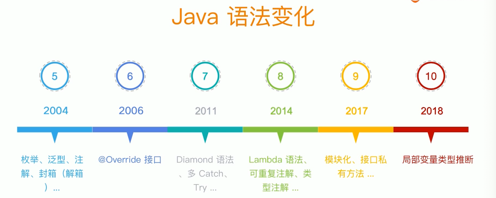
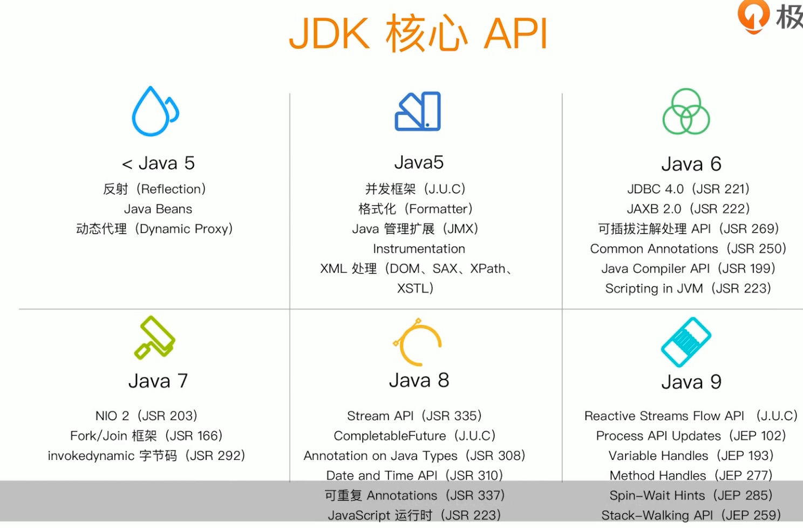

# Spring Framework总览

[toc]

# 目录结构

- 课前准备

- spring特性总览

- spring版本特性

- spring模块化设计

- spring对java语言特性运用

- Spring对JDK API的实践

- spring对JAVA EE API整合

- Spring编程模型

- Spring核心价值

- 面试题精选

# 课前准备

- 心态
  - 戒骄戒躁
  - 谨慎豁达
  - 如履薄冰
- 方法 
  - 基础:夯实基础，了解动态
  - 思考:保持怀疑，验证一切
  - 分析:不拘小节，观其大意
  - 实践:思辨结合，学以致用
- 工具
  - JDK: Oracle JDK 8 
  - Spring Framework: 5.2.2.RELEASE
  - IDE: IntelliJ IDEA 2019 (Community)
  - Maven: 3.2 +

# Spring特性总览

- 核心特性
  - loC容器( loC Container)
  - loC容器( loC Container)
  - Spring事件( Events )
  - 资源管理(Resources)
  - 国际化(i18n)
  - 校验(Validation)
  - 数据绑定(Data Binding)
  - 类型转换(Type Conversion )
  - Spring表达式(Spring Express Language )
  - 面向切面编程( AOP)
- 数据存储
  - JDBC
  - 事务抽象 (Transactions)
  - DAO 支持(DAO Support)
  - O/R映射 (O/R Mapping)
  - XML 编列(XML Marshalling)
- WEB技术
  - Web Servlet 技术栈
    - Spring MVC
    - WebSocket
    - SockJS
  - Web Reactive 技术栈
    - Spring WebFlux
    - WebClient
    - WebSocket
- 技术整合
  - 远程调用(Remoting)
  - Java消息服务(JMS)
  - Java连接架构( JCA)
  - Java管理扩展(JMX)
  - Java邮件客户端(Emai)
  - 本地任务(Tasks)
  - 本地调度(Scheduling)
  - 缓存抽象(Caching)
  - Spring测试(Testing)
- 测试（Testing）
  - 模拟对象 (Mock Objects) 
  - TestContext 框架(TestContext Framework)
  - Spring MVC 测试 (SpringMVC Test)
  - Web测试客户端(WebTestClient)

# Spring版本特性

Spring各版本引入了那些新特性？

| Spring Framework版本 | java标准版 | java企业版           |
| -------------------- | ---------- | -------------------- |
| 1.x                  | 1.3+       | Java 1.3+            |
| 2.x                  | 1.4.2+     | Java 1.3+            |
| 3.x                  | 5+         | Java 1.4 和java EE 5 |
| 4.x                  | 6+         | Java ee 6 和 7       |
| 5.x                  | 8+         | Java ee 7            |

# Spring模块化设计

Spring功能特性如何在不同模块中组织？

#  java语言特性运用

各种java语法特性怎么被spring各种版本巧妙使用呢？

##  java语法变化

## java5语法特性

| 语法特性             | spring支持的版本 | 代表实现                   |
| -------------------- | ---------------- | -------------------------- |
| 注解 (Annotation)    | 1.2 +            | @Transactional             |
| 泛型(enumeration)    | 1.2 +            | Propagation                |
| For-each语法         | 3.0 +            | AbstractApplicationContext |
| 自动装箱(autoboxing) | 3.0 +            |                            |
| 泛型(generic)        | 3.0 +            | ApplicationL istener       |

## java6语法特性

| 语法特性      | spring支持的版本 | 代表实现 |
| ------------- | ---------------- | -------- |
| 接口@override | 4.0+             |          |

## Java7 语法特性

| 语法特性                | spring支持的版本 | 代表实现                    |
| ----------------------- | ---------------- | --------------------------- |
| diamond语法             | 5.0+             | DefaultListableBeanFactory  |
| Try-catch-resources语法 | 5.0+             | ResourceBundleMessageSource |

## java8语法特性

| 语法特性   | spring支持的版本 | 代码实现                      |
| ---------- | ---------------- | ----------------------------- |
| lambda语法 | 5.0+             | PropertyEditorRegistrySupport |

# JDK API实践

spring怎么取舍java io,集合，反射，动态代理等API的使用呢？

##  JDK核心API

## <java 5 API

| API类型                  | spring支持版本 | 代表实现                   |
| ------------------------ | -------------- | -------------------------- |
| 反射(Reflection)         | 1.0+           | MethodMatcher              |
| java beans               | 1.0+           | CachedIntrospectionResults |
| 动态代理 (Dynamic Proxy) | 1.0+           | JdkDynamicAopProxy         |

## java 5 API

| API类型              | spring支持版本 | 代表实现                   |
| -------------------- | -------------- | -------------------------- |
| XML 处理(DOM,SAX...) | 1.0 +          | XmlBeanDefinitionReader    |
| Java 管理扩展 (JMX)  | 1.2 +          | @ManagedResource           |
| Instrumentation      | 2.0 +          | InstrumentationSavingAgent |
| 并发框架(J.U.C)      | 3.0 +          | ThreadPoolT askScheduler   |
| 格式化(Formatter)    | 3.0 +          | DateFormatter              |

## java 6 API

| API类型                      | spring支持版本 | 代表实现                          |
| ---------------------------- | -------------- | --------------------------------- |
| JDBC 4.0 (JSR 221)           | 1.0 +          | Jdbc Template                     |
| Common Annotations (JSR 250) | 2.5 +          | CommonAnnotationBeanPostProcessor |
| JAXB 2.0 (JSR 222)           | 3.0 +          | Jaxb2Marshaller                   |
| Scripting in JVM (JSR 223)   | 4.2 +          | StandardScriptFactory             |
| 可插拔注解处理API (JSR 269)  | 5.0 +          | @Indexed                          |
| Java Compiler API (JSR 199)  | 5.0 +          | TestCompiler ( 单元测试)          |

## java 7 API

| API类型                 | spring支持版本 | 代表实现                |
| ----------------------- | -------------- | ----------------------- |
| Fork/Join TER (JSR 166) | 3.1 +          | ForkJoinPoolFactoryBean |
| NIO 2 (JSR 203)         | 4.0 +          | PathResource            |

## java 8 API

| API类型                      | spring支持版本 | 代表实现                              |
| ---------------------------- | -------------- | ------------------------------------- |
| Date and Time API (JSR 310)  | 4.0 +          | Date TimeContext                      |
| 可重复 Annotations (JSR 337) | 4.0 +          | @PropertySources                      |
| Stream API (JSR 335)         | 4.2 +          | Stream onverter                       |
| CompletableFuture (J.U.C)    | 4.2 +          | CompletableToL istenableFutureAdapter |

# javaEE API整合

