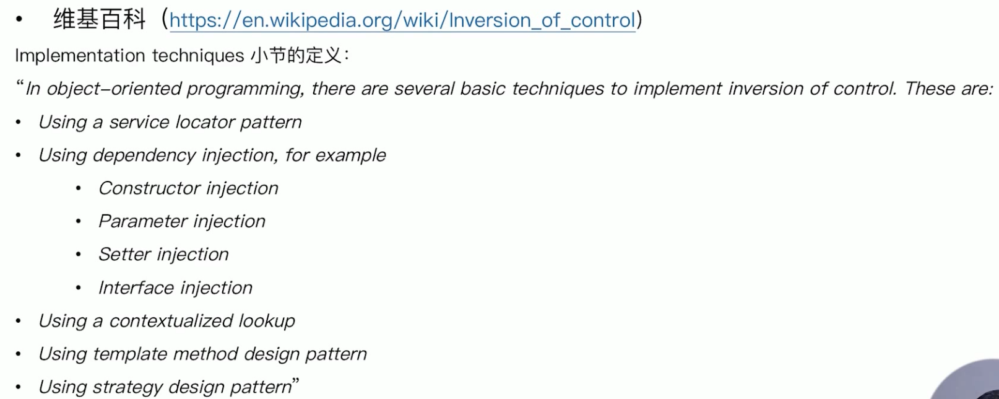
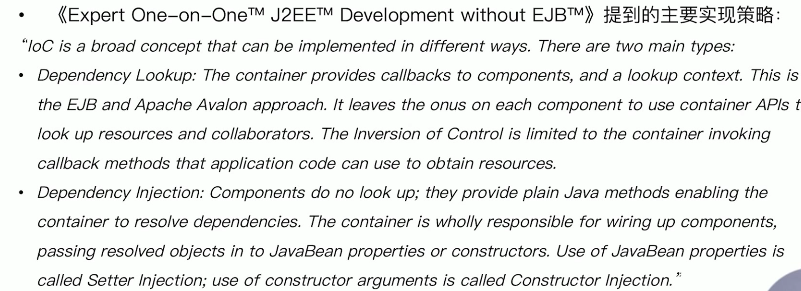
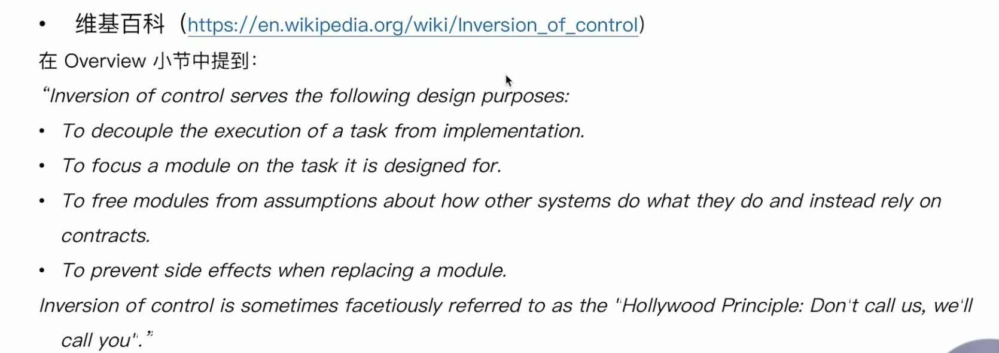
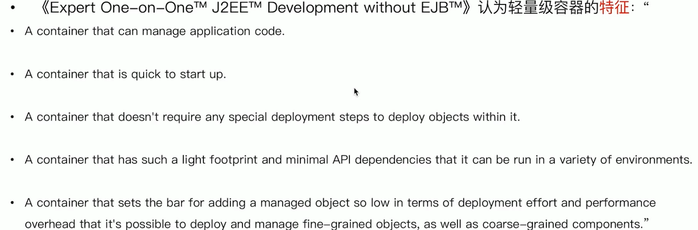

# 重新认识IOC

- loC发展简介
- loC 主要实现策略
- loC容器的职责
- IoC 容器的实现
- 传统loC容器实现
- 轻量级loC容器
- 依赖查找VS.依赖注入
- 构造器注入VS. Setter注入
- 面试题精选

# 目录

[toc]

# IOC发展简介

## 什么是IOC

## IOC的简史

- 1983#, Richard E. Sweet 在 « The Mesa Programming Environment» 中提出"HollywoodPrinciple”( 好莱坞原则)
- 1988年, Ralph E. Johnson & Brian Foote 在 « Designing Reusable Classes» 中提出"Inversionof control”( 控制反转)
- 1996年, Michael Mattson EE « Object- Oriented Frameworks, A survey of methodologicalissues» 中将 "Inversion of control" 6î87 "Hollywood principle"
- **2004年, Martin Fowler 在 Inversion of Control Containers and the Dependency Injection pattern》中提出了自己对loC以及DI的理解**
- 2005年, Martin Fowler 在 « InversionOfControl» 对loC作出进一步的说明

# loC 主要实现策略

有一本书：

# loC容器的职责

得出的一些总结：

- 通用职责
- 依赖处理
  - 依赖查找
  - 依赖注入
- 生命周期管理
  - 容器
  - 托管的资源(Java Beans或其他资源)
- 配置
  - 容器
  - 外部化配置
  - 托管的资源(Java Beans或其他资源)

# IoC 容器的实现

## 主要实现

- Java SE
  - Java Beans
  - Java Serviceloader SPI
  - JNDI (Java Naming and Directory Interface)
- Java EE
  - EJB (Enterprise Java Beans)
  - Servlet
- 开源
  - Apache Avalon (http:/ / avalon.apache.org/ closed.htmI)
  - PicoContainer (http:/ /picocontainer.com/)
  - Google Guice (https:// github.com/ google/ guice)
  - Spring Framework (https://spring.io/ projects/ spring-framework)

# 传统loC容器实现

- Java Beans作为loC容器
- 特性
  - 依赖查找
  - 生命周期管理
  - 配置元信息
  - 事件
  - 自定义
  - 资源管理
  - 持久化
- 规范
  - JavaBeans:  https://www.oracle.com/technetwork/java/javase/tech/index-jsp-138795.html
  - BeanContext: https://docs.oracle.com/javase/8/docs/technotes/guides/beans/spec/beancontext.html

# 轻量级loC容器

- (Expert One-on-OneTM  J2EETM Development without EJBTM»认为轻量级容器的好处是：
  - Escaping the monolithic container
  - Maximizing code reusability
  - Greater object orientation
  - Greater productivity
  - Better testability

# 依赖查找VS.依赖注入

## 优劣对比

| 类型     | 依赖处理 | 实现便利性 | 代码侵入性   | API依赖性     | 可读性 |
| -------- | -------- | ---------- | ------------ | ------------- | ------ |
| 依赖查找 | 主动获取 | 相对繁琐   | 侵入业务逻辑 | 依赖容器API   | 良好   |
| 依赖注入 | 被动提供 | 相对便利   | 低侵入性     | 不依赖容器API | 一般   |

# 构造器注入VS. Setter注入

- Spring Framework对构造器注入与Setter 的论点:
  - The Spring team generally **advocates constructor injection**, as it lets you implement application components as immutable objects and ensures that required dependencies are not null. Furthermore, constructor- injected components are always returned to the client (calling) code in a fully initialized state. As a side note, a large number of constructor arguments is a bad code smell, implying that the class likely has too many responsibilities and should be refactored to better address proper separation of concerns.
  - **Setter injection should primarily only be used for optional dependencies** that can be assigned reasonable default values within the class. Otherwise, not- -null checks must be performed everywhere the code uses the dependency. One benefit of setter injection is that setter methods make objects of that class amenable to reconfiguration or re- injection later. Management through JMX MBeans is therefore a compelling use case for setter injection.'

- 《Expert One-on-OneTM J2EETM Development without EJBTM»认为Setter 注入的**优点**：
  - JavaBean properties are **well supported in lDEs.**
  - JavaBean properties are **self-documenting**.
  - JavaBean properties are inherited by subclasses without the need for any code.
  - It's possible to use the **standard JavaBeans property-editor machinery for type conversions** if necessary.
  - Many existing JavaBeans can be used within a JavaBean-oriented loC container without modification.
  - If there is a corresponding getter for each setter (making the property readable, as well as writable), it is possible to ask the component for its current configuration state. This is particularly useful if we want to persist that state: for example,in an XML form or in a database. With Constructor lnjection, there's no way to find the current state.
  - Setter lnjection works well for objects that have default values, meaning that not all properties need to be supplied at
    runtime."

- «Expert One-on-OneTM J2EETM Development without EJBTM»认为Setter注入的**缺点**： 
  - The order in which setters are called is not expressed in any contract. Thus, we sometimes need to invoke a method after the last setter has been called to initialize the component. Spring provides the org.springframework.beans. factory.lnitializingBean interface for this; it also provides the ability to invoke an arbitrary init method. However, this contract must be documented to ensure correct use outside a container.
  - Not all the necessary setters may have been called before use. The object can thus be left partially configured."

- «Expert One- -on- -OneTM J2EETM Development without EJBTM»认为**构造器注入的优点**:“Advantages of Constructor lnjection include:
  - Each managed object is guaranteed to be in a consistent state-fully configured- -before it can be invoked in any business methods. This is the primary motivation of Constructor lnjection. (However, it is possible to achieve the same result with JavaBeans via dependency checking, as Spring can optionally perform.) There's no need for initialization methods.
  - There may be slightly less code than results from the use of multiple JavaBean methods, although will be no difference in complexity. '

- «Ехреrt Оnе-оn-ОnеТМ J2ЕЕТМ Dеvеlорmеnt wіthоut ЕJВТМ»认为**构造器注入的缺点是**：Disadvantages include:
  - Although also a Java-language feature, multi-argument constructors are probably less common in existing code than us of JavaBean properties.
  - Java constructor arguments don't have names visible by introspection.
  - Constructor argument lists are less well supported by IDEs than JavaBean setter methods.
  - Long constructor argument lists and large constructor bodies can become unwieldy.
  - Concrete inheritance can become problematic.
  - Poor support for optional properties, compared to JavaBeans
  - Unit testing can be slightly more difficult
  - When collaborators are passed in on object construction, it becomes impossible to change the reference held in the
    object. '

# 面试题精选

- 什么是IOC？
  - 简单来说，IOC是反转控制，类似好莱坞原则，主要有依赖查找和依赖注入实现
- 依赖查找和依赖注入的区别？
  - 依赖查找是主动或手动的依赖查找方式，通常需要依赖容器或标准API实现，而依赖注入则是手动或自动依赖绑定的方式，无需依赖特定的容器和API
- spring座位IOC容器有什么优势
  - 典型的IoC管理，依赖查找和依赖注入
  - AOP抽象
  - 事务抽象
  - 事件机制
  - SPI扩展
  - 强大的第三方整合
  - 易测试性
  - 更好的面向对象

