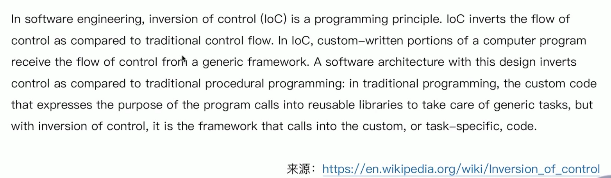

# 重新认识IOC

- loC发展简介
- loC 主要实现策略
- loC容器的职责
- IoC 容器的实现
- 传统loC容器实现
- 轻量级loC容器
- 依赖查找VS.依赖注入
- 构造器注入VS. Setter注入
- 面试题精选

# 目录

[toc]

# IOC发展简介

## 什么是IOC

## IOC的简史

- 1983#, Richard E. Sweet 在 « The Mesa Programming Environment» 中提出"HollywoodPrinciple”( 好莱坞原则)
- 1988年, Ralph E. Johnson & Brian Foote 在 « Designing Reusable Classes» 中提出"Inversionof control”( 控制反转)
- 1996年, Michael Mattson EE « Object- Oriented Frameworks, A survey of methodologicalissues» 中将 "Inversion of control" 6î87 "Hollywood principle"
- **2004年, Martin Fowler 在 Inversion of Control Containers and the Dependency Injection pattern》中提出了自己对loC以及DI的理解**
- 2005年, Martin Fowler 在 « InversionOfControl» 对loC作出进一步的说明

# loC 主要实现策略

有一本书：

# loC容器的职责

得出的一些总结：

- 通用职责
- 依赖处理
  - 依赖查找
  - 依赖注入
- 生命周期管理
  - 容器
  - 托管的资源(Java Beans或其他资源)
- 配置
  - 容器
  - 外部化配置
  - 托管的资源(Java Beans或其他资源)

# IoC 容器的实现

## 主要实现

- Java SE
  - Java Beans
  - Java Serviceloader SPI
  - JNDI (Java Naming and Directory Interface)
- Java EE
  - EJB (Enterprise Java Beans)
  - Servlet
- 开源
  - Apache Avalon (http:/ / avalon.apache.org/ closed.htmI)
  - PicoContainer (http:/ /picocontainer.com/)
  - Google Guice (https:// github.com/ google/ guice)
  - Spring Framework (https://spring.io/ projects/ spring-framework)

# 传统loC容器实现

- Java Beans作为loC容器
- 特性
  - 依赖查找
  - 生命周期管理
  - 配置元信息
  - 事件
  - 自定义
  - 资源管理
  - 持久化
- 规范
  - JavaBeans:  https://www.oracle.com/technetwork/java/javase/tech/index-jsp-138795.html
  - BeanContext: https://docs.oracle.com/javase/8/docs/technotes/guides/beans/spec/beancontext.html

# 轻量级loC容器

# 依赖查找VS.依赖注入

# 构造器注入VS. Setter注入

# 面试题精选

