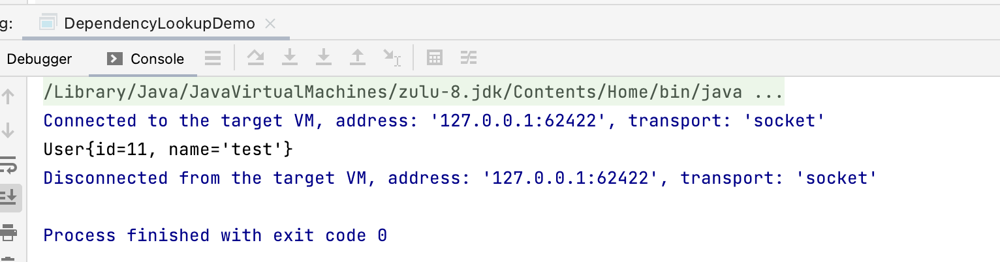
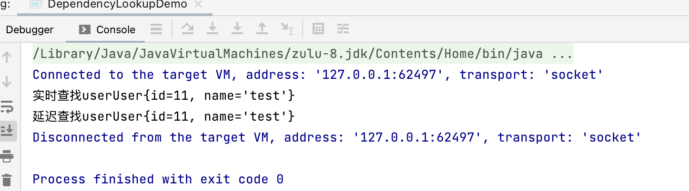
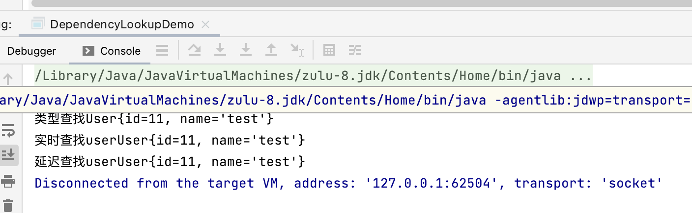
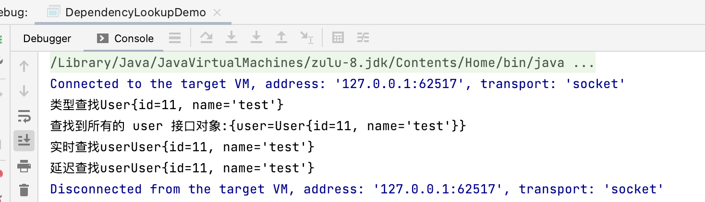
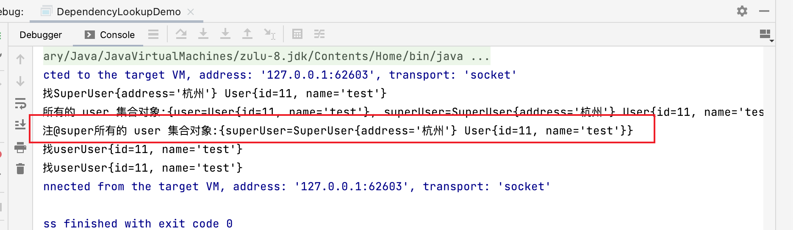
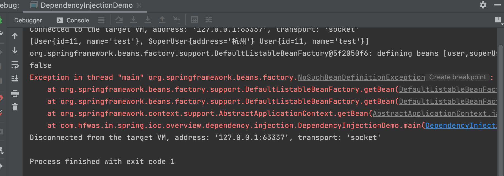
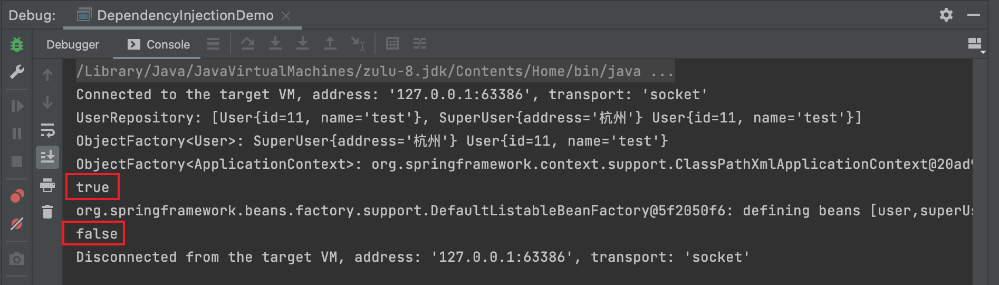

#  SpringIOC容器概述

- springIOC 依赖查找
- springIOC 依赖注入
- springIOC 依赖来源
- springIOC 配置元信息
- springIOC 容器
- springIOC 应用上下文
- 使用springIOC 容器
- springIOC 容器生命周期
- 面试题精选


# 目录

[toc]

# Spring IOC 依赖查找

- 根据Bean名称查找
  - 实时查找
  - 延迟查找
- 根据Bean类型查找
  - 单个Bean对象
  - 集合Bean对象
- 根据Bean名称+类型查找
- 根据Java注解查找
  - 单个Bean对象
  - 集合Bean对象

## 实时查找

- 添加实体类

```java
package com.hfwas.in.spring.ioc.overview.domain;

/**
 * @ClassName User
 * @Description
 * @Author <a href="hfwas1024@gmail.com">HFwas</a>
 * @Date: 12:32 上午
 * @Version: 1.0
 **/
public class User {

    private Long id;

    private String name;

    public Long getId() {
        return id;
    }

    public void setId(Long id) {
        this.id = id;
    }

    public String getName() {
        return name;
    }

    public void setName(String name) {
        this.name = name;
    }

    @Override
    public String toString() {
        return "User{" +
                "id=" + id +
                ", name='" + name + '\'' +
                '}';
    }
}

```

- 添加配置文件

```xml
<?xml version="1.0" encoding="UTF-8"?>
<beans xmlns="http://www.springframework.org/schema/beans"
       xmlns:xsi="http://www.w3.org/2001/XMLSchema-instance"
       xsi:schemaLocation="
        http://www.springframework.org/schema/beans http://www.springframework.org/schema/beans/spring-beans.xsd">

    <!-- bean definitions here -->
    <bean id="user" class="com.hfwas.in.spring.ioc.overview.domain.User">
        <property name="id" value="11"></property>
        <property name="name" value="test"></property>
    </bean>


</beans>
```

- 测试方法

```java
package com.hfwas.in.spring.ioc.overview.dependency.lookup;

import com.hfwas.in.spring.ioc.overview.domain.User;
import org.springframework.beans.factory.BeanFactory;
import org.springframework.context.support.ClassPathXmlApplicationContext;

/**
 * @ClassName DependencyLookupDemo
 * @Description
 * 依赖查找示例
 * @Author <a href="hfwas1024@gmail.com">HFwas</a>
 * @Date: 12:30 上午
 * @Version: 1.0
 **/
public class DependencyLookupDemo {

    public static void main(String[] args) {
        // 配置 xml 配置i文件
        // 启动 spring 应用上下文
        BeanFactory beanFactory = new ClassPathXmlApplicationContext("classpath:/META-INF/dependency-lookup-context.xml");
        User user = beanFactory.getBean("user", User.class);
        System.out.println(user);
    }

}

```

- 测试结果截图



## 延迟查找

- 配置文件

```xml
<bean id="objectFactory" class="org.springframework.beans.factory.config.ObjectFactoryCreatingFactoryBean">
        <property name="targetBeanName" value="user"></property>
    </bean>
```

- 测试代码

```java
private static void loopupInLazy(BeanFactory beanFactory) {
        ObjectFactory<User> objectFactory = beanFactory.getBean("objectFactory", ObjectFactory.class);
        User user = objectFactory.getObject();

        System.out.println("延迟查找user" + user);
    }
```

- 测试截图



## 通过类型查找-单个Bean对象

- 测试代码

```java
private static void loopupByType(BeanFactory beanFactory) {
        User bean = beanFactory.getBean(User.class);
        System.out.println("类型查找" + bean);
    }
```

- 测试截图



## 通过类型查找-集合Bean对象

- 测试代码

```java
private static void lookupByCollectionType(BeanFactory beanFactory) {
        if (beanFactory instanceof ListableBeanFactory) {
            ListableBeanFactory listableBeanFactory = (ListableBeanFactory) beanFactory;
            Map<String, User> beansOfType = listableBeanFactory.getBeansOfType(User.class);
            System.out.println("查找到所有的 user 接口对象:" + beansOfType);
        }
    }
```

- 测试截图



## 根据Java注解查找

- 添加配置文件

```java
<bean id="superUser" class="com.hfwas.in.spring.ioc.overview.domain.SuperUser" parent="user"
          primary="true">
        <property name="address" value="杭州"></property>
    </bean>
```

- 添加实体类

```java
package com.hfwas.in.spring.ioc.overview.domain;

import com.hfwas.in.spring.ioc.overview.annotation.Super;

/**
 * @ClassName SuperUser
 * @Description
 * @Author <a href="hfwas1024@gmail.com">HFwas</a>
 * @Date: 5:20 下午
 * @Version: 1.0
 **/
@Super
public class SuperUser extends User{

    private String address;

    public String getAddress() {
        return address;
    }

    public void setAddress(String address) {
        this.address = address;
    }

    @Override
    public String toString() {
        return "SuperUser{" +
                "address='" + address + '\'' +
                "} " + super.toString();
    }
}

```

- 添加接口类

```java
package com.hfwas.in.spring.ioc.overview.annotation;

import java.lang.annotation.ElementType;
import java.lang.annotation.Retention;
import java.lang.annotation.RetentionPolicy;
import java.lang.annotation.Target;

@Target(ElementType.TYPE)
@Retention(RetentionPolicy.RUNTIME)
public @interface Super {
}

```

- 测试方法

```java
private static void lookupByAnnotationType(BeanFactory beanFactory) {
        if (beanFactory instanceof ListableBeanFactory) {
            ListableBeanFactory listableBeanFactory = (ListableBeanFactory) beanFactory;
            Map<String, User> beansOfType = (Map) listableBeanFactory.getBeansWithAnnotation(Super.class);
            System.out.println("查找标注@super所有的 user 集合对象:" + beansOfType);
        }
    }
```

- 测试截图



# Spring IOC 依赖注入

- 根据Bean名称注入
- 根据Bean类型注入
  - 单个Bean对象
  - 集合Bean对象.
- 注入容器內建Bean对象
- 注入非Bean对象
- 注入类型
  - 实时注入
  - 延迟注入

## 代码测试

- 配置文件修改

```xml
<?xml version="1.0" encoding="UTF-8"?>
<beans xmlns="http://www.springframework.org/schema/beans"
       xmlns:xsi="http://www.w3.org/2001/XMLSchema-instance"
       xmlns:util="http://www.springframework.org/schema/util"
       xsi:schemaLocation="
        http://www.springframework.org/schema/beans http://www.springframework.org/schema/beans/spring-beans.xsd
        http://www.springframework.org/schema/util http://www.springframework.org/schema/util/spring-util.xsd">

    <!--资源的引入-->
    <import resource="dependency-lookup-context.xml"></import>

    <bean id="userRepository" class="com.hfwas.in.spring.ioc.overview.repository.UserRepository"
        autowire="byType"><!--auto wireing-->
        <!--手动配置user-->
        <!--<property name="users">
            <util:list>
                <ref bean="superUser"/>
                <ref bean="user"/>
            </util:list>
        </property>-->
    </bean>

</beans>
```

- 实体类

```java
package com.hfwas.in.spring.ioc.overview.repository;

import com.hfwas.in.spring.ioc.overview.domain.User;
import org.springframework.beans.factory.BeanFactory;

import java.util.Collection;

/**
 * @ClassName UserRepository
 * @Description
 * 用户信息仓库
 * @Author <a href="hfwas1024@gmail.com">HFwas</a>
 * @Date: 7:21 下午
 * @Version: 1.0
 **/
public class UserRepository {

    private Collection<User> users;

    private BeanFactory beanFactory;

    public Collection<User> getUsers() {
        return users;
    }

    public void setUsers(Collection<User> users) {
        this.users = users;
    }

    public BeanFactory getBeanFactory() {
        return beanFactory;
    }

    public void setBeanFactory(BeanFactory beanFactory) {
        this.beanFactory = beanFactory;
    }
}
```

- 测试代码

```java
package com.hfwas.in.spring.ioc.overview.dependency.injection;

import com.hfwas.in.spring.ioc.overview.annotation.Super;
import com.hfwas.in.spring.ioc.overview.domain.User;
import com.hfwas.in.spring.ioc.overview.repository.UserRepository;
import org.springframework.beans.factory.BeanFactory;
import org.springframework.beans.factory.ListableBeanFactory;
import org.springframework.beans.factory.ObjectFactory;
import org.springframework.context.support.ClassPathXmlApplicationContext;

import java.util.Map;

/**
 * @ClassName DependencyLookupDemo
 * @Description
 * 依赖注入示例
 *
 * @Author <a href="hfwas1024@gmail.com">HFwas</a>
 * @Date: 12:30 上午
 * @Version: 1.0
 **/
public class DependencyInjectionDemo {

    public static void main(String[] args) {
        // 配置 xml 配置i文件
        // 启动 spring 应用上下文
        BeanFactory beanFactory = new ClassPathXmlApplicationContext("classpath:/META-INF/dependency-injection-context.xml");

        UserRepository userRepository = beanFactory.getBean(UserRepository.class);
        System.out.println(userRepository.getUsers());

        System.out.println(userRepository.getBeanFactory());
        System.out.println(userRepository.getBeanFactory() == beanFactory);

        // 依赖查找
        // org.springframework.beans.factory.NoSuchBeanDefinitionException
        System.out.println(beanFactory.getBean(BeanFactory.class));
    }
}
```

- 测试截图



## 测试实体类内部注入

- 实体类代码修改

```java
package com.hfwas.in.spring.ioc.overview.repository;

import com.hfwas.in.spring.ioc.overview.domain.User;
import org.springframework.beans.factory.BeanFactory;
import org.springframework.beans.factory.ObjectFactory;
import org.springframework.context.ApplicationContext;

import java.util.Collection;

/**
 * @ClassName UserRepository
 * @Description
 * 用户信息仓库
 * @Author <a href="hfwas1024@gmail.com">HFwas</a>
 * @Date: 7:21 下午
 * @Version: 1.0
 **/
public class UserRepository {

    // 自定义 bean
    private Collection<User> users;

    // 内建非 bean 对象（依赖）
    private BeanFactory beanFactory;

    // 可以获得
    private ObjectFactory<User> userObjectFactory;

    // 对照上边的
    private ObjectFactory<ApplicationContext> userObjectFactoryApplicationContext;

    public Collection<User> getUsers() {
        return users;
    }

    public void setUsers(Collection<User> users) {
        this.users = users;
    }

    public BeanFactory getBeanFactory() {
        return beanFactory;
    }

    public void setBeanFactory(BeanFactory beanFactory) {
        this.beanFactory = beanFactory;
    }

    public ObjectFactory<User> getUserObjectFactory() {
        return userObjectFactory;
    }

    public void setUserObjectFactory(ObjectFactory<User> userObjectFactory) {
        this.userObjectFactory = userObjectFactory;
    }

    public ObjectFactory<ApplicationContext> getUserObjectFactoryApplicationContext() {
        return userObjectFactoryApplicationContext;
    }

    public void setUserObjectFactoryApplicationContext(ObjectFactory<ApplicationContext> userObjectFactoryApplicationContext) {
        this.userObjectFactoryApplicationContext = userObjectFactoryApplicationContext;
    }
}
```

- 测试方法

```java
package com.hfwas.in.spring.ioc.overview.dependency.injection;

import com.hfwas.in.spring.ioc.overview.annotation.Super;
import com.hfwas.in.spring.ioc.overview.domain.User;
import com.hfwas.in.spring.ioc.overview.repository.UserRepository;
import org.springframework.beans.factory.BeanFactory;
import org.springframework.beans.factory.ListableBeanFactory;
import org.springframework.beans.factory.ObjectFactory;
import org.springframework.context.ApplicationContext;
import org.springframework.context.support.ClassPathXmlApplicationContext;

import java.util.Map;

/**
 * @ClassName DependencyLookupDemo
 * @Description
 * 依赖注入示例
 *
 * @Author <a href="hfwas1024@gmail.com">HFwas</a>
 * @Date: 12:30 上午
 * @Version: 1.0
 **/
public class DependencyInjectionDemo {

    public static void main(String[] args) {
        // 配置 xml 配置i文件
        // 启动 spring 应用上下文
        BeanFactory beanFactory = new ClassPathXmlApplicationContext("classpath:/META-INF/dependency-injection-context.xml");

        UserRepository userRepository = beanFactory.getBean(UserRepository.class);
        System.out.println("UserRepository: " + userRepository.getUsers());

        ObjectFactory<User> userObjectFactory = userRepository.getUserObjectFactory();
        System.out.println("ObjectFactory<User>: " + userObjectFactory.getObject());

        ObjectFactory<ApplicationContext> userObjectFactoryApplicationContext = userRepository.getUserObjectFactoryApplicationContext();
        System.out.println("ObjectFactory<ApplicationContext>: " + userObjectFactoryApplicationContext.getObject());

        // true
        // 在对象内部注入了一个ObjectFactory<ApplicationContext>对象，这个对象和外部获得的BeanFactory beanFactory是一致的
        System.out.println(userObjectFactoryApplicationContext.getObject() == beanFactory);

        System.out.println(userRepository.getBeanFactory());
        // false
        // 在对象内部注入了ObjectFactory<User>，获得的对象和在外部获得对象是不一致的。false
        System.out.println(userRepository.getBeanFactory() == beanFactory);

        // 依赖查找
        // org.springframework.beans.factory.NoSuchBeanDefinitionException
//        System.out.println(beanFactory.getBean(BeanFactory.class));

    }
}
```

- 测试结果截图



# Spring IOC 依赖来源

- 自定义bean
- 容器内建bean对象
- 容器内建依赖

```java
package com.hfwas.in.spring.ioc.overview.dependency.injection;

import com.hfwas.in.spring.ioc.overview.annotation.Super;
import com.hfwas.in.spring.ioc.overview.domain.User;
import com.hfwas.in.spring.ioc.overview.repository.UserRepository;
import org.springframework.beans.factory.BeanFactory;
import org.springframework.beans.factory.BeanNameAware;
import org.springframework.beans.factory.ListableBeanFactory;
import org.springframework.beans.factory.ObjectFactory;
import org.springframework.context.ApplicationContext;
import org.springframework.context.support.ClassPathXmlApplicationContext;
import org.springframework.core.env.Environment;

import java.util.Map;

/**
 * @ClassName DependencyLookupDemo
 * @Description
 * 依赖注入示例
 *
 * @Author <a href="hfwas1024@gmail.com">HFwas</a>
 * @Date: 12:30 上午
 * @Version: 1.0
 **/
public class DependencyInjectionDemo {

    public static void main(String[] args) {
        // 配置 xml 配置i文件
        // 启动 spring 应用上下文
        BeanFactory beanFactory = new ClassPathXmlApplicationContext("classpath:/META-INF/dependency-injection-context.xml");

        // 依赖来源一：自定义 bean
        UserRepository userRepository = beanFactory.getBean(UserRepository.class);
        System.out.println("UserRepository: " + userRepository.getUsers());

        ObjectFactory<User> userObjectFactory = userRepository.getUserObjectFactory();
        System.out.println("ObjectFactory<User>: " + userObjectFactory.getObject());

        ObjectFactory<ApplicationContext> userObjectFactoryApplicationContext = userRepository.getUserObjectFactoryApplicationContext();
        System.out.println("ObjectFactory<ApplicationContext>: " + userObjectFactoryApplicationContext.getObject());

        // true
        // 在对象内部注入了一个ObjectFactory<ApplicationContext>对象，这个对象和外部获得的BeanFactory beanFactory是一致的
        System.out.println(userObjectFactoryApplicationContext.getObject() == beanFactory);

        // 依赖来源二：依赖注入 （内建依赖）
        System.out.println(userRepository.getBeanFactory());
        // false
        // 在对象内部注入了ObjectFactory<User>，获得的对象和在外部获得对象是不一致的。false
        System.out.println(userRepository.getBeanFactory() == beanFactory);

        // 依赖查找 （错误）
        // org.springframework.beans.factory.NoSuchBeanDefinitionException
//        System.out.println(beanFactory.getBean(BeanFactory.class));


        // 依赖来源三：容器内建bean
        Environment bean = beanFactory.getBean(Environment.class);
        System.out.println("获取 Environment 类型的bean:" + bean);
    }
}
```

# Spring IOC 配置元信息

- Bean定义配置
  - 基于XML文件
  - 基于Properties文件
  - 基于Java注解
  - 基于Java API (专 题讨论
- loC容器配置
  - 基于XML文件
  - 基于Java注解
  - 基于Java API (专 题讨论
- 外部化属性配置
  - 基于Java注解

# Spring IOC 容器

-  BeanFactory和ApplicationContext谁才是Spring loC容器?

# Spring IOC 应用上下文

- ApplicationContext 除了提供IOC容器角色，还有提供:
  - 面向切面(AOP)
  - 配置元信息(Configuration Metadata)
  - 资源管理(Resources)
  - 事件(Events)
  - 国际化 (i18n)
  - 注解(Annotations)
  - Environment 抽象 ( Environment Abstraction)
- https://docs.spring.io/spring/docs/5.2.2.REL.EASE/spring-framework-reference/core.html#beans-introduction

# 使用Spring IOC 容器

- BeanFactory
- ApplicationContext

# Spring IOC 容器生命周期

- 启动
- 运行
- 停止

# 面试题精选

- 什么是Spring IOC
  - Spring Framework implementation of the Inversion of Control (loC) principle. loC is also known as dependency injection (DI). It is a process whereby objects define their dependencies (that is, the other objects they work with) only through constructor arguments, arguments to a factory method, or properties that are set on the object instance after it is constructed or returned from a factory method. The container then injects those dependencies when it creates the bean.
- BeanFactory 与 FactoryBean?
  - BeanFactory是loC底层容器:
    FactoryBean是创建Bean的一种方式，帮助实现复杂的初始化逻辑
- spring IOC 容器启动时做了哪些准备
  - IoC配置元信息读取和解析、loC容器生命周期、Spring 事件发布、国
    际化等，更多答案将在后续专题章节逐-讨论


