# Spring Bean基础

- 定义Spring Bean
- BeanDefinition元信息
- 命名Spring Bean
- Spring Bean 的别名
- 注册Ѕрrіng Веаn
- 实例化Spring Bean
- 初始化 Spring Bean
- 延迟初始化 Spring Bean
- 销毁Spring Bean
- 垃圾回收 Spring Bean
- 面试题精选

# 目录

[toc]

# 定义Spring Bean

- 什么是BeanDefinition?
- BeanDefinition是Spring Framework中定义Bean的配置元信息接口，包含:
  - Bean的类名
  - Bean行为配置元素,如作用域、自动绑定的模式、生命周期回调等
  - 其他Bean引用，又可称作合作者(Collaborators) 或者依赖(Dependencies)
  - 配置设置，比如Bean属性(Properties )

# BeanDefinition元信息

| 属性                     | 说明                                             |
| ------------------------ | ------------------------------------------------ |
| Class                    | Bean全类名，必须是具体类，不能用抽象类或接口     |
| Name                     | Bean的名称或者ID                                 |
| Scope                    | Bean的作用域(如: singleton、 prototype 等)       |
| Constructor arguments    | Bean构造器参数(用于依赖注人)                     |
| Properties               | Bean属性设置(用于依赖注人)                       |
| Autowiring mode          | Bean自动绑定模式(如: 通过名称byName，byType等等) |
| Lazy initialization mode | Bean延迟初始化模式(延迟和非延迟)                 |
| Initialization method    | Bean初始化回调方法名称                           |
| Destruction method       | Bean销毁回调方法名称                             |

## BeanDefinition构建

- 通过BeanDefinitionBuilder
- 通过AbstractBeanDefinition以及派生类

## 代码测试

- 新建项目
- 修改POM文件

```xml
<?xml version="1.0" encoding="UTF-8"?>
<project xmlns="http://maven.apache.org/POM/4.0.0"
         xmlns:xsi="http://www.w3.org/2001/XMLSchema-instance"
         xsi:schemaLocation="http://maven.apache.org/POM/4.0.0 http://maven.apache.org/xsd/maven-4.0.0.xsd">
    <parent>
        <artifactId>geekbang-lessons</artifactId>
        <groupId>org.example</groupId>
        <version>1.0-SNAPSHOT</version>
    </parent>
    <modelVersion>4.0.0</modelVersion>

    <artifactId>spring-bean</artifactId>

    <properties>
        <maven.compiler.source>8</maven.compiler.source>
        <maven.compiler.target>8</maven.compiler.target>
    </properties>

    <dependencies>
        <dependency>
            <groupId>org.springframework</groupId>
            <artifactId>spring-context</artifactId>
            <version>5.2.2.RELEASE</version>
        </dependency>
        <dependency>
            <groupId>org.example</groupId>
            <artifactId>ioc-container-overview</artifactId>
            <version>1.0-SNAPSHOT</version>
        </dependency>
    </dependencies>

</project>
```

- 测试代码

```java
package com.hfwas.in.spring.bean.definition;

import com.hfwas.in.spring.domain.User;
import org.springframework.beans.MutablePropertyValues;
import org.springframework.beans.factory.config.BeanDefinition;
import org.springframework.beans.factory.support.AbstractBeanDefinition;
import org.springframework.beans.factory.support.BeanDefinitionBuilder;
import org.springframework.beans.factory.support.GenericBeanDefinition;

/**
 * @ClassName BeanDefinitionCreationDemo
 * @Description
 * {@link org.springframework.beans.factory.config.BeanDefinition} 构建示例
 * @Author <a href="hfwas1024@gmail.com">HFwas</a>
 * @Date: 11:39 下午
 * @Version: 1.0
 **/
public class BeanDefinitionCreationDemo {

    public static void main(String[] args) {
        // 1. 通过BeanDefinitionBuilder 构建
        BeanDefinitionBuilder beanDefinitionBuilder = BeanDefinitionBuilder.genericBeanDefinition(User.class);
        // 通过属性设置
        beanDefinitionBuilder
                .addPropertyValue("id", 12L)
                .addPropertyValue("name", "hfwas");
        // 获取 BeanDefinition 实例
        BeanDefinition beanDefinition = beanDefinitionBuilder.getBeanDefinition();
        // BeanDefinition 并非 bean 终态， 可以自定义修改

        // 2. 通过 AbstractBeanDefinition 以及派生类
        GenericBeanDefinition genericBeanDefinition = new GenericBeanDefinition();
        // 设置 bean 类型
        genericBeanDefinition.setBeanClass(User.class);
        // 通过 MutablePropertyValues 批量操作属性
        MutablePropertyValues propertyValues = new MutablePropertyValues();
//        propertyValues.addPropertyValue("id", 111L);
//        propertyValues.addPropertyValue("name", "hfwas");

        propertyValues.add("id", 89L).add("name", "hfwas");
        // 通过 set MutablePropertyValues 批量操作属性
       genericBeanDefinition.setPropertyValues(propertyValues);
    }
}
```

# 命名Spring Bean

- Bean的名称
  - 每个Bean拥有一个或多个标识符(identifiers) ，这些标识符在Bean所在的容器必须是唯一的。通常，一个Bean仅有一个标识符，如果需要额外的，可考虑使用别名(Alias) 来扩充。
  - 在基于XML的配置元信息中，开发人员可用id 或者name属性来规定Bean的标识符。通常Bean的标识符由字母组成，允许出现特殊字符。如果要想引入Bean的别名的话，可在name属性使用半角逗号(“,”) 或分号(“;") 来间隔。
  - Bean的id或name属性并非必须制定，如果留空的话，容器会为Bean自动生成一个唯一的名称。Bean的命名尽管没有限制，不过宫方建议采用驼峰的方式，更符合Java的命名约定。

- Bean名称生成器(BeanNameGenerator)
  - 由Spring Framework 2.0.3引入，框架內建两种实现: DefaultBeanNameGenerator:默认通用BeanNameGenerator 实现
  - AnnotationBeanNameGenerator:基于注解扫描的BeanNameGenerator实现，起始于Spring Framework 2.5，关联的官方文档:
    - With component scanning in the classpath, Spring generates bean names for unnamed components,following the rules described earlier: essentially, taking the simplet class name and turning its initial
      character to lower- -case. However, in the (unusual) special case when there is more than one character and both the first and second characters are upper case, the original casing gets preserved. T  the same rules as defined by java. beans.Introspector. decapitalize (which Spring uses here).

# Spring Bean 的别名

- Bean别名(Alias) 的价值
  - 复用现有的BeanDefinition
  - 更具有场景化的命名方法，比如:
    - <alias name="myApp-dataSource" alias="subsystemA-dataSource"/>
    - <alias name="myApp-dataSource" alias="subsystemB-dataSource' />

## 代码测试

- 配置文件

```java
<?xml version="1.0" encoding="UTF-8"?>
<beans xmlns="http://www.springframework.org/schema/beans"
       xmlns:xsi="http://www.w3.org/2001/XMLSchema-instance"
       xsi:schemaLocation="
        http://www.springframework.org/schema/beans http://www.springframework.org/schema/beans/spring-beans.xsd">

    <!--导入第三方包-->
    <import resource="dependency-lookup-context.xml"/>

    <!--将Spring 容器中 "user" bean 关联/建立别名 - 'xiaomage-user' -->
    <alias name="user" alias="xiaomage-user"/>

</beans>
```

- 测试代码

```java
package com.hfwas.in.spring.bean.definition;

import com.hfwas.in.spring.domain.User;
import org.springframework.beans.factory.BeanFactory;
import org.springframework.context.support.ClassPathXmlApplicationContext;

/**
 * @ClassName BeanAliasDemo
 * @Description
 * bean 别名实例
 * @Author <a href="hfwas1024@gmail.com">HFwas</a>
 * @Date: 8:52 下午
 * @Version: 1.0
 **/
public class BeanAliasDemo {

    public static void main(String[] args) {
        // 配置 xml 配置i文件
        // 启动 spring 应用上下文
        BeanFactory beanFactory = new ClassPathXmlApplicationContext("classpath:/META-INF/dependency-definition-context.xml");
        // 通过别名 xiaomage-user 获取曾用名 user 的 bean
        User user = beanFactory.getBean("user", User.class);
        User xiaomage = beanFactory.getBean("xiaomage-user", User.class);
        System.out.println(xiaomage == user);
    }
}
```

- 测试截图

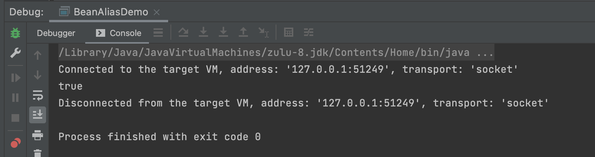

# 注册Ѕрrіng Веаn

- BeanDefinition注册
  - XML配置元信息
    - <bean name="”... />
- Java注解配置元信息
  - @Bean
  - @Component
  - @Import
- Java API配置元信息
  - 命名方式:BeanDefinitionRegistry #registerBeanDefinition (String, BeanDefinition )
  - 非命名方式:BeanDefinitionReaderUtils #registerWithGeneratedName (AbstractBeanDefinition,BeafinitionRegistry)
  - 配置类方式: AnotatedBeensfiniticnRaader#register(Class..）

## 代码测试

- 配置文件

```xml
<?xml version="1.0" encoding="UTF-8"?>
<beans xmlns="http://www.springframework.org/schema/beans"
       xmlns:xsi="http://www.w3.org/2001/XMLSchema-instance"
       xsi:schemaLocation="
        http://www.springframework.org/schema/beans http://www.springframework.org/schema/beans/spring-beans.xsd">

    <!--导入第三方包-->
    <import resource="dependency-lookup-context.xml"/>

    <!--将Spring 容器中 "user" bean 关联/建立别名 - 'xiaomage-user' -->
    <alias name="user" alias="xiaomage-user"/>

</beans>
```

- 测试代码

```java
package com.hfwas.in.spring.bean.definition;

import com.hfwas.in.spring.domain.User;
import org.springframework.beans.factory.support.BeanDefinitionBuilder;
import org.springframework.beans.factory.support.BeanDefinitionReaderUtils;
import org.springframework.beans.factory.support.BeanDefinitionRegistry;
import org.springframework.context.annotation.AnnotationConfigApplicationContext;
import org.springframework.context.annotation.Bean;
import org.springframework.context.annotation.Import;
import org.springframework.stereotype.Component;
import org.springframework.util.StringUtils;

import java.util.Map;

import static org.springframework.beans.factory.support.BeanDefinitionBuilder.genericBeanDefinition;

/**
 * @ClassName AnnotationBeanDefinitionDemo
 * @Description
 *
 * 注解
 *
 * @Author <a href="hfwas1024@gmail.com">HFwas</a>
 * @Date: 9:04 下午
 * @Version: 1.0
 **/
// 3。 通过 @Import 来进行导入
@Import(AnnotationBeanDefinitionDemo.Config.class)
public class AnnotationBeanDefinitionDemo {

    public static void main(String[] args) {
        // 创建 BeanFactory 容器
        AnnotationConfigApplicationContext applicationContext = new AnnotationConfigApplicationContext();
        // 注册 Configuration class (配置类)
        applicationContext.register(Config.class);

        // 通过 BeanDefinition 注册 API 实现
        // 1。命名 bean 的注册方式
        registerUserBeanDefinition(applicationContext, "mercyblitz-user");
        // 2. 非命名的 bean 的注册方法
        registerUserBeanDefinition(applicationContext);

        // 启动应用上下文
        applicationContext.refresh();
        // 按照类型查找
        System.out.println("Config 类型的所有的 beans : " + applicationContext.getBeansOfType(Config.class));
        System.out.println("User 类型的所有的  beans : " + applicationContext.getBeansOfType(User.class));

        // 显示地关闭Spring 应用上下文
        applicationContext.close();
    }

    /**
     * 命名 bean 的注册方式
     *
     * @param beanDefinitionRegistry
     * @param beanName
     */
    public static void registerUserBeanDefinition(BeanDefinitionRegistry beanDefinitionRegistry, String beanName) {
        BeanDefinitionBuilder beanDefinitionBuilder = genericBeanDefinition(User.class);
        beanDefinitionBuilder
                .addPropertyValue("id", 89L)
                .addPropertyValue("name", "hfwas");

        // 判断如果 beanName 参数存在时
        if (StringUtils.hasText(beanName)) {
            // 注册 BeanDefinition
            beanDefinitionRegistry.registerBeanDefinition(beanName, beanDefinitionBuilder.getBeanDefinition());
        } else {
            // 非命名的 bean 注册方法
            BeanDefinitionReaderUtils.registerWithGeneratedName(beanDefinitionBuilder.getBeanDefinition(), beanDefinitionRegistry);
        }
    }

    public static void registerUserBeanDefinition(BeanDefinitionRegistry beanDefinitionRegistry) {
        registerUserBeanDefinition(beanDefinitionRegistry, null);
    }


    // 2. 通过 @Component 方式
    @Component // 定义当前类作为 Spring bean （组件）
    public static class Config{
        // 1。 通过 @bean 方法定义
        /*通过 java 注解的方式， 定义了一个bean */
        @Bean(name = {"user", "xiaomage-user"})
        public User get(){
            User user = new User();
            user.setId(89L);
            user.setName("hfwas");
            return user;
        }
    }
}
```

- 测试截图

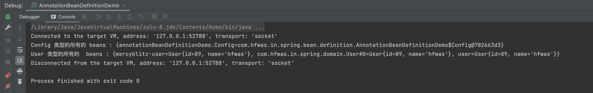

# 实例化Spring Bean

- Bean实例化(Instantiation)
- 常规方式
  - 通过构造器(配置元信息: XML、Java注解和Java API )
  - 通过静态工厂方法(配置元信息: XML和Java API )
  - 通过Bean工厂方法(配置元信息: XML和Java API )
  - 通过FactoryBean (配置元信息: XML、Java注解和Java API )
- 特殊方式
  - 通过Servicel oaderFactoryBean (配置元信息: XML、Java注解和Java API )
  - 通过AutowireCapableBeanFactory#createBean(java.lang.Class, int, boolean)
  - 通过BeanDefinitionRegistry #registerBeanDefinition ( String, BeanDefinition )

## 通过静态工厂方法

- 配置文件

```xml
<?xml version="1.0" encoding="UTF-8"?>
<beans xmlns="http://www.springframework.org/schema/beans"
       xmlns:xsi="http://www.w3.org/2001/XMLSchema-instance"
       xsi:schemaLocation="
        http://www.springframework.org/schema/beans http://www.springframework.org/schema/beans/spring-beans.xsd">

    <bean id="user-by-static-method" class="com.hfwas.in.spring.domain.User"
    factory-method="createUser">

    </bean>

</beans>
```

- 实体类修改

```java
package com.hfwas.in.spring.domain;

/**
 * @ClassName User
 * @Description
 * @Author <a href="hfwas1024@gmail.com">HFwas</a>
 * @Date: 12:32 上午
 * @Version: 1.0
 **/
public class User {

    private Long id;

    private String name;

    public Long getId() {
        return id;
    }

    public void setId(Long id) {
        this.id = id;
    }

    public String getName() {
        return name;
    }

    public void setName(String name) {
        this.name = name;
    }

    @Override
    public String toString() {
        return "User{" +
                "id=" + id +
                ", name='" + name + '\'' +
                '}';
    }

    public static User createUser(){
        return new User();
    }
}
```

- 测试代码

```java
package com.hfwas.in.spring.bean.definition;

import com.hfwas.in.spring.domain.User;
import org.springframework.beans.factory.BeanFactory;
import org.springframework.context.support.ClassPathXmlApplicationContext;

/**
 * @ClassName BeanInstantiationDemo
 * @Description
 *
 * bean 实例话演示
 *
 * @Author <a href="hfwas1024@gmail.com">HFwas</a>
 * @Date: 12:32 上午
 * @Version: 1.0
 **/
public class BeanInstantiationDemo {

    public static void main(String[] args) {
        // 配置 xml 配置i文件
        // 启动 spring 应用上下文
        BeanFactory beanFactory = new ClassPathXmlApplicationContext("classpath:/META-INF/dependency-creation-context.xml");
        User bean = beanFactory.getBean("user-by-static-method", User.class);
        System.out.println(bean);
    }
}
```

- 测试截图

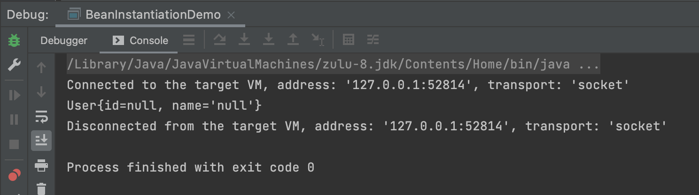

## 通过Bean工厂方法

- 配置文件

```xml
<?xml version="1.0" encoding="UTF-8"?>
<beans xmlns="http://www.springframework.org/schema/beans"
       xmlns:xsi="http://www.w3.org/2001/XMLSchema-instance"
       xsi:schemaLocation="
        http://www.springframework.org/schema/beans http://www.springframework.org/schema/beans/spring-beans.xsd">

    <!-- 静态方法实例话 bean -->
    <bean id="user-by-static-method" class="com.hfwas.in.spring.domain.User"
    factory-method="createUser">
    </bean>

    <!-- 实例（bean） 方法实例话bean -->
    <bean id="user-by-instance-method" factory-bean="userFactory" factory-method="creataUser"/>

    <!--  -->
    <bean id="userFactory" class="com.hfwas.in.spring.bean.factory.DefaultUserFactory"/>

</beans>
```

- 代码

  - 新建接口

  ```java
  package com.hfwas.in.spring.bean.factory;
  
  import com.hfwas.in.spring.domain.User;
  
  /**
   * @ClassName UserFactory
   * @Description
   *
   * user 工厂类
   *
   * @Author <a href="hfwas1024@gmail.com">HFwas</a>
   * @Date: 9:40 下午
   * @Version: 1.0
   **/
  public interface UserFactory {
  
      default User creataUser(){
          return User.createUser();
      }
  }
  ```

  - 新建实现类

  ```java
  package com.hfwas.in.spring.bean.factory;
  
  /**
   * @ClassName DefaultUserFactory
   * @Description
   *
   * 默认 {@link UserFactory} 实现
   *
   * @Author <a href="hfwas1024@gmail.com">HFwas</a>
   * @Date: 9:43 下午
   * @Version: 1.0
   **/
  public class DefaultUserFactory implements UserFactory{
  }
  ```

- 测试代码

```java
package com.hfwas.in.spring.bean.definition;

import com.hfwas.in.spring.domain.User;
import org.springframework.beans.factory.BeanFactory;
import org.springframework.context.support.ClassPathXmlApplicationContext;

/**
 * @ClassName BeanInstantiationDemo
 * @Description
 *
 * bean 实例话演示
 *
 * @Author <a href="hfwas1024@gmail.com">HFwas</a>
 * @Date: 12:32 上午
 * @Version: 1.0
 **/
public class BeanInstantiationDemo {

    public static void main(String[] args) {
        // 配置 xml 配置i文件
        // 启动 spring 应用上下文
        BeanFactory beanFactory = new ClassPathXmlApplicationContext("classpath:/META-INF/dependency-instantiation-context.xml");
        User bean = beanFactory.getBean("user-by-static-method", User.class);
        User userByInstanceMethod = beanFactory.getBean("user-by-instance-method", User.class);
        System.out.println(bean);
        System.out.println(userByInstanceMethod);
        System.out.println(bean == userByInstanceMethod);
    }
}
```

- 测试截图

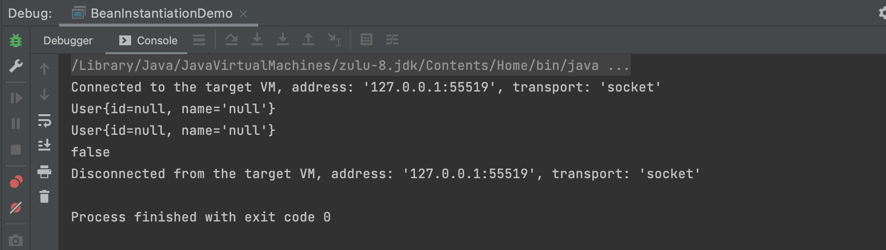

## Servicel oaderFactoryBean

- 配置文件

```java
<?xml version="1.0" encoding="UTF-8"?>
<beans xmlns="http://www.springframework.org/schema/beans"
       xmlns:xsi="http://www.w3.org/2001/XMLSchema-instance"
       xsi:schemaLocation="
        http://www.springframework.org/schema/beans http://www.springframework.org/schema/beans/spring-beans.xsd">

    <!--  -->
    <bean id="userFactoryServiceLoader" class="org.springframework.beans.factory.serviceloader.ServiceLoaderFactoryBean">
        <property name="serviceType" value="com.hfwas.in.spring.bean.factory.UserFactory"/>
    </bean>

</beans>
```

- 测试代码

```java
package com.hfwas.in.spring.bean.definition;

import com.hfwas.in.spring.bean.factory.UserFactory;
import org.springframework.beans.factory.BeanFactory;
import org.springframework.beans.factory.serviceloader.ServiceLoaderFactoryBean;
import org.springframework.context.support.ClassPathXmlApplicationContext;

import java.util.Iterator;
import java.util.ServiceLoader;

/**
 * @ClassName SpecialBeanInstantiationDemo
 * @Description
 *
 * 特殊的 bean 实例化示例
 *
 * @Author <a href="hfwas1024@gmail.com">HFwas</a>
 * @Date: 9:58 下午
 * @Version: 1.0
 **/
public class SpecialBeanInstantiationDemo {

    public static void main(String[] args) {
        // 配置 xml 配置文件
        // 启动 spring 应用上下文
        BeanFactory beanFactory = new ClassPathXmlApplicationContext("classpath:/META-INF/special-bean-instantiation-context.xml");

        ServiceLoader<UserFactory> serviceLoader = beanFactory.getBean("userFactoryServiceLoader", ServiceLoader.class);
        displayServiceLoader(serviceLoader);

         demoServiceLoader();
    }

    public static void demoServiceLoader() {
        ServiceLoader<UserFactory> serviceLoader = ServiceLoader.load(UserFactory.class, Thread.currentThread().getContextClassLoader());
        displayServiceLoader(serviceLoader);
    }

    public static void displayServiceLoader(ServiceLoader<UserFactory> serviceLoader){
        Iterator<UserFactory> iterator = serviceLoader.iterator();
        while (iterator.hasNext()) {
            UserFactory next = iterator.next();
            System.out.println(next.creataUser());
        }
    }
}
```

- 测试截图

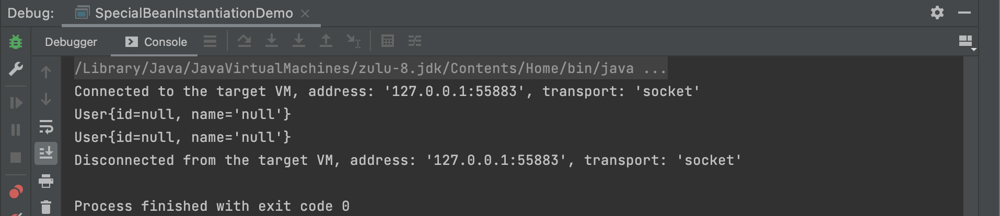


## AutowireCapableBeanFactory

- 测试代码

```java
package com.hfwas.in.spring.bean.definition;

import com.hfwas.in.spring.bean.factory.DefaultUserFactory;
import com.hfwas.in.spring.bean.factory.UserFactory;
import org.springframework.beans.factory.BeanFactory;
import org.springframework.beans.factory.config.AutowireCapableBeanFactory;
import org.springframework.beans.factory.serviceloader.ServiceLoaderFactoryBean;
import org.springframework.context.ApplicationContext;
import org.springframework.context.support.ClassPathXmlApplicationContext;

import java.util.Iterator;
import java.util.ServiceLoader;

/**
 * @ClassName SpecialBeanInstantiationDemo
 * @Description
 *
 * 特殊的 bean 实例化示例
 *
 * @Author <a href="hfwas1024@gmail.com">HFwas</a>
 * @Date: 9:58 下午
 * @Version: 1.0
 **/
public class SpecialBeanInstantiationDemo {

    public static void main(String[] args) {
        // 配置 xml 配置文件
        // 启动 spring 应用上下文
        ApplicationContext applicationContext = new ClassPathXmlApplicationContext("classpath:/META-INF/special-bean-instantiation-context.xml");
        // 通过 ApplicationContext 获取 AutowireCapableBeanFactory
        AutowireCapableBeanFactory beanFactory = applicationContext.getAutowireCapableBeanFactory();
        ServiceLoader<UserFactory> serviceLoader = beanFactory.getBean("userFactoryServiceLoader", ServiceLoader.class);
        displayServiceLoader(serviceLoader);

//         demoServiceLoader();

        // 创建 UserFactory 对象， 通过AutowireCapableBeanFactory
        UserFactory userFactory = beanFactory.createBean(DefaultUserFactory.class);
        System.out.println("AutowireCapableBeanFactory: " + userFactory.creataUser());

    }

    public static void demoServiceLoader() {
        ServiceLoader<UserFactory> serviceLoader = ServiceLoader.load(UserFactory.class, Thread.currentThread().getContextClassLoader());
        displayServiceLoader(serviceLoader);
    }

    public static void displayServiceLoader(ServiceLoader<UserFactory> serviceLoader){
        Iterator<UserFactory> iterator = serviceLoader.iterator();
        while (iterator.hasNext()) {
            UserFactory next = iterator.next();
            System.out.println(next.creataUser());
        }
    }
}
```

- 测试截图

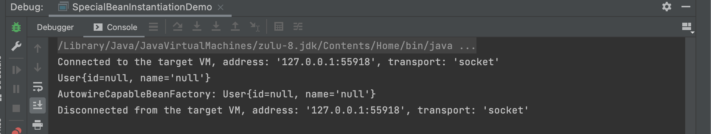


# 初始化 Spring Bean

- Bean初始化(Initialization)
- @PostConstruct标注方法
- 实现InitializingBean 接口的afterPropertiesSet()方法
- 自定义初始化方法
  - XML配置: <bean init- -method="init" ... />
  - Java注解: @Bean(initMethod=” init”)
  - Java API: AbstractBeanDefinition#setlnitMethodName(String)
- 思考:假设以上三种方式均在同一Bean中定义，那么这些方法的执行顺序是怎样?

## 分别实现

### @PostConstruct标注方法

- 代码修改

```java
package com.hfwas.in.spring.bean.factory;

import javax.annotation.PostConstruct;

/**
 * @ClassName DefaultUserFactory
 * @Description
 *
 * 默认 {@link UserFactory} 实现
 *
 * @Author <a href="hfwas1024@gmail.com">HFwas</a>
 * @Date: 9:43 下午
 * @Version: 1.0
 **/
public class DefaultUserFactory implements UserFactory{

    // 基于 @PostConstruct 注解
    @PostConstruct
    public void init(){
        System.out.println("@PostConstruct UserFactory 初始化中。。。 ");
    }
}
```

- 测试代码

```java
package com.hfwas.in.spring.bean.definition;

import com.hfwas.in.spring.bean.factory.DefaultUserFactory;
import com.hfwas.in.spring.bean.factory.UserFactory;
import org.springframework.context.annotation.AnnotationConfigApplicationContext;
import org.springframework.context.annotation.Bean;
import org.springframework.context.annotation.Configuration;

/**
 * @ClassName BeanInitializationDemo
 * @Description
 *
 * bean 初始化 demo
 *
 * @Author <a href="hfwas1024@gmail.com">HFwas</a>
 * @Date: 10:51 下午
 * @Version: 1.0
 **/
@Configuration
public class BeanInitializationDemo {

    public static void main(String[] args) {
        // 创建 BeanFactory 容器
        AnnotationConfigApplicationContext applicationContext = new AnnotationConfigApplicationContext();
        // 注册 Configuration class （配置类）
        applicationContext.register(BeanInitializationDemo.class);
        // 启动 Spring 应用上下文
        applicationContext.refresh();
        // 依赖查找 UserFactory
        UserFactory bean = applicationContext.getBean(UserFactory.class);
        // 关闭 Spring 应用上下文
        applicationContext.close();
    }

    @Bean
    public UserFactory userFactory(){
        return new DefaultUserFactory();
    }
}
```

- 测试截图

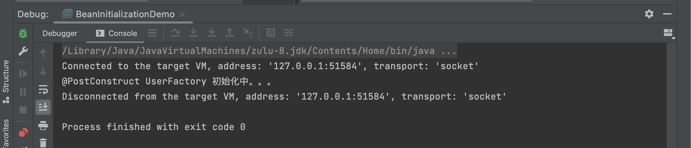

### @PostConstruct标注方法

- 修改代码

```java
package com.hfwas.in.spring.bean.factory;

import javax.annotation.PostConstruct;

/**
 * @ClassName DefaultUserFactory
 * @Description
 *
 * 默认 {@link UserFactory} 实现
 *
 * @Author <a href="hfwas1024@gmail.com">HFwas</a>
 * @Date: 9:43 下午
 * @Version: 1.0
 **/
public class DefaultUserFactory implements UserFactory{

    // 基于 @PostConstruct 注解
    @PostConstruct
    public void init(){
        System.out.println("@PostConstruct UserFactory 初始化中。。。 ");
    }

    public void initUserFactory(){
        System.out.println("自定义初始化方法 initUserFactory（）： UserFactory初始化中。。。。" );
    }
}
```

- 测试方法

```java
package com.hfwas.in.spring.bean.definition;

import com.hfwas.in.spring.bean.factory.DefaultUserFactory;
import com.hfwas.in.spring.bean.factory.UserFactory;
import org.springframework.context.annotation.AnnotationConfigApplicationContext;
import org.springframework.context.annotation.Bean;
import org.springframework.context.annotation.Configuration;

/**
 * @ClassName BeanInitializationDemo
 * @Description
 *
 * bean 初始化 demo
 *
 * @Author <a href="hfwas1024@gmail.com">HFwas</a>
 * @Date: 10:51 下午
 * @Version: 1.0
 **/
@Configuration
public class BeanInitializationDemo {

    public static void main(String[] args) {
        // 创建 BeanFactory 容器
        AnnotationConfigApplicationContext applicationContext = new AnnotationConfigApplicationContext();
        // 注册 Configuration class （配置类）
        applicationContext.register(BeanInitializationDemo.class);
        // 启动 Spring 应用上下文
        applicationContext.refresh();
        // 依赖查找 UserFactory
        UserFactory bean = applicationContext.getBean(UserFactory.class);
        // 关闭 Spring 应用上下文
        applicationContext.close();
    }

    @Bean(initMethod = "initUserFactory")
    public UserFactory userFactory(){
        return new DefaultUserFactory();
    }
}
```

- 测试截图

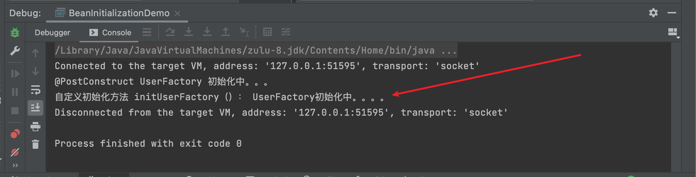

### 实现InitializingBean 接口

- 代码修改
  - 实现InitializingBean，覆盖afterPropertiesSet方法

```java
package com.hfwas.in.spring.bean.factory;

import org.springframework.beans.factory.InitializingBean;

import javax.annotation.PostConstruct;

/**
 * @ClassName DefaultUserFactory
 * @Description
 *
 * 默认 {@link UserFactory} 实现
 *
 * @Author <a href="hfwas1024@gmail.com">HFwas</a>
 * @Date: 9:43 下午
 * @Version: 1.0
 **/
public class DefaultUserFactory implements UserFactory, InitializingBean {

    // 基于 @PostConstruct 注解
    @PostConstruct
    public void init(){
        System.out.println("@PostConstruct UserFactory 初始化中。。。 ");
    }

    public void initUserFactory(){
        System.out.println("自定义初始化方法 initUserFactory（）： UserFactory初始化中。。。。" );
    }

    @Override
    public void afterPropertiesSet() throws Exception {
        System.out.println("自定义初始化方法 InitializingBean#afterPropertiesSet 初始化中。。。。" );
    }
}
```

- 测试代码
  - 参考上述测试方法

- 测试截图
  - 可以看出三种方式的执行优先级，

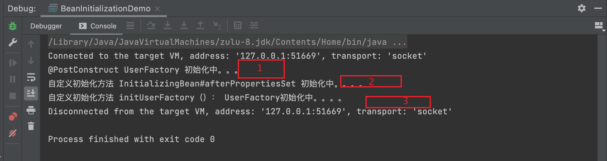

# 延迟初始化 Spring Bean

- Bean延迟初始化(Lazy Initialization)
  - XML配置: <bean lazy-init= ”true”... />
  - Java注解: @Lazy(true)
- 思考:当某个Bean定义为延迟初始化，那么，Spring 容器返回的对象与非延迟的对象存在怎样的差异?

## 测试

- 测试代码

```java
package com.hfwas.in.spring.bean.definition;

import com.hfwas.in.spring.bean.factory.DefaultUserFactory;
import com.hfwas.in.spring.bean.factory.UserFactory;
import org.springframework.context.annotation.AnnotationConfigApplicationContext;
import org.springframework.context.annotation.Bean;
import org.springframework.context.annotation.Configuration;
import org.springframework.context.annotation.Lazy;

/**
 * @ClassName BeanInitializationDemo
 * @Description
 *
 * bean 初始化 demo
 *
 * @Author <a href="hfwas1024@gmail.com">HFwas</a>
 * @Date: 10:51 下午
 * @Version: 1.0
 **/
@Configuration
public class BeanInitializationDemo {

    public static void main(String[] args) {
        // 创建 BeanFactory 容器
        AnnotationConfigApplicationContext applicationContext = new AnnotationConfigApplicationContext();
        // 注册 Configuration class （配置类）
        applicationContext.register(BeanInitializationDemo.class);
        // 启动 Spring 应用上下文
        applicationContext.refresh();
        System.out.println("非延迟初始化在 sprign 应用上下文启动完成后，被初始化s");
        // 依赖查找 UserFactory
        UserFactory bean = applicationContext.getBean(UserFactory.class);
        // com.hfwas.in.spring.bean.factory.DefaultUserFactory@c8e4bb0
        System.out.println(bean);
        // 关闭 Spring 应用上下文
        applicationContext.close();
    }

    @Bean(initMethod = "initUserFactory")
    @Lazy(value = false)// 非延迟初始化时开启 value= false
    public UserFactory userFactory(){
        return new DefaultUserFactory();
    }
}
```

- 测试效果

  - 非延迟初始化

  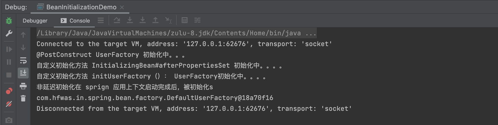

  - 延迟初始化

  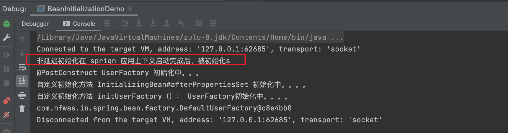

  

# 销毁Spring Bean

- Bean销毁(Destroy)
  - @PreDestroy标注方法
  - 实现DisposableBean接口的destroy() 方法;
  - 自定义销毁方法
    - XML配置: <bean destroy=' destroy”... />
    - Java注解: @Bean(destroy=" destroy")
    - Java API: AbstractBeanDefinition#setDestroyMethodName(String)
- 思考:假设以上三种方式均在同一Bean中定义，那么这些方法的执行顺序是怎样?

## 测试验证

- 修改代码

  - 修改DefaultUserFactory 方法

  ```java
  package com.hfwas.in.spring.bean.factory;
  
  import org.springframework.beans.factory.DisposableBean;
  import org.springframework.beans.factory.InitializingBean;
  
  import javax.annotation.PostConstruct;
  import javax.annotation.PreDestroy;
  
  /**
   * @ClassName DefaultUserFactory
   * @Description
   *
   * 默认 {@link UserFactory} 实现
   *
   * @Author <a href="hfwas1024@gmail.com">HFwas</a>
   * @Date: 9:43 下午
   * @Version: 1.0
   **/
  public class DefaultUserFactory implements UserFactory, InitializingBean, DisposableBean {
  
      // 基于 @PostConstruct 注解
      @PostConstruct
      public void init(){
          System.out.println("@PostConstruct UserFactory 初始化中。。。 ");
      }
  
      public void initUserFactory(){
          System.out.println("自定义初始化方法 initUserFactory（）： UserFactory初始化中。。。。" );
      }
  
      @Override
      public void afterPropertiesSet() throws Exception {
          System.out.println("自定义初始化方法 InitializingBean#afterPropertiesSet 初始化中。。。。" );
      }
  
      @PreDestroy
      public void preDestory() throws Exception {
          System.out.println("@@PreDestroy UserFactory 销毁中。。。 ");
      }
  
      @Override
      public void destroy() throws Exception {
          System.out.println("@@DisposableBean#destroy  UserFactory 销毁中。。。 ");
      }
  
      public void doDestory() {
          System.out.println("自定义 destroy 方法  UserFactory 销毁中。。。 ");
      }
  }
  ```

  - 注册doDestory

  ```java
  @Bean(initMethod = "initUserFactory", destroyMethod = "doDestory")
      @Lazy(value = false)
      public UserFactory userFactory(){
          return new DefaultUserFactory();
      }
  ```

  - 测试方法

  ```java
  package com.hfwas.in.spring.bean.definition;
  
  import com.hfwas.in.spring.bean.factory.DefaultUserFactory;
  import com.hfwas.in.spring.bean.factory.UserFactory;
  import org.springframework.context.annotation.AnnotationConfigApplicationContext;
  import org.springframework.context.annotation.Bean;
  import org.springframework.context.annotation.Configuration;
  import org.springframework.context.annotation.Lazy;
  
  /**
   * @ClassName BeanInitializationDemo
   * @Description
   *
   * bean 初始化 demo
   *
   * @Author <a href="hfwas1024@gmail.com">HFwas</a>
   * @Date: 10:51 下午
   * @Version: 1.0
   **/
  @Configuration
  public class BeanInitializationDemo {
  
      public static void main(String[] args) {
          // 创建 BeanFactory 容器
          AnnotationConfigApplicationContext applicationContext = new AnnotationConfigApplicationContext();
          // 注册 Configuration class （配置类）
          applicationContext.register(BeanInitializationDemo.class);
          // 启动 Spring 应用上下文
          applicationContext.refresh();
          System.out.println("非延迟初始化在 sprign 应用上下文启动完成后，被初始化    ");
          // 依赖查找 UserFactory
          UserFactory bean = applicationContext.getBean(UserFactory.class);
          // com.hfwas.in.spring.bean.factory.DefaultUserFactory@c8e4bb0
          System.out.println(bean);
          System.out.println("spring 上下文   准备 关闭");
          // 关闭 Spring 应用上下文
          applicationContext.close();
          System.out.println("spring 上下文已关闭");
      }
  
      @Bean(initMethod = "initUserFactory", destroyMethod = "doDestory")
      @Lazy(value = false)
      public UserFactory userFactory(){
          return new DefaultUserFactory();
      }
  }
  ```

- 测试截图

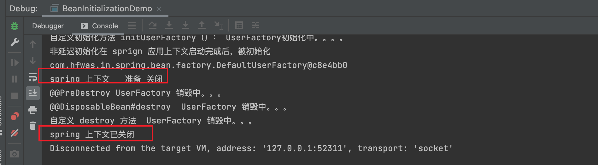

# 垃圾回收 Spring Bean

- Bean垃圾回收(GC)
  - 关闭Spring容器(应用上下文)
  - 执行GC.
  - Spring Bean覆盖的finalize() 方法被回调

## 代码验证

- 修改代码
  - 在DefaultUserFactory类当中添加方法

```java
@Override
    protected void finalize() throws Throwable {
        System.out.println("当前对象正在被回收");
    }
```

- 测试代码
  - 新建BeanGarbageCollectionDemo类

```java
package com.hfwas.in.spring.bean.definition;

import com.hfwas.in.spring.bean.factory.UserFactory;
import org.springframework.context.annotation.AnnotationConfigApplicationContext;

/**
 * @ClassName BeanGarbageCollectionDemo
 * @Description
 *
 * spring bean 垃圾回收的 demo
 *
 * @Author <a href="hfwas1024@gmail.com">HFwas</a>
 * @Date: 11:14 下午
 * @Version: 1.0
 **/
public class BeanGarbageCollectionDemo {

    public static void main(String[] args) throws InterruptedException {
        // 创建 BeanFactory 容器
        AnnotationConfigApplicationContext applicationContext = new AnnotationConfigApplicationContext();
        // 注册 Configuration class （配置类）
        applicationContext.register(BeanInitializationDemo.class);
        // 启动 Spring 应用上下文
        applicationContext.refresh();
        // 关闭 Spring 应用上下文
        applicationContext.close();

        Thread.sleep(5000L);
        // 强制执行 gc
        System.gc();
        Thread.sleep(5000L);
    }
}
```

- 测试截图

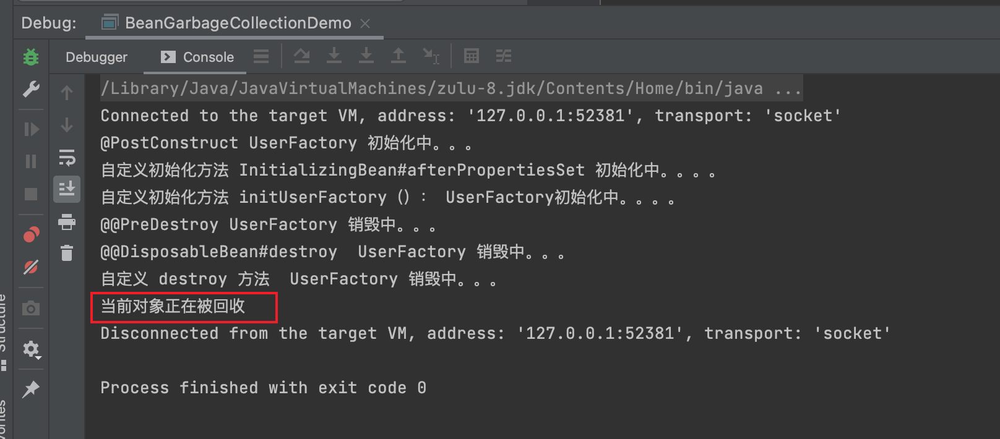

#  面试题精选

- 如何注册一个spring bean?
  - 通过注册一个bean definition和外部单体对象
- 什么是spring BeanDefinition?
  - 
- 


