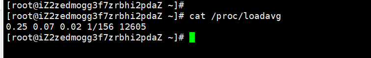

# 系统平均负载

系统平均负载被定义为`在特定时间间隔内运行队列中的平均进程数`。如果一个进程满足以下条件则其就会位于运行队列中：

- 它没有在等待I/O操作的结果
- 它没有主动进入等待状态(也就是没有调用wait)
- 没有被停止(例如：等待终止)

# 查看系统平均负载的常用命令

## `cat /proc/loadavg`

字段含义：

- 0.25 0.07 0.02：表示在过去的1、5、15分钟内运行队列中的平均进程数量
- 1/156：分子是正在运行的进程数，分母是进程总数
- 12605：最近运行的进程号

截图如下：



## `uptime`

名称： uptime
使用权限： 所有使用者
使用方式： uptime [-V]
说明： uptime 提供使用者下面的资讯，不需其他参数：
现在的时间 系统开机运转到现在经过的时间 连线的使用者数量 最近一分钟，五分钟和十五分钟的系统负载
参数： -V 显示版本资讯。
范例： uptime

#### 其结果为：

```
 10:41am up 5 days, 10 min, 1 users, load average: 0.00, 0.00, 1.99
```

# `w`

功能说明：显示目前登入系统的用户信息。
语　　法：w [-fhlsuV][用户名称]
补充说明：执行这项指令可得知目前登入系统的用户有那些人，以及他们正在执行的程序。单独执行w
指令会显示所有的用户，您也可指定用户名称，仅显示某位用户的相关信息。

#### 参数说明：

- `-f`: 开启或关闭显示用户从何处登入系统。
- `-h`: 不显示各栏位的标题信息列。
- `-l`: 使用详细格式列表，此为预设值。
- `-s`: 使用简洁格式列表，不显示用户登入时间，终端机阶段作业和程序所耗费的CPU时间。
- `-u`: 忽略执行程序的名称，以及该程序耗费CPU时间的信息。
- `-V`: 显示版本信息。

# `top`

功能说明：显示，管理执行中的程序。
语　　法：top [bciqsS][d <间隔秒数>][n <执行次数>]
补充说明：执行top指令可显示目前正在系统中执行的程序，并通过它所提供的互动式界面，用热键加以管理。

#### 参数说明：

- `b`: 使用批处理模式。
- `c`: 列出程序时，显示每个程序的完整指令，包括指令名称，路径和参数等相关信息。
- `d<间隔秒数>`: 设置top监控程序执行状况的间隔时间，单位以秒计算。
- `i`: 执行top指令时，忽略闲置或是已成为Zombie的程序。
- `n<执行次数>`: 设置监控信息的更新次数。
- `q`: 持续监控程序执行的状况。
- `s`: 使用保密模式，消除互动模式下的潜在危机。
- `S`: 使用累计模式，其效果类似ps指令的"-S"参数。

# `tload`

功能说明：显示系统负载状况。
语　　法：tload [-V][-d <间隔秒数>][-s <刻度大小>][终端机编号]
补充说明：tload指令使用ASCII字符简单地以文字模式显示系统负载状态。假设不给予终端机编号，则会在执行tload指令的终端机显示负载情形。

#### 参数说明：

- `-d<间隔秒数>`:设置tload检测系统负载的间隔时间，单位以秒计算。
- `-s<刻度大小>`:设置图表的垂直刻度大小，单位以列计算。
- `-V`:显示版本信息。


