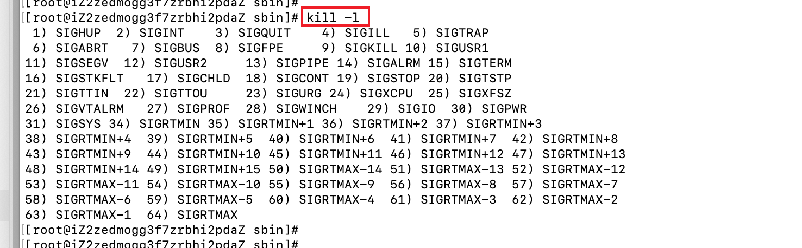
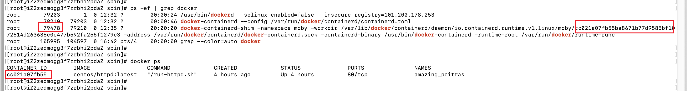
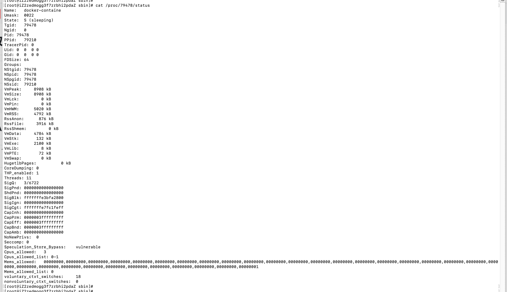

# linux信号

在linux当中可以使用kill -l 查看所有的信号

截图如下：



信号的解释如下表：

| 取值 | 名称       | 解释                             | 默认动作               |
| :--- | :--------- | :------------------------------- | :--------------------- |
| 1    | SIGHUP     | 挂起                             |                        |
| 2    | SIGINT     | 中断                             |                        |
| 3    | SIGQUIT    | 退出                             |                        |
| 4    | SIGILL     | 非法指令                         |                        |
| 5    | SIGTRAP    | 断点或陷阱指令                   |                        |
| 6    | SIGABRT    | abort发出的信号                  |                        |
| 7    | SIGBUS     | 非法内存访问                     |                        |
| 8    | SIGFPE     | 浮点异常                         |                        |
| 9    | SIGKILL    | kill信号                         | 不能被忽略、处理和阻塞 |
| 10   | SIGUSR1    | 用户信号1                        |                        |
| 11   | SIGSEGV    | 无效内存访问                     |                        |
| 12   | SIGUSR2    | 用户信号2                        |                        |
| 13   | SIGPIPE    | 管道破损，没有读端的管道写数据   |                        |
| 14   | SIGALRM    | alarm发出的信号                  |                        |
| 15   | SIGTERM    | 终止信号                         |                        |
| 16   | SIGSTKFLT  | 栈溢出                           |                        |
| 17   | SIGCHLD    | 子进程退出                       | 默认忽略               |
| 18   | SIGCONT    | 进程继续                         |                        |
| 19   | SIGSTOP    | 进程停止                         | 不能被忽略、处理和阻塞 |
| 20   | SIGTSTP    | 进程停止                         |                        |
| 21   | SIGTTIN    | 进程停止，后台进程从终端读数据时 |                        |
| 22   | SIGTTOU    | 进程停止，后台进程想终端写数据时 |                        |
| 23   | SIGURG     | I/O有紧急数据到达当前进程        | 默认忽略               |
| 24   | SIGXCPU    | 进程的CPU时间片到期              |                        |
| 25   | SIGXFSZ    | 文件大小的超出上限               |                        |
| 26   | SIGVTALRM  | 虚拟时钟超时                     |                        |
| 27   | SIGPROF    | profile时钟超时                  |                        |
| 28   | SIGWINCH   | 窗口大小改变                     | 默认忽略               |
| 29   | SIGIO      | I/O相关                          |                        |
| 30   | SIGPWR     | 关机                             | 默认忽略               |
| 31   | SIGSYS     | 系统调用异常                     |                        |
| 34   | SIGRTMIN   |                                  |                        |
| 35   | SIGRTMIN+1 |                                  |                        |
| 36   | SIGRTMIN+2 |                                  |                        |
| 37   | SIGRTMIN+3 |                                  |                        |
| 38   | SIGRTMIN+4 |                                  |                        |
| 39   |            |                                  |                        |
| 40   |            |                                  |                        |
| 41   |            |                                  |                        |
| 42   |            |                                  |                        |
|      |            |                                  |                        |
|      |            |                                  |                        |
|      |            |                                  |                        |
|      |            |                                  |                        |

# 信号处理

| 名称 | 描述                                              |
| ---- | ------------------------------------------------- |
| 忽略 | 信号不做任何处理，SIGKILL 和 SIGSTOP 这个两个信号 |
| 捕获 |                                                   |
| 缺省 |                                                   |


# 示例

## 查看进程正在监听的信号

- 查看进程号码，执行`ps -ef | grep docker `,查看得到我们新创建的容器ID为`cc021a07fb55`的进程ID为79478



- 执行`cat /proc/79478/status`，可以查看正在运行的进程正在监听的信号



- 主要关注以下内容：右侧字符是16进制的，需要转换为二进制，借助`https://www.sojson.com/hexconvert/16to10.html`网站，得到二进制位：`1111111111111111111111111111111000111011111110100010100000000000`

```
SigBlk:	fffffffe3bfa2800
SigIgn:	0000000000000000
SigCgt:	fffffffe7fc1feff
```

- 分析内容：


- 

