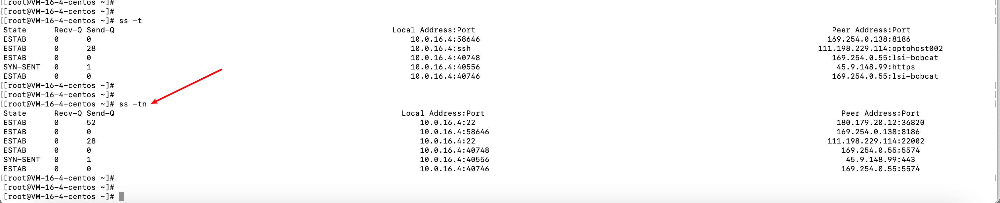
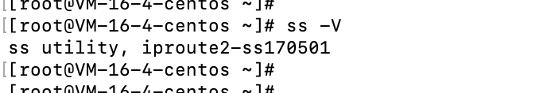
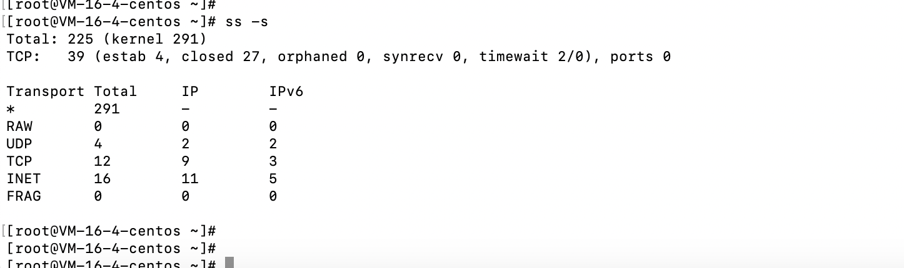
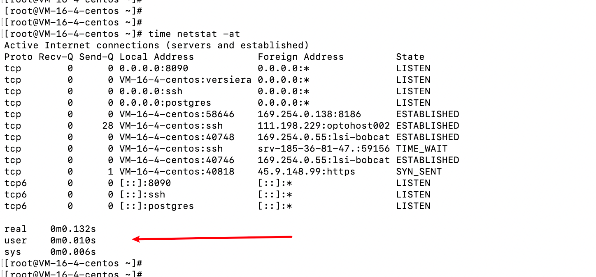
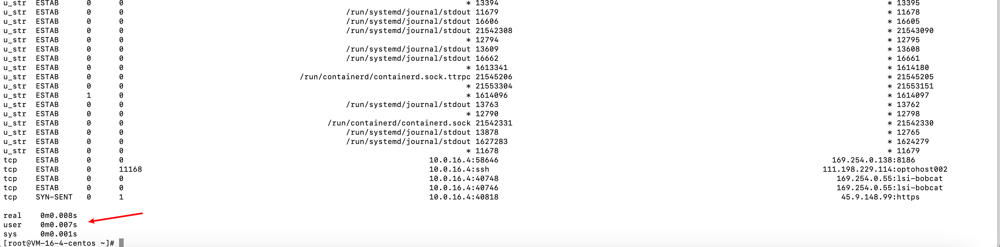

# ss命令

- ss命令和netstat命令用法类似，ss命令的出现也是为了替代netstat命令的。
- netstat连接数达到了上万级别的时候，执行该命令查询会很耗时，而ss命令的出现就是为了解决该问题。
- ss的速度比netstat的速度快的原因是：使用到了tcp协议栈中tcp_diag。tcp_diag是一个统计分析的模块，可以获得linux内核当中的第一手的信息，这就确保了ss的快捷高效

# 参数

- -n： 不解析服务名称，展示对应的应用名称。
  - 展示了不解析和解析两个的展示区别。

- -t：展示tcp协议

- -d：展示udp协议
- -l：展示监听的程序。
- -V：查看程序版本信息
  - ss是iproute2包附带的一个工具，允许查询socket的有关统计信息。

- -a：展示所有的套接字
- -s：显示套接字使用概况

- 

# 效率对比

- 执行ss和netstat效率对比

  - 执行`time netstat -at`

  

  - 执行`time ss `

  

- 

