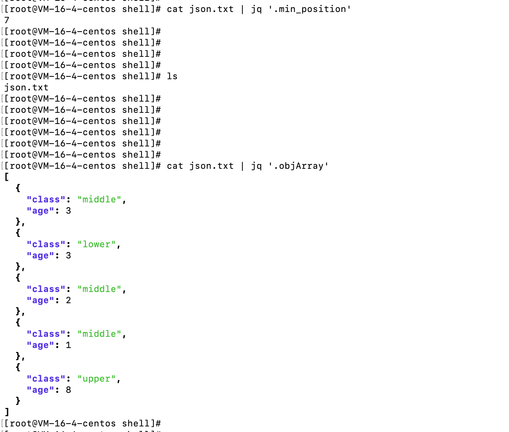
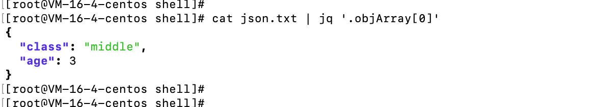
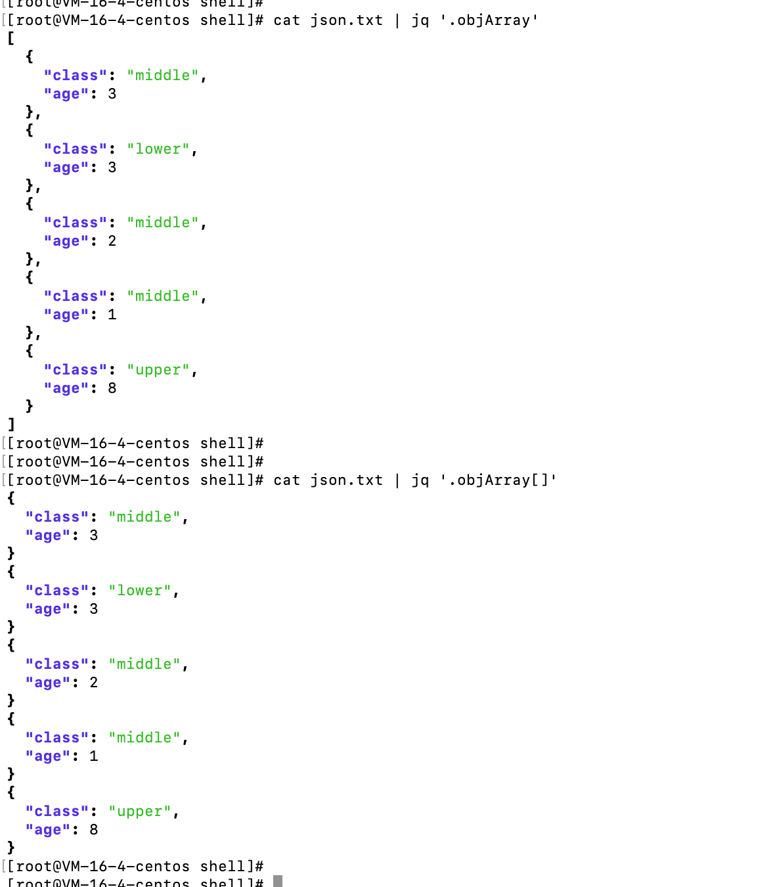
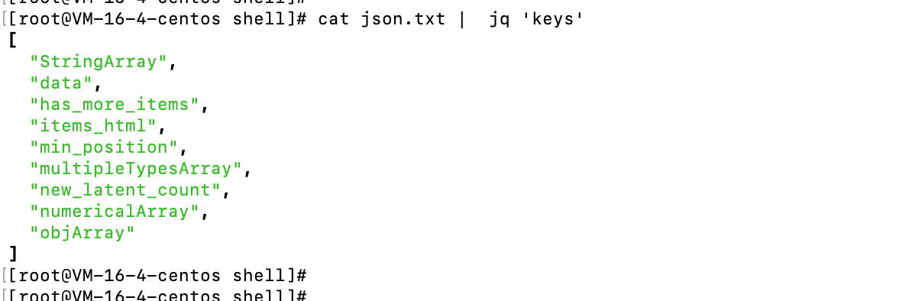

# jq命令

# 选项

- 感觉选项并没有什么用处，只使用简单的用法就可以满足日常使用，但是为了后续使用，还是将选项粘贴到这里。

```
-c               紧凑而不是漂亮的输出;
-n               使用`null`作为单个输入值;
-e               根据输出设置退出状态代码;
-s               将所有输入读取（吸取）到数组中；应用过滤器;
-r               输出原始字符串，而不是JSON文本;
-R               读取原始字符串，而不是JSON文本;
-C               为JSON着色;
-M               单色（不要为JSON着色）;
-S               在输出上排序对象的键;
--tab            使用制表符进行缩进;
--arg a v        将变量$a设置为value<v>;
--argjson a v    将变量$a设置为JSON value<v>;
--slurpfile a f  将变量$a设置为从<f>读取的JSON文本数组;
--rawfile a f    将变量$a设置为包含<f>内容的字符串;
--args           其余参数是字符串参数，而不是文件;
--jsonargs       其余的参数是JSON参数，而不是文件;
--               终止参数处理;
```

# 简单用法

- 获取某一个key的值。



- 获取value为数组的某一个值。执行`cat json.txt | jq '.objArray[0]'`



- 遍历value为数组的每一个值，执行`cat json.txt | jq '.objArray[]'`



- 获取json当中的所有的key，执行命令`cat json.txt | jq 'keys'`



- 


# 其他

## 测试数据

```json
{
   "min_position": 7,
   "has_more_items": false,
   "items_html": "Bus",
   "new_latent_count": 2,
   "data": {
      "length": 26,
      "text": "Duis aute irure dolor in reprehenderit in voluptate velit esse cillum dolore eu fugiat nulla pariatur."
   },
   "numericalArray": [
      29,
      31,
      27,
      20,
      28
   ],
   "StringArray": [
      "Nitrogen",
      "Carbon",
      "Nitrogen",
      "Nitrogen"
   ],
   "multipleTypesArray": 5,
   "objArray": [
      {
         "class": "middle",
         "age": 3
      },
      {
         "class": "lower",
         "age": 3
      },
      {
         "class": "middle",
         "age": 2
      },
      {
         "class": "middle",
         "age": 1
      },
      {
         "class": "upper",
         "age": 8
      }
   ]
}
```

## 参考链接

- https://www.jianshu.com/p/6de3cfdbdb0e
- https://developer.aliyun.com/article/743533
- https://wangchujiang.com/linux-command/c/jq.html