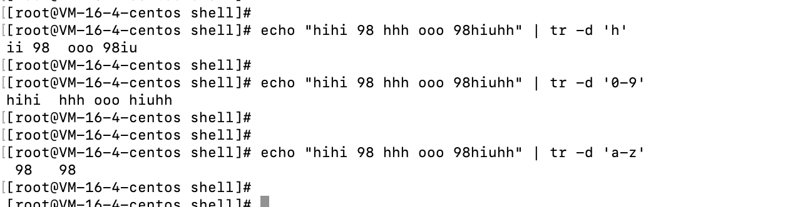
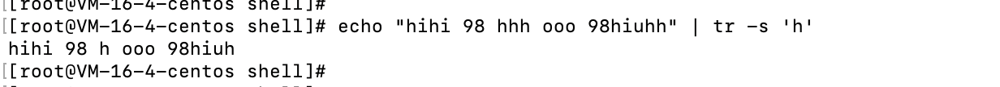
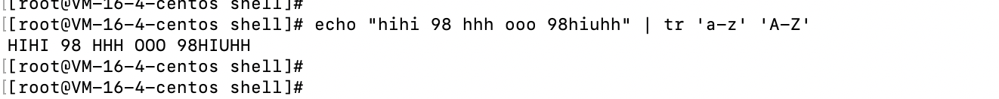
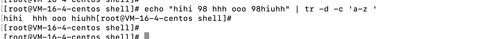
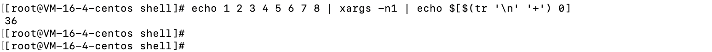

# tr命令

# 基本概念

- 将字符进行替换压缩和删除
- 还可以对来自标准输入的字符进行替换，压缩，删除，它可以将一组字符变成另外一组字符，经常用来编写优美的单行命令，作用很强大。

# 选项

- -c：取代所有不属于第一字符集的字符
- -d：删除所有属于第一字符集的字符
- -s：吧连续重复的字符以单独一个字符表示
- -t：先删除第一字符集较第二字符集多出的字符

# 参数

- 第一字符集：指定要转换或者删除的原字符集。当执行转换操作时，必须使用参数“字符集2”指定转换的目标字符集。但执行删除操作时，不需要参数“字符集2”
- 第二字符集：指定要转换成的目标字符集。

# 示例

- 删除指定字符，



- 替换掉连续的字符，只保留一个



- 将输入字符有小写转换为大写



- 字符集补集，从输入文本当中将不在补集当中的所有字符删除，表示不在a-z和空格在内的所有字符全部删除。



- 使用tr做数字加法，执行命令`echo 1 2 3 4 5 6 7 8 | xargs -n1 | echo $[$(tr '\n' '+') 0]`



- 

# 字符类

```
[:alnum:]：字母和数字
[:alpha:]：字母
[:cntrl:]：控制（非打印）字符
[:digit:]：数字
[:graph:]：图形字符
[:lower:]：小写字母
[:print:]：可打印字符
[:punct:]：标点符号
[:space:]：空白字符
[:upper:]：大写字母
[:xdigit:]：十六进制字符  
```

