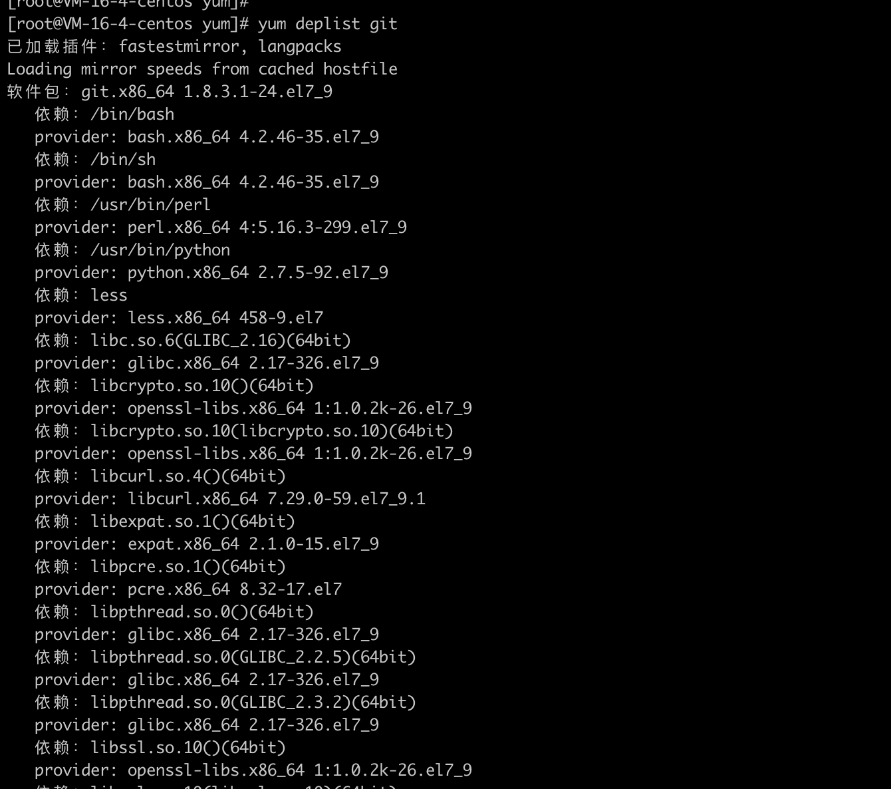
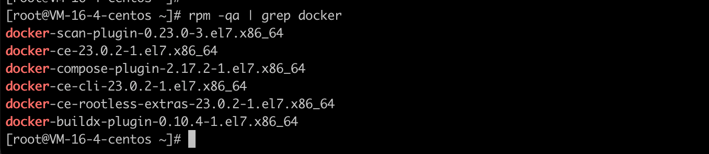
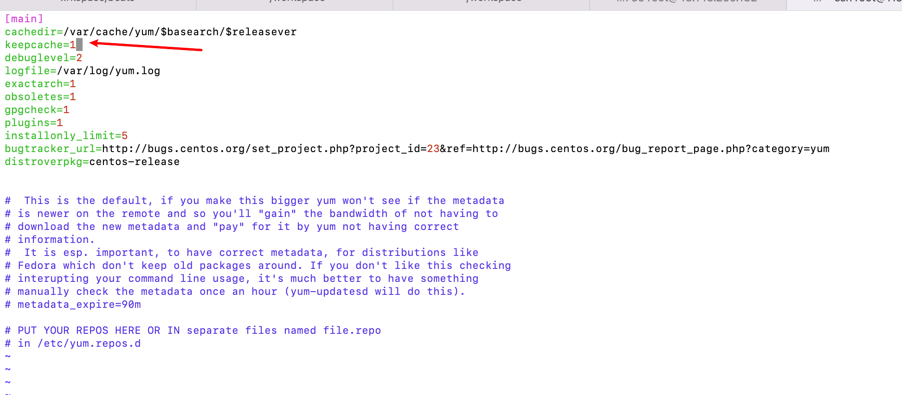
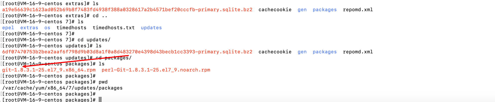
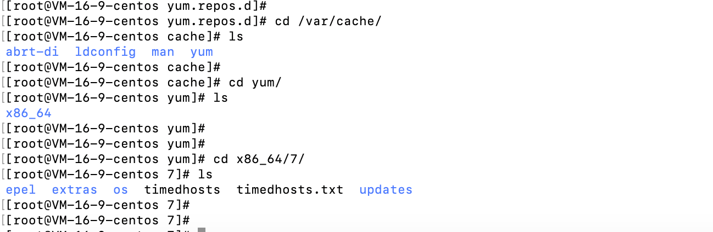
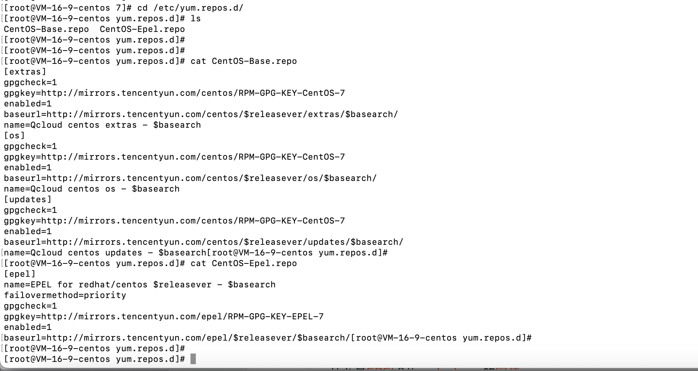

# yum命令

- yum（ Yellow dog Updater, Modified）是一个在 Fedora 和 RedHat 以及 SUSE 中的 Shell 前端软件包管理器。
- 基于 RPM 包管理，能够从指定的服务器自动下载 RPM 包并且安装，可以自动处理依赖性关系，并且一次安装所有依赖的软件包，无须繁琐地一次次下载、安装。
- yum 提供了查找、安装、删除某一个、一组甚至全部软件包的命令，而且命令简洁而又好记。

# 参数

```

List of Commands:

check          检查 RPM 数据库问题
check-update   检查是否有可用的软件包更新
clean          删除缓存数据
deplist        列出软件包的依赖关系
distribution-synchronization 已同步软件包到最新可用版本
downgrade      降级软件包
erase          从系统中移除一个或多个软件包
fs             Acts on the filesystem data of the host, mainly for removing docs/lanuages for minimal hosts.
fssnapshot     Creates filesystem snapshots, or lists/deletes current snapshots.
groups         显示或使用、组信息
help           显示用法提示
history        显示或使用事务历史
info           显示关于软件包或组的详细信息
install        向系统中安装一个或多个软件包
langavailable  Check available languages
langinfo       List languages information
langinstall    Install appropriate language packs for a language
langlist       List installed languages
langremove     Remove installed language packs for a language
list           列出一个或一组软件包
load-transaction 从文件名中加载一个已存事务
makecache      创建元数据缓存
provides       查找提供指定内容的软件包
reinstall      覆盖安装软件包
repo-pkgs      将一个源当作一个软件包组，这样我们就可以一次性安装/移除全部软件包。
repolist       显示已配置的源
search         在软件包详细信息中搜索指定字符串
shell          运行交互式的 yum shell
swap           Simple way to swap packages, instead of using shell
update         更新系统中的一个或多个软件包
update-minimal Works like upgrade, but goes to the 'newest' package match which fixes a problem that affects your system
updateinfo     Acts on repository update information
upgrade        更新软件包同时考虑软件包取代关系
version        显示机器和/或可用的源版本
```

# 相关示例

- 获取yum安装的离线rpm包，执行`yum install --downloadonly --downloaddir=/root/yum/git  curl-devel expat-devel gettext-devel openssl-devel zlib-devel`

- 查看软件依赖管理，执行`yum deplist git`



- 查看服务器自带的rpm包的位置，


- 查看是否安装了某个依赖，执行`rpm -qa | grep docker`



- 卸载某个依赖，执行`rpm -e rpm包名称`

- 更新某个软件名称，执行`yum upgrade 软件名称`

- yum安装软件时保留rpm包，

  - 修改配置文件，执行`vim /etc/yum.conf `，将keepcache值修改为1

  

  - 查看安装的软件的软件包，例如：查看linux当中没有安装git，执行`yum install git`，查看`cd /var/cache/yum`目录下，在`/var/cache/yum/x86_64/7/updates/packages`可以看到下载的git的rpm包

  

  - 

- yum下载的rpm包

  - yum下载通常有四个，

  

  - yum配置在`/etc/yum.repos.d`，可以看到有两个配置文件
    - 文件`CentOS-Base.repo`当中配置了extras，os，updates的地址
    - 文件`CentOS-Epel.repo`当中配置了epel的地址

  

  - 

- 