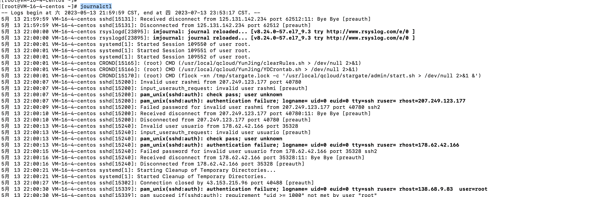
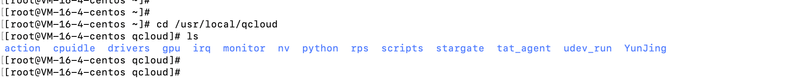
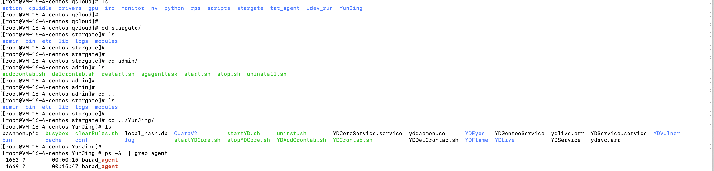

# 腾讯云服务器qcloud

- 无意中执行journalctl，看到一个进程

- 可以看到一只有一个bash，`/usr/local/qcloud/YunJing/clearRules.sh > /dev/null 2>&1`
- 上网查询了一下，这是腾讯云的云监控，
- 我们可以自行卸载，
- 进入到`qcloud`目录下，执行`cd /usr/local/qcloud`，

- 可以看到文件夹下有自带的脚本，启动脚本，重启脚本，卸载脚本

- 我们可以执行卸载脚本下载掉这些组件。